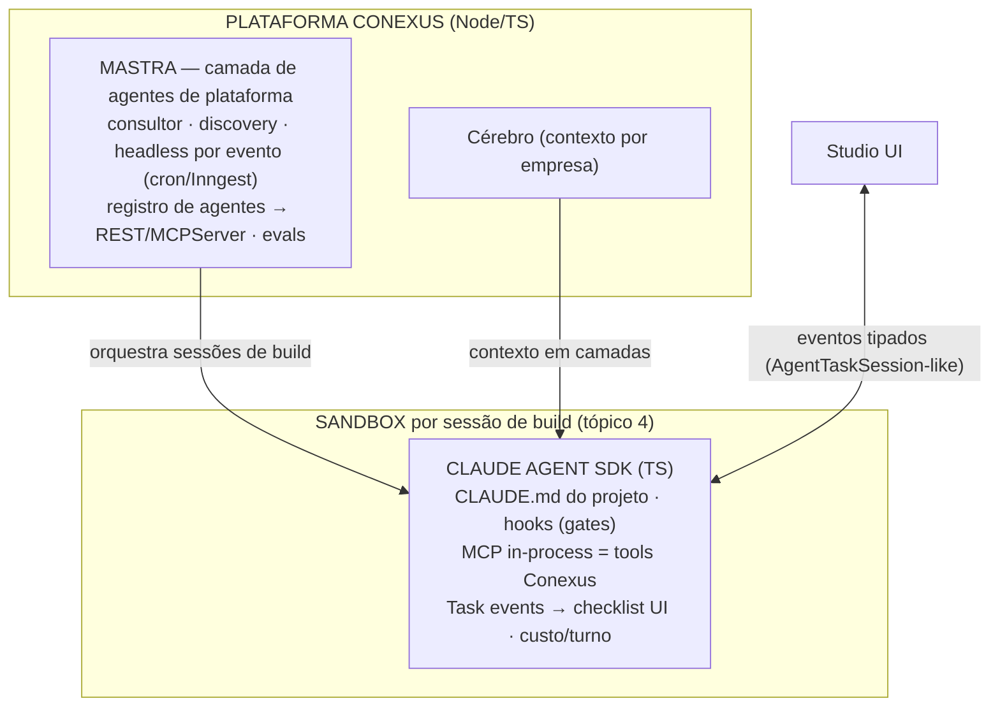

# Tópico 3 — Runtime do agente (como o código é construído)

**Status: RASCUNHO — aguarda revisão do operador.**
Evidência: mapa Mitra (§2, §18–22, §26) + docs oficiais Claude Agent SDK e Mastra/ACP
(pesquisadas 2026-08-10, citações inline).

## 1. Como a Mitra faz (evidência, respondendo a pergunta do operador)

**A Mitra NÃO usa skills nem plugins. O mecanismo é mínimo:**

1. **Claude Code CLI** spawnado server-side num sandbox E2B por projeto. O system prompt base é
   montado no servidor no momento do spawn — não está no repo nem no bundle do cliente
   ([§22.4](../research/MITRA-INSPIRATION-MAP.md)).
2. A única camada por projeto é o **`CLAUDE.md`** na raiz do repo (mecanismo nativo de instruções
   de projeto do Claude Code). Varremos `.claude/`, skills, plugins, `AGENTS.md` → tudo 404.
3. **Tools da plataforma via MCP** (`mcp__mitra-business__executeServerFunction`…), carregadas
   sob demanda com `ToolSearch` (deferidas). Tools nativas: Bash/Read/Write/Edit/TodoWrite/
   AskUserQuestion — sem WebSearch/WebFetch.
4. **Auth**: OAuth da assinatura Claude Pro/Max do usuário ("Conectar via CLI") ou API key BYOK
   (8 provedores). Runtime plugável no tipo (`claudecode | codex | opencode`) mas **default e
   produção = claudecode**; OpenCode só existe como tipo; Pi não aparece.
5. O "SKILL_MD" da etapa de Escopo **não é skill do Claude Code** — é template de prompt guardado
   como dado numa tabela de outro projeto Mitra e injetado num prompt **Gemini** (etapa de escopo
   usa modelo barato; o build usa Claude). Duas coisas distintas.

**Conclusão anti-overengineering: a receita da Mitra é `spawn CLI + CLAUDE.md + MCP`. Só.**

## 2. O que as docs oficiais mudam no jogo (fatos-chave)

### Claude Agent SDK (TypeScript) — [docs](https://code.claude.com/docs/en/agent-sdk/overview.md)

- **É o mesmo motor do Claude Code** — o SDK embute o binário `claude` e o supervisiona por stdio;
  versão do CLI pinada à versão do pacote. O que a Mitra faz por spawn manual, o SDK entrega como
  biblioteca.
- Cobre cada requisito nosso já numerado:
  - `PreToolUse` hook **bloqueia mecanicamente** tool call (`permissionDecision: deny/ask`) → HAR-3.
  - `TaskCreate/TaskUpdate` como tool_use no stream → checklist viva na UI → HAR-8.
  - `ResultMessage` com `total_cost_usd` + usage por modelo → OBS-1.
  - Sessões: `resume`, `forkSession`, `SessionStore` (S3/Redis/Postgres) p/ retomar cross-host.
  - **MCP in-process** (`createSdkMcpServer`) → tools da plataforma sem processo extra.
  - `settingSources` controla CLAUDE.md/skills; guia explícito de **multi-tenant**
    (`settingSources: []`, `CLAUDE_CONFIG_DIR` e `cwd` por tenant) e de
    [sandboxing](https://code.claude.com/docs/en/agent-sdk/secure-deployment) (sandbox-runtime/
    bubblewrap → Docker hardened → gVisor → Firecracker; egress só via proxy). ~1 GiB RAM / 5 GiB
    disco / 1 CPU por agente.
- **⚠️ Achado de política (impacta o modelo da Mitra):** docs afirmam, verbatim: *"Anthropic does
  not allow third party developers to offer claude.ai login or rate limits for their products"*
  sem aprovação prévia. O "conecte sua assinatura" da Mitra é zona cinzenta de ToS. Conexus fase 1
  (interna): nossa própria assinatura/`CLAUDE_CODE_OAUTH_TOKEN` é legítima — somos o usuário.
  Fase 2 (SaaS): API key própria, BYOK do cliente ou Bedrock/Vertex — **não** assinatura do cliente.

### Mastra — [docs](https://mastra.ai/docs)

- v1.0 estável (jan/2026), ~1,1M downloads/semana, cadência semanal.
- Entrega exatamente o que o Agent SDK **não** tem: workflows duráveis com suspend/resume +
  **cron** + Inngest (→ AGT-3 headless), memória em camadas com threads/working/semantic recall
  (→ candidato a substrato do **cérebro**), **evals/scorers** (→ QUA-1 benchmark), registro de
  agentes exposto como **REST + MCPServer** automaticamente (→ AGT-2 central de agentes),
  multi-provedor de modelo por string (→ etapa de escopo com modelo barato).
- **Ponte first-party pronta**: `@mastra/claude` embrulha o Claude Agent SDK como agente Mastra
  (in-process). `@mastra/acp` dirige CLIs de código via ACP (child process headless).
- **⚠️ Risco registrado**: ataque de supply-chain em jun/2026 (~140 pacotes npm comprometidos via
  conta de contribuidor). Mitigação padrão: lockfile, versões pinadas, provenance, delay de
  upgrade.

### ACP — [agentclientprotocol.com](https://agentclientprotocol.com)

- Protocolo editor↔agente (Zed/JetBrains), stdio JSON-RPC; suporte remoto "work in progress".
  **Editor-cêntrico por design.** Único uso headless documentado é o próprio `@mastra/acp`.
- Só compra **pluggabilidade de runtime** (codex/gemini CLIs) — que já decidimos adiar
  ("começar com 1 runtime sólido", [§18 ADAPT](../research/MITRA-INSPIRATION-MAP.md)).

## 3. Decisão proposta

| Papel | Escolha | Veredito |
|---|---|---|
| **Harness de build** (o que escreve código) | **Claude Agent SDK (TS)** direto, 1 processo por sessão no sandbox | **ADOPT** |
| Instruções de projeto | `CLAUDE.md` gerado pela plataforma (receita Mitra) | ADOPT |
| Tools da plataforma no build | MCP **in-process** (`createSdkMcpServer`) | ADOPT |
| Gates mecânicos (aprovação, SHARE, migration) | `PreToolUse` hooks + `canUseTool` | ADOPT |
| **Agentes de plataforma** (consultor/discovery/headless) + central + evals | **Mastra** (`@mastra/core` + `@mastra/claude` na fronteira) | **ADOPT** |
| Skills/plugins do Claude Code no harness | Não usar na fase 1 (Mitra prova que CLAUDE.md+MCP basta) | DEFER |
| ACP / multi-runtime (codex, gemini) | Não agora; se F2 pedir, `@mastra/acp` é o caminho pronto | **DEFER** |
| Pi | Acervo MNFS (spike AS-02 segue como evidência) | REFERENCE |
| Assinatura do cliente como billing (padrão Mitra) | Violação de política Anthropic sem aprovação | **REJECT** |
| Auth fase 1 | Nossa assinatura via `setup-token` OU API key | ADOPT |
| Auth fase 2 (SaaS) | API key própria / BYOK / Bedrock-Vertex | ADOPT (futuro) |

**Por que não Mastra para o build também?** O `@mastra/claude` existe e pode embrulhar depois —
mas na fase 1 a camada extra não paga: o Agent SDK sozinho já entrega loop, tools, gates, sessões
e streaming. Mastra entra onde tem valor único (workflows/cron/memória/evals/registro). Fronteira
limpa: **Mastra orquestra; Agent SDK constrói.**

**Uma língua (TypeScript) em toda a stack** — plataforma, harness, SDKs gerados, scaffold.

## 4. Consequências

1. Tópico 4 (sandbox) herda os requisitos do SDK: ~1 GiB/agente, filesystem local por sessão,
   egress por proxy; cookbook oficial de hosting (Docker/Modal/K8s) como ponto de partida.
2. Tópico 9 (agente 1ª classe) ganha substrato: agente Conexus = entidade sobre Mastra
   (identidade/versão/tools) + sessões Agent SDK quando precisa codar.
3. Tópico 15 (cérebro) avalia a memória do Mastra (threads/working/semantic) como motor v1.
4. Supply-chain Mastra: pin + lockfile + provenance desde o primeiro commit do produto.
5. Fase 2 SaaS não pode replicar o "conecte sua assinatura" da Mitra — precificação própria.

## Decisão

_(pendente — operador ratifica ou ajusta)_
