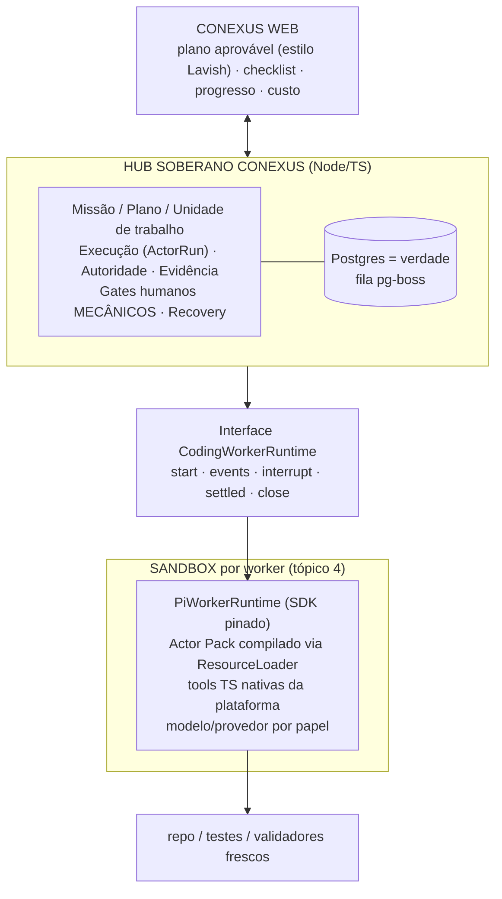

# Tópico 3 — Runtime do agente (hub + workers)

**Status: DECIDIDO — C-002, ratificado pelo operador em 2026-08-10.**
Evidência: mapa Mitra (§2, §18–22, §26) + 4 rodadas de pesquisa primária (Pi, ecossistema Pi,
Mastra/orquestração, adendos de verificação — 2026-08-10) + **relatório externo independente
(ChatGPT deep research, 2026-08-10)** que convergiu na mesma arquitetura (~89% confiança).

## 1. Como a Mitra faz (evidência, respondendo a pergunta do operador)

**A Mitra NÃO usa skills nem plugins. O mecanismo é mínimo:**

1. **Claude Code CLI** spawnado server-side num sandbox E2B por projeto; system prompt montado no
   servidor no momento do spawn ([§22.4](../research/MITRA-INSPIRATION-MAP.md)).
2. Única camada por projeto: **`CLAUDE.md`** na raiz do repo, **gerado pela plataforma**.
   `.claude/`, skills, plugins, `AGENTS.md` → tudo 404.
3. **Tools da plataforma via MCP** (`mcp__mitra-business__*`), deferidas via ToolSearch.
4. **Auth**: OAuth da assinatura Claude Pro/Max do usuário ou API key BYOK. Runtime plugável no
   tipo (`claudecode | codex | opencode`), mas default e produção = claudecode.
5. "SKILL_MD" da etapa de escopo = template de prompt em tabela, injetado num prompt **Gemini** —
   não é skill do Claude Code.
6. **Uma sessão única de builder** — sem orquestração multi-agente.

**Receita Mitra: `spawn CLI + CLAUDE.md + MCP`. Só.** Nós vamos além dela em um eixo (hub
multi-agente com validação independente) e mantemos o resto igualmente simples.

## 2. Processo de decisão (resumo)

1. Rascunho inicial (Agent SDK constrói + Mastra orquestra) **rejeitado pelo operador** —
   decisão não podia ser unilateral e pesou errado os pontos fracos do Pi.
2. Entrevista fixou dois requisitos: **forma de HUB** (Lead despacha workers frescos; inspiração
   Factory.ai Missions + FirstMate + Mitra) e **multi-modelo por papel** (requisito duro —
   ex.: escopo barato, builder forte, validador de outro provedor).
3. Quatro rodadas de pesquisa primária + relatório externo independente (ChatGPT) para
   comparação cega. **Convergência quase total** — divergências apenas em fila (PG puro × pg-boss)
   e cadência de adoção.

## 3. Evidências-chave

- **Placar de orquestradores reais** (Factory Missions, Codebuff, OpenHands, Anthropic
  multi-agent, GitHub Copilot, Cursor, Ona/Gitpod, vibe-kanban, Claude Squad, Terragon):
  **10/10 control plane próprio; 0/10 delegam orquestração soberana a framework genérico**
  (Mastra/LangGraph/Temporal). Confirmado pelas duas pesquisas independentes.
- **Pi (MIT, v0.84.1)**: SDK real p/ embedding (`createAgentSession`, ResourceLoader, tools
  custom TypeBox, eventos, RPC, fork de sessão); ~30 provedores; system prompt totalmente
  substituível. Sem MCP nem subagents **por design** — e o ecossistema resolve:
  `pi-mcp-adapter` (MIT, proxy ~200 tokens, factory embutível), `pi-subagents` (MIT, clone do
  Task tool do Claude Code), FirstMate (MIT, crew multi-harness do Kun Chen), pi-chat (Apache,
  1 worker por micro-VM Gondolin, placeholders de secrets). Riscos: 0.x com breaking changes
  frequentes; bus factor concentrado (Zechner); **sem benchmark neutro vs Claude Code**.
- **Claude Agent SDK**: motor do Claude Code como lib; melhor machinery pronta de eventos/
  permissões/subagents; **só modelos Claude** → incompatível como runtime único com multi-modelo
  por papel; licença = Anthropic Commercial Terms (não MIT).
- **Mastra (Apache-2.0 + `ee/`)**: supervisor = "agente chama agente como tool call" (sem
  durabilidade própria); durabilidade só via Workflows — issue **#17284 aberta** (bloat de
  snapshot exatamente no padrão gate-humano + missão longa; fix PR fechado sem merge);
  supply-chain jun/2026 (145 pacotes, sem postmortem próprio); Observational Memory (Apache,
  94,9% LongMemEval — benchmark do fornecedor) exige wrapper de Agent Mastra. Poderoso demais
  para ficar **abaixo** da nossa semântica sem virar segunda autoridade.
- **Billing por assinatura**: OAuth Claude Max dentro do Pi cobra **"extra usage" por token**
  (não consome franquia). Anthropic não autoriza terceiros a oferecer login/limites claude.ai
  em produto próprio sem aprovação.

## 4. Decisão C-002

| # | Componente | Decisão |
|---|---|---|
| 1 | **Hub** | Próprio, Node/TS + **Postgres** (verdade única) + **pg-boss** (fila: retry/backoff, cron, DLQ — MIT, só Postgres, zero infra extra). Temporal/Inngest DEFER até consumidor distribuído real. |
| 2 | **Worker runtime** | **Pi SDK** (versão pinada + conformance tests + upgrade gate). 1 worker **fresco por unidade de trabalho**; validador independente pode usar modelo/provedor diferente do implementador. |
| 3 | **Interface** | `CodingWorkerRuntime` mínima (`start/events/interrupt/settled/close`) com **1 adapter (Pi)**. Sem registry, sem ProviderFactory. |
| 4 | **Identidade de execução** | Persistir por ActorRun: `runtime + runtimeVersion + provider + model + reasoning + authBinding + actorPackHash + toolSurfaceHash`. Pi+Claude ≠ Pi+GPT — mesmo runtime, configuração distinta (custo/eval/reprodução). |
| 5 | **Contexto** | **Actor Pack compilado pelo hub** (camadas plataforma → empresa → projeto → papel → tarefa, com hashes) injetado via **ResourceLoader controlado**. `AGENTS.md`/`CLAUDE.md` no workspace: **permitido quando gerado pelo hub** (receita Mitra, explícita e auditável). Bloqueado: discovery ambiental (`~/.pi/`, diretórios pai, skills/extensions globais). Arquivo de instrução em repo de **cliente** = dado, não autoridade (injection surface). |
| 6 | **Tools da plataforma** | **TypeScript nativas** no boundary (registrar artefato, SQL seguro, provisionar preview, pedir credencial…). MCP = **borda de compatibilidade** (padrão `pi-mcp-adapter` vendorado) quando integração externa genérica surgir. |
| 7 | **Aprovação humana** | **Gate mecânico do hub**: `HANDOFF_REQUIRED` bloqueia novo turno/tool/efeito até nova autoridade. Nunca disciplina de prompt (fraqueza observada no Mitra). Plano visual aprovável estilo Lavish antes de codar. |
| 8 | **Challenger** | **Claude Agent SDK** como `ClaudeAgentRuntime`, ativado só por trigger: Pi perder materialmente no **Conexus Worker Eval** (tarefas nossas: feature backend, migration, página React, bug complexo, integração Sankhya, recovery) OU capability Claude-específica eliminar machinery significativa. OpenCode/ACP: DEFER. |
| 9 | **Mastra** | **Fora do hub** (evita segunda autoridade). Minerar como referência (supervisor/AgentController/evals). **Observational Memory** = candidata isolada futura p/ Lead longevo / cérebro (tópico 15). |
| 10 | **Auth/billing** | Fase 1 interna: nossa assinatura/login (operador já usa) ou API key. **Baseline fase 2 SaaS: API própria / BYOK** — nunca assinatura do cliente sem autorização Anthropic. Semântica de missão nunca depende de token de assinatura. |
| 11 | **Minerar código/ideias** | FirstMate, Treehouse, pi-subagents, pi-mcp-adapter, pi-chat/Gondolin, Codebuff, OpenHands (MIT/Apache — copiar com registro de origem). Claude Squad (AGPL): estudar padrões, **não copiar código**. |

### O que NÃO entra agora (anti-overengineering)

Registry de runtimes · marketplace de modelos · workflow DSL · Temporal/Inngest · Observational
Memory nos workers · supervisores recursivos · frota remota · cron genérico · UI de BYOS.
Tudo tem valor; nada tem consumidor no primeiro Golden Path.

## 5. Consequências

1. **Tópico 4 (sandbox)** herda: 1 sandbox por worker; padrão pi-chat/Gondolin (micro-VM +
   placeholder de secrets substituído só em requests a hosts permitidos) vira input direto do
   design de credenciais.
2. **Conexus Worker Eval** entra no roadmap antes de declarar o runtime definitivo — não existe
   benchmark neutro Pi × Claude Code; a evidência que vale é nossa tarefa real.
3. **Tópico 9 (agente 1ª classe)**: agente = identidade/versão/tools no hub + ActorRuns Pi.
4. **Tópico 15 (cérebro)**: avaliar Observational Memory (Mastra, Apache) como motor isolado.
5. Pin de versão + lockfile + registro de origem de código minerado desde o primeiro commit.
6. Se Pi falhar no eval: **troca-se o runtime (adapter), não a arquitetura**.

## Decisão

**C-002 ratificada em 2026-08-10.** Hub soberano próprio (Node/TS + Postgres + pg-boss) orquestra
workers Pi frescos via SDK pinado, com Actor Pack compilado, tools TS nativas, multi-modelo por
papel, gates humanos mecânicos e Claude Agent SDK como challenger sob trigger. Mastra fica fora do
hub como referência a minerar.

## Adendo pós-C-008 (2026-08-11) — worker vira remoto, arquitetura não muda

A [C-008](05-sandbox.md) move o worker Pi para microVM E2B alugada. Nada da C-002 muda de
autoridade — hub continua soberano, worker continua fresco por task, estado continua em git+hub.
O que a C-008 acrescenta a este tópico:

- **Bridge hub-local↔worker-remoto**: eventos do worker chegam ao hub via stream da API E2B
  (não IPC local). Reconexão reconstrói do estado do hub, nunca da memória do agente (já era
  normativo; agora é o caso comum, não o excepcional). `interrupt`/cancel viajam pelo mesmo
  canal; se o canal cair, TTL provider-side + `onTimeout: kill` garantem que o sandbox morre
  sozinho.
- **Desconexão/queda do hub**: reconciliação de sandboxes e chaves órfãs no boot do hub é
  responsabilidade do orquestrador (C-002), com metadata por ActorRun para reencontrar o que é
  nosso. Bundle não coletado = falha explícita do run, nunca perda silenciosa.
- **SYNC→SHARE mediado**: o workspace do worker nasce de git bundle sem credencial enviado pelo
  hub (`baseCommitSha` congelado); o resultado volta como bundle+evidências coletados pelo hub —
  o worker jamais fala com o remoto git. Validador independente roda no hub sobre o material em
  quarentena (preserva a separação implementador × validador).
- **Identidade de execução** ganha os campos já previstos na C-004: `sandboxProvider` +
  `sandboxId` + `templateHash` por ActorRun.
- **Orçamento de turno**: sessão Hobby de 1h vira restrição de desenho — turno representativo
  ≤40–45 min com marcos 45/50/55/58. Turno que estoura 1h = falha de decomposição (reforça, não
  contradiz, o worker fresco da C-002). Pause/resume não vira mecanismo padrão.
- **Chave de LLM por run**: capability efêmera criada pelo hub (`expires_at` ≤ TTL, spend cap
  por ActorRun, revogação no teardown) — ver invariante desdobrado na C-008.
