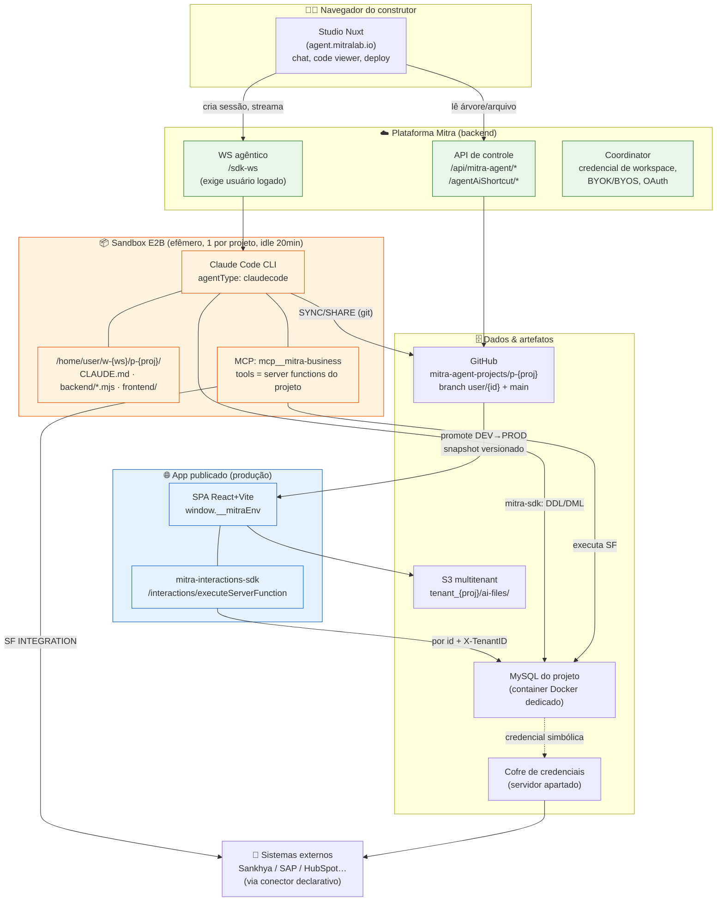
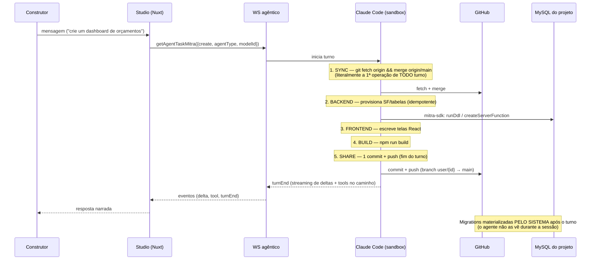

# Mitra — Referência Técnica (visão geral)

> **Propósito desta pasta.** Documentação técnica de engenharia reversa da plataforma **Mitra**
> (`agent.mitralab.io` — app-builder brasileiro guiado por IA), organizada por assunto para servir
> de **consulta** no desenho do **Conexus** (nossa harness).
>
> Não é o registro de descoberta — esse é [`MITRA-INSPIRATION-MAP.md`](../../research/MITRA-INSPIRATION-MAP.md)
> (v0.9.0, cadeia de evidência congelada). Esta pasta **deriva** dele: reorganiza por tema, adiciona
> diagramas, e termina cada documento com o veredito para o Conexus. Toda afirmação factual aqui
> tem origem rastreável no mapa; quando divergir de uma leitura casual, o mapa prevalece.

## Como esta pasta está organizada

| # | Documento | O que responde |
|---|---|---|
| — | [`DECISION-REGISTER.md`](DECISION-REGISTER.md) | **Comece aqui.** Todos os ~170 vereditos ADOPT/REJECT/OWN num só lugar, com link para a evidência |
| 00 | este arquivo | Mapa macro + glossário + os 7 fatos que você precisa saber antes de tudo |
| 01 | [`01-harness-agentico.md`](01-harness-agentico.md) | Como o agente roda: E2B, Claude Code, `CLAUDE.md`, protocolo de turno, MCP |
| 02 | [`02-registro-artefatos.md`](02-registro-artefatos.md) | O que o agente cria: server functions, dataLoaders, dbActions, os dois SDKs |
| 03 | [`03-camada-dados.md`](03-camada-dados.md) | Onde os dados vivem: MySQL por projeto, migrations, teste, credenciais |
| 04 | [`04-integracao-externa.md`](04-integracao-externa.md) | Como fala com o mundo: conectores declarativos, blueprints, túnel, o caso Sankhya |
| 05 | [`05-ciclo-de-vida.md`](05-ciclo-de-vida.md) | Do build ao ar: git por usuário, SYNC/SHARE, releases, promote DEV→PROD |
| 06 | [`06-runtime-publicado.md`](06-runtime-publicado.md) | O app final: SPA React, `__mitraEnv`, SDK de runtime, login/RBAC, chat-embed |
| 07 | [`07-padrao-de-projeto.md`](07-padrao-de-projeto.md) | Como um projeto real nasce: as 8 fases, docs de planejamento, testes, honestidade |
| 08 | [`08-limites-e-gaps.md`](08-limites-e-gaps.md) | Onde a Mitra falha = onde o Conexus ganha. Todos os REJECT + as apostas OWN |
| 09 | [`09-agente-embarcado.md`](09-agente-embarcado.md) | O agente **dentro** do app publicado (Playground/Generative UI) + protocolo WS capturado ao vivo |

Cada documento temático segue a mesma estrutura:
**O que é → Como funciona (diagrama) → Contratos exatos → Evidência (link do mapa) → Decisão Conexus → Ideias de melhoria.**

---

## Os 7 fatos que definem a Mitra

1. **A harness é o Claude Code CLI**, rodando num sandbox E2B efêmero, um por projeto. Não há
   agente proprietário — a inteligência é o CLI comercial dentro de um envelope da Mitra.
2. **O agente não tem "ferramentas" configuráveis.** As tools do agente **são** as server functions
   do projeto, expostas por um MCP server (`mcp__mitra-business`). Capacidade do agente = artefato
   versionado do projeto.
3. **Existem dois SDKs, com dois níveis de privilégio.** `mitra-sdk` (build) tem DDL/DML; o app
   publicado só recebe `mitra-interactions-sdk`, que só executa artefato registrado por id. **O
   poder mora no build, não no runtime.**
4. **Todo backend é serverless-gerenciado.** Não há `src/` de servidor. O "backend" são scripts Node
   que **provisionam** tabelas e server functions na plataforma, de forma idempotente, e são
   descartados (mas ficam versionados no git).
5. **Cada projeto tem seu próprio banco** (schema MySQL + container Docker), criado no `create`.
   Credenciais de integração ficam num servidor apartado.
6. **A qualidade não vem de um workflow engine.** Vem de quatro coisas empilhadas: um `CLAUDE.md`
   gerado pela plataforma (protocolo de turno rígido), documentos de planejamento versionados que o
   agente relê como memória, o SDK de build privilegiado, e um scaffold/UI-kit byte-idêntico.
7. **Não existe a abstração "Agente".** Nenhuma entidade com identidade, versão, conjunto de tools e
   ciclo de vida próprios. O "agente de negócio" da Mitra é uma convenção montada à mão dentro de
   cada app. **É exatamente aí que o Conexus tem espaço para existir.**

---

## Diagrama macro — os contêineres da plataforma (C4 nível 2)

**Como ler o diagrama:**
- **Laranja** = efêmero (o sandbox some no idle; só o que foi para o GitHub sobrevive).
- **Verde** = privilegiado (build): pode DDL/DML, cria artefatos.
- **Azul** = restrito (runtime): só invoca artefato já registrado, por id.
- A fronteira de segurança é a linha `mitra-sdk` (verde) vs `mitra-interactions-sdk` (azul).

---

## O fluxo de um turno (do "oi" ao deploy)

---

## Glossário

| Termo | Significado |
|---|---|
| **Server Function (SF)** | Unidade de lógica de backend registrada no projeto. Três tipos: `SQL`, `JAVASCRIPT`, `INTEGRATION`. Invocada por id numérico + input. É a única superfície de execução do app. |
| **dataLoader** | Registry irmão da SF, para ingestão (ETL) de fonte externa. |
| **dbAction** | Registry irmão da SF, para operação de dados. `executeDbAction({projectId, dbActionId, input})`. |
| **`mitra-sdk`** | SDK de **build**. Roda no sandbox e dentro de SFs JAVASCRIPT. Privilegiado: DDL, DML, criar/atualizar SF. |
| **`mitra-interactions-sdk`** | SDK de **runtime**. Roda no browser do app publicado. Restrito: só executa artefato registrado. |
| **`mcp__mitra-business`** | O MCP server que expõe as server functions do projeto como tools do agente. A superfície de ação do agente. |
| **Perfil (de IA / de app)** | Unidade de RBAC: define quais tabelas/SFs/telas um grupo pode usar. O RBAC do agente reusa o mesmo Perfil do app. |
| **SYNC / SHARE** | Início e fim obrigatórios de todo turno. SYNC = `git fetch + merge origin/main`. SHARE = 1 commit + push. |
| **Promote** | Publicação DEV→PROD: PROD é um projeto forkado e ligado ao DEV; deploy por snapshot versionado, 12 steps observáveis. |
| **`window.__mitraEnv`** | Config de runtime (apiBaseURL, agentWsUrl) injetada no HTML no momento do publish. |
| **E2B** | Provedor de sandbox cloud onde o Claude Code roda. Um sandbox por projeto, descartado após 20 min idle. |
| **modelId** | String `origem:provider:modelo:esforço`, ex. `subscription:anthropic:claude-fable-5:medium`. |
| **Conexus** | Nossa harness (a ser desenhada). O alvo de todas as decisões deste registro. |

---

## O que fazer com isto

1. Ler o [`DECISION-REGISTER.md`](DECISION-REGISTER.md) inteiro uma vez — é a lista de compras.
2. Para cada área que o Conexus for atacar, abrir o documento temático correspondente: ele tem o
   diagrama, os contratos exatos, e a seção *Ideias de melhoria* onde suas próprias ideias entram.
3. As linhas **OWN** do registro são as apostas do Conexus. As **REJECT** são os requisitos
   negativos. Juntas, elas são o esqueleto do que o Conexus precisa ser para superar a Mitra —
   consolidadas em [`08-limites-e-gaps.md`](08-limites-e-gaps.md).
