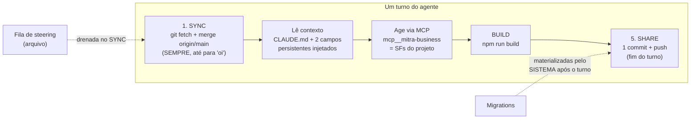
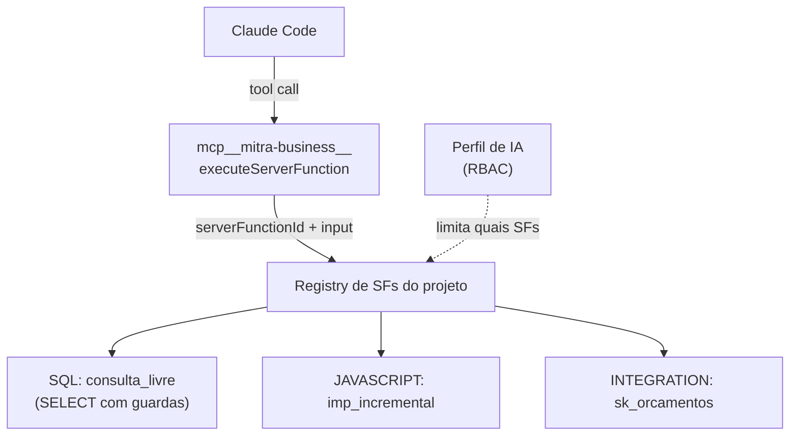

# 01 — Harness agêntico

> Como o agente da Mitra efetivamente roda: onde executa, o que lê, como age, e como um turno é
> disciplinado. Fonte: [§2](../../research/MITRA-INSPIRATION-MAP.md),
> [§20–22](../../research/MITRA-INSPIRATION-MAP.md), [§26](../../research/MITRA-INSPIRATION-MAP.md),
> [§30–31](../../research/MITRA-INSPIRATION-MAP.md), [§34](../../research/MITRA-INSPIRATION-MAP.md).

## O que é

A harness da Mitra **não é um agente proprietário**. É o **Claude Code CLI** (comercial) rodando
dentro de um **sandbox E2B** efêmero, um por projeto, no diretório `/home/user/w-{ws}/p-{proj}/`.
A Mitra não escreveu o loop agêntico — ela envelopou o CLI e o alimenta com contexto, tools e um
protocolo de turno.

`agentType` disponíveis: `claudecode` (default) · `codex` · `opencode-cli` · `opencode-sdk`.
`modelId` é uma string única `origem:provider:modelo:esforço` — ex.
`subscription:anthropic:claude-fable-5:medium`.

## Como funciona



### As três fontes de contexto do agente

1. **`CLAUDE.md`/`AGENTS.md`** — arquivo versionado no repo do projeto, gerado pela plataforma.
   Contém o protocolo de turno (ver abaixo). Precedência de arquivo sobre regra genérica.
2. **Dois campos de texto persistentes** — "Diretrizes para a IA" + "Considerações Adicionais",
   concatenados a **toda** mensagem. É o "system prompt" editável pelo construtor.
3. **Perfil de IA** — o RBAC que limita quais tabelas e server functions o agente pode tocar
   (ver [`02`](02-registro-artefatos.md) e [`06`](06-runtime-publicado.md)).

### O protocolo de turno (do `CLAUDE.md` real do projeto 55833)

Ordem obrigatória, **todo turno, inclusive para "oi" ou "qual a cor X?"**:

```
1. SYNC     git fetch origin && git merge origin/main   ← 1ª operação literal do turno
2. BACKEND  provisiona SF/tabelas (idempotente)
3. FRONTEND escreve telas
4. BUILD    cd frontend && npm run build
5. SHARE    git add -A → 1 commit → push (branch user/{id} → main)
```

Regras críticas capturadas verbatim:
- *"Pular SYNC = mentir sobre o estado real. Pular SHARE = trabalho órfão que some no idle de 20min."*
- **SHARE é UM commit no fim**, não um por arquivo.
- **`AskUserQuestion` deve ser a ÚLTIMA ação da resposta.** Motivo declarado: *"O sistema NÃO
  bloqueia tools posteriores — qualquer ação DEPOIS de `AskUserQuestion` será EXECUTADA no sandbox
  antes da resposta do usuário, gerando trabalho não autorizado e estado divergente."*
- Após **3 tentativas** falhas, PARAR e escalar com dossiê estruturado.
- Conflito de merge → sempre `AskUserQuestion` em linguagem de negócio, nunca resolver sozinho.

> **Correção 2026-08-11 (sonda do [tópico 16](../../conexus/16-sonda-manutencao-mitra.md), OBS-10).**
> Este doc trata a pausa da Mitra como sendo sempre "por prompt, não por mecanismo". São **dois
> regimes distintos na mesma plataforma**: `AskUserQuestion` é mitigação por prompt (o sistema não
> bloqueia tools posteriores), mas **tool approval tem gate mecânico** — componente `.agent-approval`
> com `requestId`, três escopos (`allow_once` / `allow_session` / `deny`) e o input da tool visível
> antes de decidir. O STRENGTHEN do Conexus fica mais preciso: **pôr pergunta no mesmo regime
> mecânico em que a Mitra já pôs aprovação**, não inventar o mecanismo do zero.

### A superfície de ação: MCP, não SQL

O agente **não tem uma tool de SQL genérica**. Suas tools **são** as server functions do projeto,
expostas por um único MCP server por domínio, `mcp__mitra-business__executeServerFunction`.



Consequência de design: **a capacidade do agente é um artefato versionado, revisável e
permissionável** — não uma configuração solta. Para dar uma habilidade nova ao agente, cria-se uma
server function; ela nasce auditável e sob RBAC.

> **Correção 2026-08-11 (OBS-20).** O mapa v0.9.0 afirma duas vezes *"sem `WebSearch`/`WebFetch`
> neste build"*. **Existe acesso à web**: rótulo de tool **"Acessando URL"** observado ao vivo
> buscando `developer.sankhya.com.br/llms.txt` e as páginas de referência do fornecedor — e foi isso
> que permitiu **provar o ambiente sandbox sem emitir uma requisição ao ERP** (OBS-21). A superfície
> de ação continua sendo MCP para dados; web é superfície de **leitura de documentação**. Veredito
> Conexus: **ADOPT com allowlist de domínio**. Detalhe a copiar: o agente procurou o `llms.txt` antes
> de ler a doc — sabe buscar o índice antes do conteúdo.

## Contratos exatos

```js
// Abrir/reabrir sessão (mitra-interactions-sdk, lado do app)
getAgentTaskMitra({ create: true, agentType: 'claudecode', modelId })  // → { taskId }
getAgentTaskMitra({ taskId })                                          // reconecta, inclusive stream ativa

// Eventos do stream
taskCreated | turnStart | delta({delta, kind}) | tool({tool, input}) | turnEnd({content}) | error | statusChange
// (usar SÓ kind === 'text' nos deltas)

// Controle
send() · cancel() · loadHistory()
```

⚠️ Armadilhas documentadas pela própria Mitra (ver [`08`](08-limites-e-gaps.md)):
- O WS agêntico **só aceita usuário logado** (token de integração → "conexão fechada"). **Sem agente
  headless** — mata cron/webhook.
- O `input` do evento `tool` chega **truncado** — a Mitra manda nunca dar `JSON.parse`, extrair por
  regex tolerante. Sintoma de protocolo fraco.

## Evidência

- Harness = Claude Code / E2B: [§2](../../research/MITRA-INSPIRATION-MAP.md), [§20](../../research/MITRA-INSPIRATION-MAP.md), [§21](../../research/MITRA-INSPIRATION-MAP.md)
- Protocolo de turno / `CLAUDE.md`: [§34.10](../../research/MITRA-INSPIRATION-MAP.md)
- MCP como superfície de tools: [§31.2](../../research/MITRA-INSPIRATION-MAP.md)
- Contexto injetado (2 campos + Perfil): [§31.3–31.5](../../research/MITRA-INSPIRATION-MAP.md)
- Sessão/eventos/streaming: [§16.5](../../research/MITRA-INSPIRATION-MAP.md), [§20](../../research/MITRA-INSPIRATION-MAP.md), [§26](../../research/MITRA-INSPIRATION-MAP.md)

## Decisão Conexus

| Padrão | Veredito |
|---|---|
| Tools do agente = server functions via MCP | **ADOPT** — melhor decisão da Mitra |
| Um MCP server por domínio | **ADOPT** |
| Sem SQL direto p/ o agente de negócio | **ADOPT** (guarda-corpo) |
| `CLAUDE.md` por projeto como contexto versionado | **ADOPT** |
| Steering por fila em arquivo, drenada no SYNC | **ADOPT** |
| `taskId` = sessão contínua sem limite de turnos | ADOPT |
| Telemetria de token por turno **e** sessão | ADOPT |
| `AskUserQuestion` encerra o turno (mitigação por prompt) | **REFERENCE + STRENGTHEN** → bloqueio mecânico |
| Tool approval **com** gate mecânico, 3 escopos, input visível (OBS-10) | **ADOPT** — é o modelo que a pergunta deve seguir |
| Acesso à web para doc oficial do fornecedor (OBS-20) | **ADOPT** com allowlist de domínio |
| Compactação delegada ao CLI, sem expor estado ao usuário | ADAPT |
| WS exige usuário logado (sem headless) | **REJECT → OWN** (agente por evento) |
| `input` de tool truncado / `loadHistory` texto cru | **REJECT** (protocolo íntegro, histórico tipado) |
| **Não existe entidade "Agente"** de 1ª classe | **OWN** — a aposta central do Conexus |

## Ideias de melhoria (Conexus)

- **Agente como objeto de 1ª classe**: identidade, versão, conjunto de tools declarado, política e
  ciclo de vida próprios — versionado. A Mitra tem os primitivos (MCP, RBAC de tools, contexto
  persistente, sessão embarcável) mas **não a abstração**. É onde diferenciamos. → [`08`](08-limites-e-gaps.md)
- **Contexto em camadas**: plataforma → projeto → agente → tarefa. A Mitra tem contexto único por
  projeto.
- **Carregamento de contexto determinístico no harness**, não um pedido ao modelo: se o arquivo
  existe no path convencionado, ele entra. (A Mitra admite que a leitura do `CLAUDE.md` "não é
  garantida" — ver [`08`](08-limites-e-gaps.md).)
- **Bloqueio mecânico** para o problema do `AskUserQuestion`, em vez de instrução no prompt.
- **Agente headless com identidade de serviço** para cron/webhook/evento — o que o WS logado-only
  da Mitra impede.
- **_(seu espaço para ideias)_**
