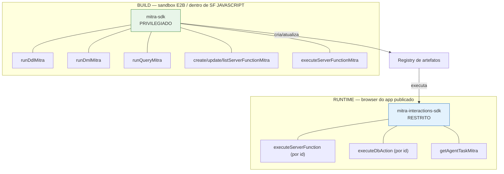

# 02 — Registro de artefatos (server functions)

> O que o agente cria e como o app o consome. É o núcleo técnico da Mitra. Fonte:
> [§21](../../research/MITRA-INSPIRATION-MAP.md), [§23](../../research/MITRA-INSPIRATION-MAP.md),
> [§32.3](../../research/MITRA-INSPIRATION-MAP.md), [§34](../../research/MITRA-INSPIRATION-MAP.md).

## O que é

O backend de um app Mitra não tem servidor próprio. Tem um **registro de artefatos executáveis**,
todos endereçados por **id numérico + input**. Três registries irmãos:

| Registry | Papel | Assinatura de runtime |
|---|---|---|
| **`serverFunction`** | lógica (query, job, chamada externa) | `executeServerFunction({projectId, serverFunctionId, input})` |
| **`dataLoader`** | ingestão / ETL de fonte externa | (id + input) |
| **`dbAction`** | operação de dados | `executeDbAction({projectId, dbActionId, input})` |

Server function tem **três tipos**, e é aqui que mora a maior inconsistência da plataforma:

| Tipo | O `code` é… | Binding de parâmetro |
|---|---|---|
| `SQL` | uma string SQL com `{{x}}` | `{{x}}` mustache, **sempre entre aspas** |
| `JAVASCRIPT` | um script Node (com `require('mitra-sdk')`) | `event.x` como variável global |
| `INTEGRATION` | um **JSON** `{connection, method, endpoint, body}` | `event.x` textual dentro da string |

**Nenhum dos três é bind parameter de verdade — todos são interpolação de string.** Ver
[`08-limites-e-gaps.md`](08-limites-e-gaps.md) para o risco de injeção.

## Como funciona

### Os dois SDKs — a fronteira de privilégio



> **O poder mora no build, não no runtime.** O agente tem DDL/DML arbitrário porque fala pela API
> autenticada com `MITRA_TOKEN` + `MITRA_PROJECT_ID` — **nunca vê a senha do banco**, e o escopo
> é garantido do lado do servidor. O app publicado só recebe o SDK restrito.

### Provisionamento idempotente — "o script é a versão"

Como as SFs **não são versionadas** pela plataforma (mudança vale na hora, ver
[`03`](03-camada-dados.md)), o agente resolve versionamento com um **script idempotente** que
recria o estado:

```js
const existentes = await listServerFunctionsMitra({ projectId });
const mapa = {}; for (const sf of existentes) mapa[sf.name] = sf.id;

for (const def of TODAS) {
  if (mapa[def.name])  await updateServerFunctionMitra({ projectId, serverFunctionId: mapa[def.name], code: def.code, ... });
  else                 await createServerFunctionMitra({ projectId, ...def });
}
```

Propriedades: idempotência por **`name`** (id é detalhe), DDL sempre `CREATE TABLE IF NOT EXISTS`,
e aditividade declarada no cabeçalho do arquivo (`add-analytics.mjs`: *"NAO executa DDL, NAO toca em
dados, NAO altera as SFs de importacao"*).

### O elo `sf-ids.ts` — codegen para contornar a plataforma

O SDK "não expõe variáveis", então o script **gera** um arquivo TS mapeando nome→id para o frontend:

```js
writeFileSync('../frontend/src/lib/sf-ids.ts',
  '// GERADO — nao editar a mao\nexport const SF = ' + JSON.stringify(ids, null, 2) + ' as const;\n');
```

Resultado: `{ "sk_vendedores": 2, … "dash_kpis": 13, … "int_cobertura": 40 }`. **Isto é uma
gambiarra forçada pela API de ids numéricos** — ver decisão abaixo.

### Composição analítica — fragmentos SQL nomeados

As 28 SFs analíticas não são 28 queries escritas à mão. São constantes compostas:

```js
const DIAS_PARADO = `DATEDIFF(CURDATE(), o.DTALTER)`;
const FAIXA = `CASE WHEN ${DIAS_PARADO} <= 3 THEN 'Janela de ouro' … END`;
const BASE  = `FROM ORCAMENTOS o JOIN … WHERE o.PENDENTE='S' AND o.TEM_DERIVADO='N'`;
const fVend = `AND ('{{vendedor}}'='' OR o.CODVEND='{{vendedor}}')`;
// dash_por_vendedor recebe fCli, fFaixa, fMes — MAS NÃO fVend
```

Duas regras de ouro:
- **"A SF de X nunca recebe o próprio `{{x}}`"** → clicar num vendedor filtra os outros gráficos
  sem apagar o próprio. Cross-filter de BI inteiro resolvido em uma linha.
- **Contrato de coluna `name` / `value` / `code`** → um `Chart.tsx` genérico consome qualquer SF de
  gráfico sem adaptador; `code` carrega a chave para o drill.

### Parâmetro opcional — o idioma da ausência de bind

```sql
AND ('{{vendedor}}'='' OR o.CODVEND='{{vendedor}}')
```

Uma SF serve filtrada e não-filtrada; o frontend sempre manda todas as chaves, vazias quando não
aplicáveis.

## Contratos exatos

```js
// Runtime (app) — envelope de resposta
executeServerFunction({ projectId, serverFunctionId, input })
// → { result: { executionId, executionStatus: 'SUCCESS'|'FAILED', error?, output: { rowCount, rows } } }
executeDbAction({ projectId, dbActionId, input })
executeServerFunctionAsync(...) ; stopServerFunctionExecution(...)   // execução longa cancelável

// Normalizador defensivo real (o output vem em 3 formas: string JSON / {result:[]} / objeto)
function extractOutput(res) {
  let o = res?.result?.output;
  if (typeof o === 'string') { try { o = JSON.parse(o); } catch {} }
  if (o && Array.isArray(o.result)) return o.result;
  return o;
}
```

## Evidência

- Três registries + envelope: [§32.3](../../research/MITRA-INSPIRATION-MAP.md), [§33](../../research/MITRA-INSPIRATION-MAP.md)
- Dois SDKs: [§34.1](../../research/MITRA-INSPIRATION-MAP.md)
- Provisionamento idempotente + `sf-ids.ts`: [§21](../../research/MITRA-INSPIRATION-MAP.md), [§34.3](../../research/MITRA-INSPIRATION-MAP.md)
- Três sintaxes de binding: [§34.4](../../research/MITRA-INSPIRATION-MAP.md)
- Fragmentos SQL + cross-filter: [§34.7](../../research/MITRA-INSPIRATION-MAP.md)
- Normalizador de output: [§34.8](../../research/MITRA-INSPIRATION-MAP.md)

## Decisão Conexus

| Padrão | Veredito |
|---|---|
| Três registries por id + input; nenhum SQL do cliente | **ADOPT** |
| Envelope `{executionId, executionStatus, output}` | **ADOPT** (auditoria de graça) |
| Async + stop de execução | **ADOPT** |
| Dois SDKs (build privilegiado / runtime restrito) | **ADOPT** (arquitetura central) |
| Provisionamento idempotente por `name` | **ADOPT** |
| Fragmentos SQL + "X nunca filtra X" + contrato `name/value/code` | **ADOPT** |
| Upsert em chunk + cursor derivado (ver [`04`](04-integracao-externa.md)) | **ADOPT** |
| `serverFunctionId` numérico no cliente → `sf-ids.ts` gerado | **REJECT** → slug estável |
| Três sintaxes de binding | **REJECT** → uma só |
| SQL por interpolação + regex-sanitize no cliente | **REJECT** → bind params reais |
| Código de job como string em template literal | **REJECT** → arquivo real |

## Ideias de melhoria (Conexus)

- **Chave natural desde o dia 1**: se a API expusesse `callFunction('dash_kpis')`, o `sf-ids.ts` não
  existiria. Artefatos endereçáveis por slug estável, nunca por id auto-incremento — some com o
  remapeamento manual em cada promote/duplicação.
- **Uma sintaxe de binding, com bind params reais**. Parâmetro opcional vira `(:vendedor IS NULL OR
  col = :vendedor)` — mesmo idioma, **sem** superfície de injeção.
- **Código de job é arquivo de verdade**, não string de template literal (a própria Mitra documenta
  a armadilha do `\s` que vira `s`).
- **Versionamento nativo de artefato** no harness, para o script idempotente deixar de ser
  necessário como muleta de versão.
- Manter o **contrato de coluna `name/value/code`** e a **regra do cross-filter** como convenção de
  primeira classe do nosso layer de visualização.
- **_(seu espaço para ideias)_**
