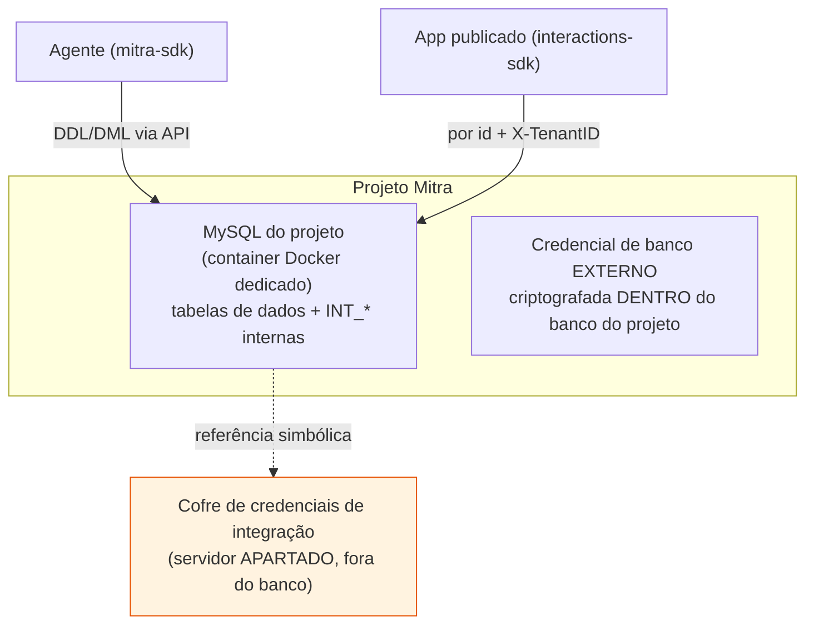
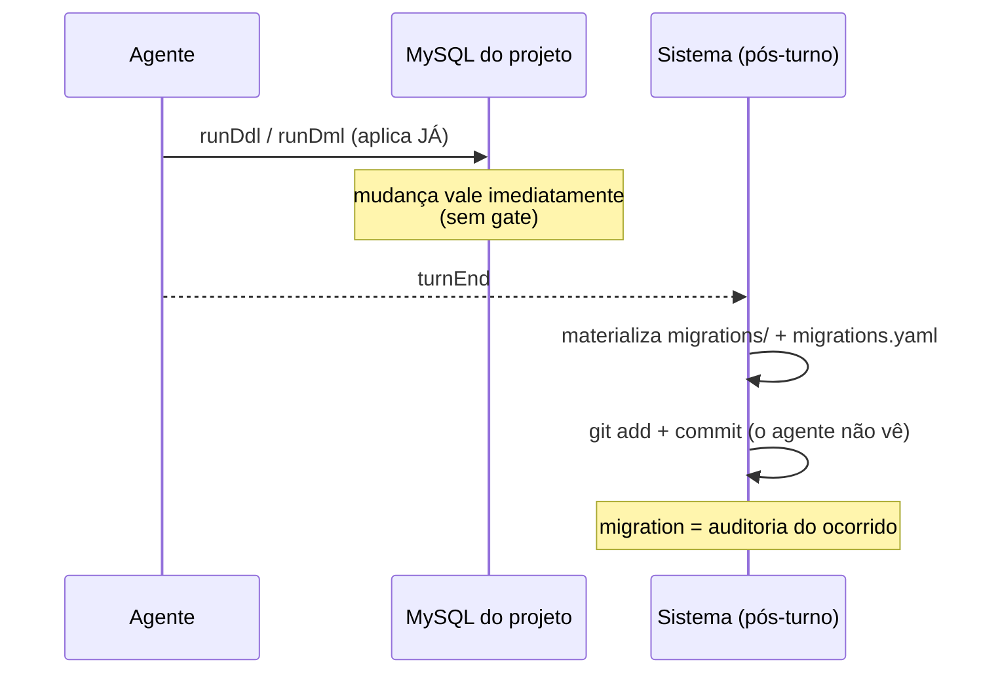

# 03 — Camada de dados

> Onde os dados do projeto vivem, como o schema evolui, e por que a ausência de ambiente de teste é
> o maior risco da plataforma. Fonte: [§26–27](../../research/MITRA-INSPIRATION-MAP.md),
> [§33](../../research/MITRA-INSPIRATION-MAP.md), [§34](../../research/MITRA-INSPIRATION-MAP.md).

## O que é

Cada projeto Mitra tem **seu próprio banco**: um schema MySQL num container Docker dedicado,
provisionado automaticamente no `create` do projeto. O agente fala com esse banco pela API da
plataforma (via `mitra-sdk`), nunca com a senha na mão.



Dois lugares de segredo — e uma inconsistência:
- Credenciais de **integração** (Sankhya, SAP…) ficam num **servidor apartado**. ✔️ separação limpa.
- Credencial de **banco externo** fica **criptografada dentro do próprio banco do projeto**. ⚠️
  inconsistente com a regra acima (ver decisão).

## Como funciona

### Schema a partir de linguagem natural

O agente deriva o schema de uma descrição em linguagem natural e materializa com DDL idempotente
(`CREATE TABLE IF NOT EXISTS`). Detalhe de robustez real: injeta **placeholders de FK** para dado
sujo da origem —

```js
// placeholders para CODVEND=0 / CODPARC=0 (existem no Sankhya) — evita quebra de FK
INSERT INTO VENDEDORES VALUES (0,'SEM VENDEDOR','-','N') ON DUPLICATE KEY UPDATE …
```

### Migrations = log de auditoria, não gate de deploy

Ponto sutil e importante (do `CLAUDE.md` real):

- As migrations são **append-only**.
- O **sistema** materializa e commita `backend/migrations/` + `backend/migrations.yaml`
  **ele mesmo, depois que o turno termina** — o agente **não as vê durante a sessão** e nunca as
  cria/edita/`git add`.
- Ou seja: no fluxo observado, a migration é **registro do que já aconteceu**, não um portão que
  precisa passar antes de aplicar. **O banco e as SFs mudam na hora.**



### Sem ambiente de teste — o banco de DEV é o banco

Não há base de teste separada por padrão. Consequência direta: **o "teste" do projeto é um smoke
test contra dados reais** (`testar-sfs.mjs` roda 31 chamadas de SF). Só é seguro porque as 28 SFs
analíticas são `SELECT`. Uma SF destrutiva rodada "em dev" atingiria produção. É o maior risco
operacional da plataforma. Ver [`08`](08-limites-e-gaps.md).

### O conflito de fontes não resolvido (DEV vs PROD)

O mapa deixa isto explicitamente em aberto:
- **§27** (engenharia reversa): PROD é um projeto forkado, com **seu próprio banco** e migrations.
- **Doc oficial da Mitra**: *"o banco de dados e as Server Functions são os mesmos nos dois"*.

As duas fontes se contradizem. O mapa **não escolheu** a versão conveniente — registrou ambas e
marcou como o **único conflito de fontes não resolvido**, que só um promote real observado decide.
→ [§33.3](../../research/MITRA-INSPIRATION-MAP.md). Tratado como **SPIKE**.

## Contratos exatos

```js
// build (mitra-sdk) — as operações de dados privilegiadas
runDdlMitra({ projectId, sql })       // CREATE TABLE …
runDmlMitra({ projectId, sql })       // INSERT … ON DUPLICATE KEY UPDATE
runQueryMitra({ projectId, sql })     // SELECT (usado p/ cursor incremental)
```

Modelo de dados típico (projeto de orçamentos): tabelas de negócio normalizadas
(`ORCAMENTOS`, `ORCAMENTO_ITENS`, `CLIENTES`, `VENDEDORES`, `PRODUTOS`, `ESTOQUE`) + `LOG_IMPORTACOES`
para instrumentação. Tabelas nativas `INT_*` = log de ações da plataforma dentro do próprio banco.

## Evidência

- Um banco + container por projeto: [§33](../../research/MITRA-INSPIRATION-MAP.md)
- Migrations como audit log: [§33](../../research/MITRA-INSPIRATION-MAP.md), [§34.3](../../research/MITRA-INSPIRATION-MAP.md)
- Sem ambiente de teste / smoke em produção: [§33](../../research/MITRA-INSPIRATION-MAP.md), [§34.9](../../research/MITRA-INSPIRATION-MAP.md)
- Conflito DEV/PROD: [§27](../../research/MITRA-INSPIRATION-MAP.md), [§33.3](../../research/MITRA-INSPIRATION-MAP.md)
- Credenciais apartadas vs criptografadas no banco: [§33](../../research/MITRA-INSPIRATION-MAP.md)

## Decisão Conexus

| Padrão | Veredito |
|---|---|
| Um schema + container Docker por projeto no create | **ADOPT** (isolamento por padrão) |
| Credenciais de integração em servidor apartado | **ADOPT** (copiar exatamente) |
| Backend serverless (só SFs, sem `src/`) | ADOPT |
| Migrations append-only materializadas pelo sistema | ADOPT (princípio) |
| Placeholders de FK p/ dado sujo | ADOPT |
| Schema a partir de linguagem natural | ADAPT (revisão humana antes de produção) |
| Credencial de banco externo criptografada no banco do projeto | ADAPT (preferir cofre único) |
| **Sem ambiente de teste de dados** | **REJECT** → efêmero + fixtures |
| **Banco/SFs não versionados; mudança na hora** | **REJECT** → migration como gate |
| Smoke test contra produção | **REJECT** → asserção de valor em base efêmera |
| Conflito DEV/PROD | **SPIKE** (resolver com promote observado) |

## Ideias de melhoria (Conexus)

- **Ambiente de dados efêmero por tarefa** + **fixtures**: o gap mais claro para superar a Mitra. O
  teste deixa de ser "não explodiu contra produção" e passa a ser **asserção de valor** contra dado
  controlado (`pendentes == 187`, não `query rodou`).
- **Migration como gate**, não como log pós-fato: schema só evolui por migration validada, com
  dry-run **antes** do deploy (ver [`05`](05-ciclo-de-vida.md)).
- **Cofre único** para todo segredo — sem a exceção "criptografado dentro do banco do projeto".
- **UTF-8 fim a fim, não negociável** (o projeto real teve que guardar `Reativacao` sem acento e
  traduzir na borda; ver [`06`](06-runtime-publicado.md)).
- **_(seu espaço para ideias)_**
