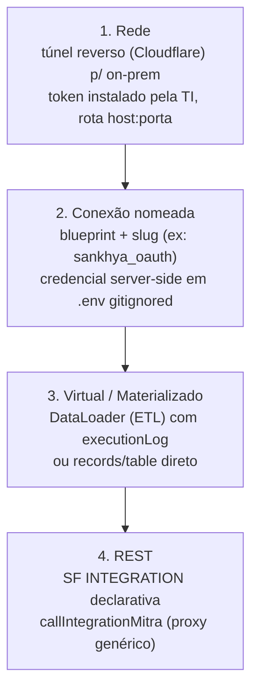

# 04 — Integração externa

> Como um app Mitra fala com sistemas de fora (ERP, SaaS, on-prem) sem nunca expor credencial. Fonte:
> [§12](../../research/MITRA-INSPIRATION-MAP.md), [§15–16](../../research/MITRA-INSPIRATION-MAP.md),
> [§25](../../research/MITRA-INSPIRATION-MAP.md), [§34.5–34.6](../../research/MITRA-INSPIRATION-MAP.md).

## O que é

Integração externa na Mitra é **declarativa**. Uma SF do tipo `INTEGRATION` não é código — é um JSON
que descreve *o que* chamar, referenciando a credencial por **nome simbólico**. A credencial real
vive no servidor; nem o repositório nem o cliente a veem.

```js
// O "code" de uma SF INTEGRATION é isto — um JSON, não um script:
{
  connection: 'sankhya',                 // ← handle simbólico; a credencial fica no servidor
  method: 'POST',
  endpoint: '/gateway/v1/mge/service.sbr?serviceName=DbExplorerSP.executeQuery&outputType=json',
  body: { serviceName: 'DbExplorerSP.executeQuery', requestBody: { sql } },
}
```

Por isso o repositório do projeto é **público-safe**: `connection: 'sankhya'` não revela nada.

## Como funciona

### As 4 camadas de acesso a dado externo



### Blueprint de conector — formulário gerado do schema

Uma conexão nasce de um **blueprint** versionado com `fieldsSchema` (gera o formulário de credencial
dinamicamente) + `testEndpoint` (teste de conexão padrão). Autorização é uma **union fechada**:
`header | basic | cookie | query` + `DYNAMIC_TOKEN` (token-refresh server-side). Cobre ~95% dos SaaS.

O catálogo real observado inclui Gmail, Google Calendar, HubSpot, SAP, Supabase, além de `custom`
(blueprint próprio) e `CSV` (upload como tipo de conexão).

### Data Discovery — o antídoto ao "inventar regra"

O padrão mais valioso desta área: antes de codar, o agente **consulta o dado real por SQL** para
validar hipóteses de escopo. No projeto de orçamentos isso derrubou três suposições:

- `Orçamento = CODTIPOPER IN (14,714)` (e não o `TGFTOP.ORCAMENTO='S'`, que estava mal configurado).
- `VLRCUS` **não é custo** em 94,8% dos itens → margem não é calculável → feature cancelada com o
  número que prova.
- Pendente = `PENDENTE='S'` sem derivado em `TGFVAR` → 187 orçamentos / R$ 6.283.878.

É o estágio-2 (build) **auditando** o estágio-1 (escopo) contra a fonte real. Ver [`07`](07-padrao-de-projeto.md).

### O caso Sankhya — paginação e upsert (SF JAVASCRIPT)

O gateway do ERP corta em 5.000 linhas/chamada. A SF de importação contorna com um helper de
paginação-até-esgotar (com teto de segurança), upsert em chunk e cursor incremental derivado do
próprio dado:

```js
async function fetchAll(sfId, baseInput) {          // lê todas as páginas
  const todas = []; let offset = 0;
  for (;;) {
    const rows = await fetchPage(sfId, {...baseInput, offset, limite: PAGE});
    todas.push(...rows);
    if (rows.length < PAGE) break;
    offset += PAGE;
    if (offset > 400000) throw new Error('Paginacao excedeu o teto de seguranca');
  }
  return todas;
}
// cursor sem estado externo: SELECT MAX(DTALTER) do próprio espelho, recuado 1h
```

Toda importação grava em `LOG_IMPORTACOES` com `ETAPAS_JSON`, `DURACAO_MS`, `PARAMETROS` e erro
truncado — sucesso **e** falha, antes de re-lançar.

## Contratos exatos

```js
// build — provisiona a SF INTEGRATION
createServerFunctionMitra({ projectId, name, type: 'INTEGRATION',
  code: JSON.stringify({ connection, method, endpoint, body }), description })

// runtime — proxy REST genérico (a credencial fica no servidor)
callIntegrationMitra({ ... })

// on-prem — túnel gerenciado
// cloudflared com token copiável na UI; 4 níveis: túnel → rota → jdbc → dataset
```

## Evidência

- SF INTEGRATION declarativa: [§34.5](../../research/MITRA-INSPIRATION-MAP.md)
- `callIntegrationMitra` / proxy: [§12](../../research/MITRA-INSPIRATION-MAP.md)
- Blueprint / `fieldsSchema` / `AuthorizationConfig`: [§16.2](../../research/MITRA-INSPIRATION-MAP.md), [§25](../../research/MITRA-INSPIRATION-MAP.md)
- Data Discovery por SQL: [§14.1](../../research/MITRA-INSPIRATION-MAP.md), [§15](../../research/MITRA-INSPIRATION-MAP.md)
- Túnel on-prem 4 níveis: [§18](../../research/MITRA-INSPIRATION-MAP.md), [§25](../../research/MITRA-INSPIRATION-MAP.md)
- Paginação/upsert/cursor Sankhya: [§34.6](../../research/MITRA-INSPIRATION-MAP.md)

## Decisão Conexus

| Padrão | Veredito |
|---|---|
| SF INTEGRATION declarativa + credencial simbólica | **ADOPT** |
| `callIntegrationMitra` (app nunca vê credencial) | ADOPT (princípio) |
| Blueprint + `fieldsSchema` + `testEndpoint` | ADOPT |
| Union fechada de auth + `DYNAMIC_TOKEN` | ADOPT |
| Data Discovery por SQL antes de codar | **ADOPT (forte)** |
| 4 camadas rede→conexão→virtual→REST | ADOPT |
| Túnel reverso gerenciado p/ on-prem | ADOPT |
| CSV como tipo de conexão | ADOPT |
| Paginação com teto + upsert em chunk + cursor derivado + log por etapa | **ADOPT** |
| Perfil de ERP plugável (TGFCAB, `AD_`…) | REFERENCE |
| Gateway com SQL livre em produção | ADAPT (read-only + allowlist por perfil) |
| Credencial de produção colada no chat; 1 token → 6 empresas | **REJECT** → canal dedicado, escopo por empresa |
| Chave de LLM no cliente / SF pública com segredo | **REJECT** |

## Ideias de melhoria (Conexus)

- **Dispatch multicanal como capability de 1ª classe** (e-mail nativo existe; WhatsApp/SMS ausentes
  na Mitra) — diferenciação clara.
- **Perfil de ERP versionado e plugável** (Sankhya, depois Protheus/SAP): conhecimento de domínio
  como dado, não hardcoded no agente.
- **SQL livre só em Discovery, com trava**: read-only forçado + allowlist de tabelas/schema por
  perfil. Nunca SQL livre contra produção.
- **Canal de credencial dedicado** com escopo por empresa e seleção explícita de ambiente — o
  oposto do "cola o token de produção no chat".
- Reaproveitar o **helper de paginação/upsert/cursor** como biblioteca do harness, não como código
  gerado por template literal.
- **_(seu espaço para ideias)_**
