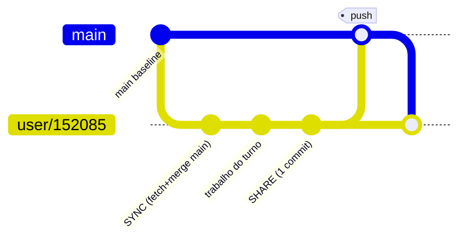
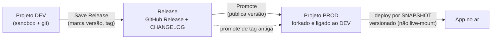

# 05 — Ciclo de vida (build → release → promote)

> Como o trabalho vai do sandbox efêmero ao app no ar, e como múltiplos construtores colaboram sem
> se atropelar. Fonte: [§24](../../research/MITRA-INSPIRATION-MAP.md),
> [§27–28](../../research/MITRA-INSPIRATION-MAP.md), [§34 (CLAUDE.md)](../../research/MITRA-INSPIRATION-MAP.md).

## O que é

O git é a espinha do ciclo de vida. Cada construtor trabalha num branch próprio; `main` é a baseline
compartilhada. O sandbox é descartável — **só o que foi para o GitHub sobrevive**. Publicação é um
**promote** de DEV para um projeto PROD separado, por snapshot versionado.

## Como funciona

### Colaboração — branch por usuário, SYNC/SHARE por turno



Sequência exata do SHARE (do `CLAUDE.md` real):

```
git add -A -- . ':(exclude)backend/migrations' ':(exclude)backend/migrations.yaml'
git commit -m "tipo: descrição"          # feat/fix/refactor/style/chore, em pt-BR
git checkout main
git pull --no-rebase origin main
git merge user/152085 --no-edit
git push origin main
git checkout user/152085
git merge main --no-edit
```

Regras: nunca `--force`, nunca `--rebase`, nunca deletar branch remoto. Conflito → `AskUserQuestion`
em linguagem de negócio, nunca resolver sozinho. Sandbox descartado após **20 min idle** → *"pular
SHARE = trabalho órfão que some no idle"*.

### Publicação — promote DEV→PROD



Características-chave:
- **PROD é um projeto forkado**, não uma flag "modo prod". Isolamento real de ambiente.
- **Save Release desacoplado de Promote**: marcar versão ≠ publicar versão.
- **12 steps nomeados e observáveis** no status do promote.
- **Rollback** = promote de uma tag antiga (código, não schema — coerente com migrations
  forward-only).
- **Falha de deploy vira tarefa do agente** ("Resolve with the agent") — fecha o loop
  agente↔operação.
- Status do app: `inSync / hasOutput / published / version` → UX clara de "há mudanças não
  publicadas".

### Baseline / scaffold — o piso de qualidade

Arquivos do UI-kit (`Chart.tsx`, `LoginPage.tsx`, `useDrill.ts`, `Button.tsx`, `useHighlight.ts`)
são **byte-idênticos entre projetos diferentes** — evidência de um template versionado que o agente
**não** autora. `mergeMitraPackageBaseline` atualiza o template upstream depois do fork.

## Contratos exatos

```
# code viewer (lê GitHub, NÃO o sandbox)
GET /api/mitra-agent/github-files/{ws}/{proj}                 → { files: [] }   (árvore, ?ref)
GET /api/mitra-agent/github-files/{ws}/{proj}/content         ?path=&ref=  (texto)
GET /api/mitra-agent/github-files/{ws}/{proj}/releases
GET /api/mitra-agent/github-files/{ws}/{proj}/release-tree?version=
GET /api/mitra-agent/github-files/{ws}/{proj}/release-content?version=&path=

# git ops
GET  /api/e2b-git/{ws}/{proj}/metadata   → { currentBranch, branches }   ⚠️ morto neste deploy
POST /api/e2b-git/{ws}/{proj}/checkout   { branch, createNew }
GET  /api/e2b-git/{ws}/{proj}/log?limit=                                  ⚠️ morto neste deploy
```

## Evidência

- SYNC/SHARE, branch por usuário, 20min idle: [§34 (CLAUDE.md)](../../research/MITRA-INSPIRATION-MAP.md)
- Promote / releases / 12 steps / rollback: [§27](../../research/MITRA-INSPIRATION-MAP.md)
- Deploy por snapshot / status de publicação: [§24](../../research/MITRA-INSPIRATION-MAP.md)
- Baseline byte-idêntico / `mergeMitraPackageBaseline`: [§21](../../research/MITRA-INSPIRATION-MAP.md), [§27](../../research/MITRA-INSPIRATION-MAP.md), [§34.2](../../research/MITRA-INSPIRATION-MAP.md)
- Painel de Git morto / code viewer lê GitHub: [§34.12](../../research/MITRA-INSPIRATION-MAP.md)

## Decisão Conexus

| Padrão | Veredito |
|---|---|
| Branch `user/{id}` + `main` baseline; SYNC/SHARE por turno | ADOPT |
| PROD como projeto forkado ligado ao DEV | **ADOPT** |
| 12 steps nomeados e observáveis | **ADOPT** |
| Falha de deploy vira tarefa do agente | **ADOPT** |
| Save Release desacoplado de Promote | ADOPT |
| Rollback por promote de tag antiga | ADOPT |
| GitHub Release + CHANGELOG automáticos | ADOPT |
| Deploy por snapshot versionado (não live-mount) | ADOPT |
| Status `inSync/hasOutput/published` | ADOPT |
| Scaffold/UI-kit byte-idêntico versionado | ADAPT (bom piso, precisa escape hatch) |
| `mergeMitraPackageBaseline` p/ template upstream | REFERENCE |
| Dry-run de migration só dentro do promote | **REJECT** → validar antes |
| `/cancel` que a UI diz não poder cancelar | **REJECT** (contrato inconsistente) |
| Owner/Admin do workspace entra em todo projeto como dev | **REJECT** (privilégio implícito) |
| Painel de Git degradando em silêncio (rota devolve SPA) | REFERENCE (lição negativa) |

## Ideias de melhoria (Conexus)

- **Dry-run de migration ANTES do deploy**, não dentro dele. Descobrir schema quebrado no meio do
  promote é tarde.
- **Privilégio explícito e auditável** — nada de Owner de workspace entrando como dev em todo
  projeto por padrão.
- **Baseline com escape hatch**: o scaffold rico é uma alavanca de qualidade real (o agente herda
  boas decisões), mas o projeto precisa poder divergir do template de forma versionada.
- **Rota crítica nunca degrada em silêncio**: se o painel de git não pode responder, a UI diz
  "indisponível", não finge lista vazia (ver [`06`](06-runtime-publicado.md) e [`08`](08-limites-e-gaps.md)).
- **_(seu espaço para ideias)_**
