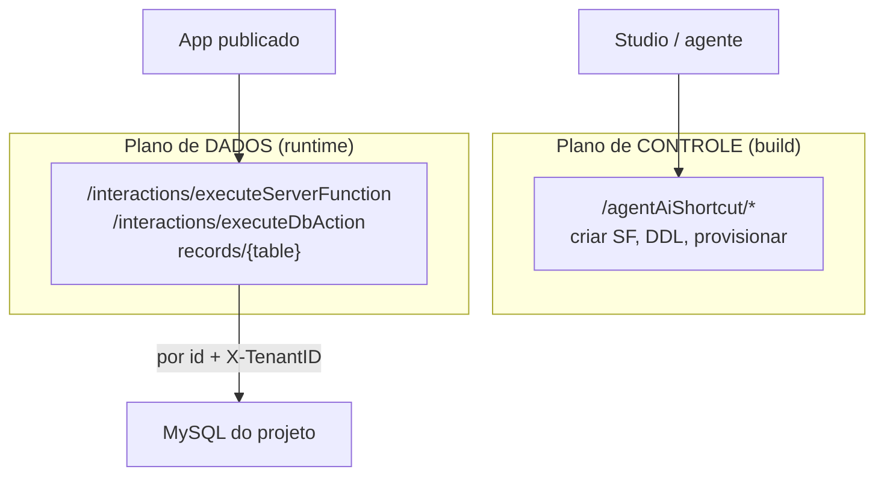
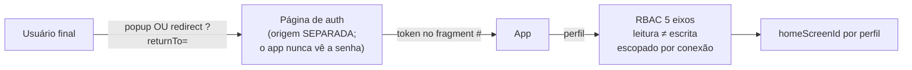
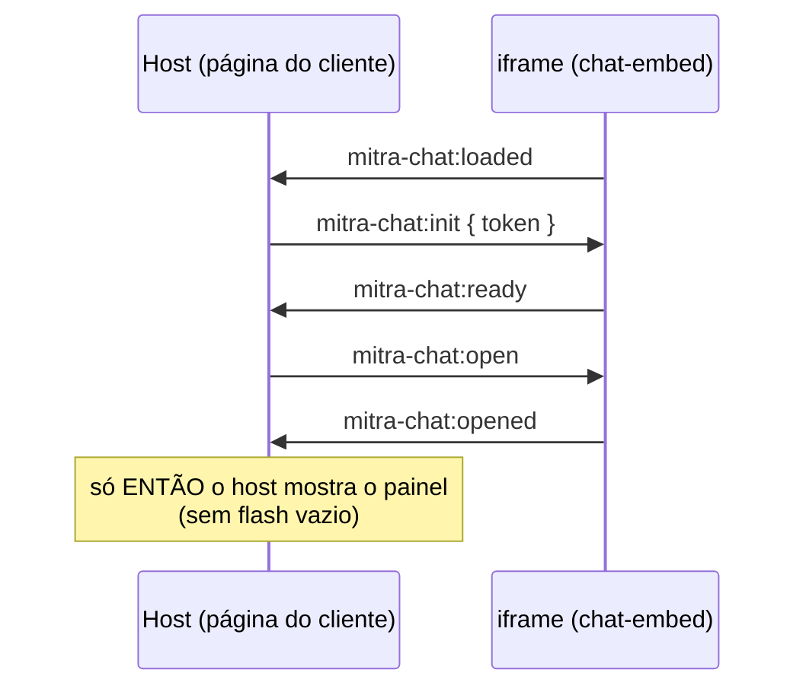

# 06 — Runtime publicado

> O que o usuário final recebe: o app React no ar, como ele autentica, como fala com o backend, e
> como o chat de IA se embute em qualquer página. Fonte:
> [§20](../../research/MITRA-INSPIRATION-MAP.md), [§29](../../research/MITRA-INSPIRATION-MAP.md),
> [§32](../../research/MITRA-INSPIRATION-MAP.md), [§34.8](../../research/MITRA-INSPIRATION-MAP.md).

## O que é

O app publicado é uma **SPA React + Vite** (não Nuxt — o studio é Nuxt; o runtime é outra stack). No
momento do publish, a plataforma injeta `window.__mitraEnv` no HTML com a config de ambiente. O app
só recebe o **SDK restrito** (`mitra-interactions-sdk`) e só executa artefato por id.

```html
<script>window.__mitraEnv={
  "apiBaseURL":"https://api2.mitrasheet.com:4133",
  "agentWsUrl":"wss://mitra-agent-websocket-production.up.railway.app/sdk-ws"
};</script>
```

## Como funciona

### Dois planos de API



- **`/interactions/executeServerFunction`** é o que o app realmente usa; header `X-TenantID` por
  request.
- **`records/{table}`** dá CRUD tabular genérico com filtro/paginação server-side.
- Envelope de resposta e normalizador defensivo: ver [`02`](02-registro-artefatos.md).

### Login e RBAC do app (usuário final ≠ construtor)



- **Self-signup** com código de 6 dígitos por projeto — contas próprias sem convite manual.
- **RBAC em 5 eixos**, leitura separada de escrita, escopado por conexão; **administrável via SDK em
  runtime** (o agente provisiona RBAC por código). É o **mesmo Perfil** que limita o agente ([`01`](01-harness-agentico.md)).
- Token vive no fragment `#`, limpo via `replaceState` (não vaza em referrer/log). Refresh
  silencioso por iframe invisível (frágil com cookies 3rd-party — ver decisão).

### Chat-embed — IA em qualquer página, via postMessage

O chat da plataforma se embute como iframe controlado por um handshake de estado — sem `setTimeout`:



Layout responsivo por **razão**, não por breakpoint fixo: `W=480, PUSH_RATIO=0.4, FULL_RATIO=0.75`
→ modos push (app encolhe) / overlay / full. `window.__mitraChat = { init, open, close, isOpen, isReady }`.

### Armazenamento — S3 multitenant

`mitra-multitenant-prod/tenant_{projectId}/ai-files/public/…` — prefixo por tenant + sufixo único no
nome do arquivo. `/public/` é legível sem URL assinada (ver decisão).

### Uma disciplina que vale ouro

O `api.ts` real isola cada defeito da plataforma num ponto de borda **com o porquê comentado**:

```ts
/** O banco não aceita acentos nesse rótulo; a interface exibe acentuado. */
export const rotuloFaixa = (nome) => nome === 'Reativacao' ? 'Reativação' : nome;
```

## Contratos exatos

```js
// runtime SDK
executeServerFunctionMitra({ projectId, serverFunctionId, input })
executeDbAction({ projectId, dbActionId, input })   // POST /interactions/executeDbAction

// embed
window.__mitraChat.init(token) · .open() · .close() · .isOpen · .isReady
// postMessage types: mitra-chat:{loaded|init|ready|open|close|opened|closed}
```

## Evidência

- Dois planos de API / `records`: [§20](../../research/MITRA-INSPIRATION-MAP.md)
- `__mitraEnv` injetado no publish: [§32.1](../../research/MITRA-INSPIRATION-MAP.md)
- Login / RBAC 5 eixos / self-signup: [§29](../../research/MITRA-INSPIRATION-MAP.md)
- Chat-embed handshake / modos: [§32.4](../../research/MITRA-INSPIRATION-MAP.md)
- S3 multitenant: [§32.2](../../research/MITRA-INSPIRATION-MAP.md)
- Normalizador / rótulo sem acento: [§34.8](../../research/MITRA-INSPIRATION-MAP.md)

## Decisão Conexus

| Padrão | Veredito |
|---|---|
| 2 planos: `/agentAiShortcut` (dev) × `/interactions` (runtime) | ADOPT |
| `__mitraEnv` injetado no publish | **ADOPT** |
| `records/{table}` genérico server-side | ADOPT |
| Normalizador defensivo + comentar o defeito | ADOPT (disciplina) |
| Auth em origem separada (app nunca vê senha) | **ADOPT** |
| Popup **e** redirect `returnTo` | ADOPT |
| Self-signup com código de 6 dígitos | ADOPT |
| RBAC 5 eixos, leitura≠escrita, por conexão, via SDK | **ADOPT** |
| `homeScreenId` por perfil | ADOPT |
| Chat-embed handshake `loaded→init→ready→opened` | **ADOPT** |
| Modos push/overlay/full por razão | **ADOPT** |
| S3: prefixo por tenant + sufixo único | **ADOPT** |
| Token no fragment `#` limpo via replaceState | ADOPT |
| Refresh silencioso por iframe invisível | ADAPT (preferir refresh token) |
| `X-TenantID` como **única** fronteira de tenancy | ADAPT (não pode ser a única) |
| `/public/` legível sem URL assinada | ADAPT (Conexus: privado por padrão) |
| Token via `postMessage` `targetOrigin:"*"` | **REJECT** (origem explícita) |
| Erro colapsado em estado vazio na UI | **REJECT** (3 estados distintos) |

## Ideias de melhoria (Conexus)

- **`postMessage` sempre com origem explícita** — nunca `"*"`. Token não pode vazar para qualquer
  frame ouvinte.
- **Tenancy com fronteira real** no servidor, não só o header `X-TenantID` de trace.
- **Object storage privado por padrão**; público é opt-in explícito e assinado.
- **Três estados de UI sempre distintos**: `vazio`, `carregando`, `falhou`. Na Mitra, a aba Código
  colapsa erro em vazio e um projeto cheio parece vazio (ver [`08`](08-limites-e-gaps.md)).
- **Histórico tipado na origem**: refresh token em vez de iframe invisível; sessão robusta a
  políticas de cookie 3rd-party.
- **_(seu espaço para ideias)_**
