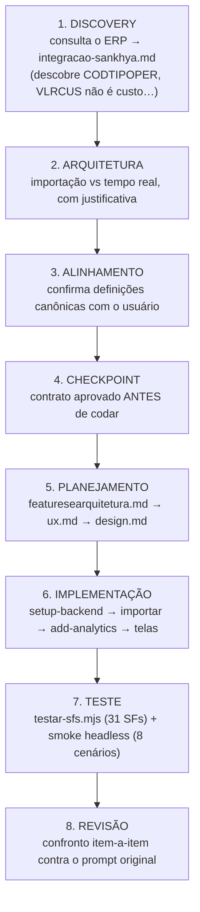
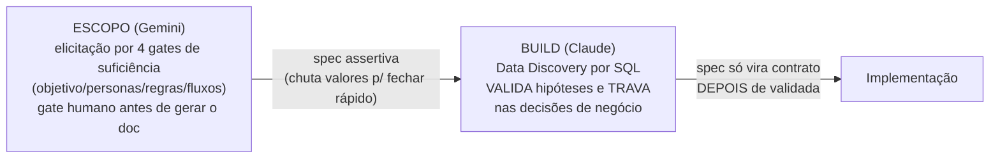

# 07 — Padrão de projeto (como um app real nasce)

> A resposta à pergunta de fundo: *"o padrão da Mitra é workflow, skill ou código gerado por LLM?"*
> **É código gerado por LLM, disciplinado por um `CLAUDE.md` de plataforma e por documentos de
> planejamento versionados.** Não há workflow engine. Não há orquestrador de agentes. Fonte:
> [§13–14](../../research/MITRA-INSPIRATION-MAP.md), [§34](../../research/MITRA-INSPIRATION-MAP.md).
> Estudo de caso: projeto 55833 "Analisador Inteligente de Orçamentos (Sankhya)".

## O que é

Um projeto real não é gerado num passo. Nasce de um **pipeline de duas etapas com auditoria** e um
conjunto de **documentos de planejamento que o próprio agente escreve e depois relê como memória**.
A qualidade percebida vem de quatro mecanismos empilhados — nenhum é mágico.

## Como funciona

### As 8 fases (reconstruídas de `tasks.md` + `CLAUDE.md` + artefatos)

Sobreposto a isso, o protocolo de turno do `CLAUDE.md`: `SYNC → BACKEND → FRONTEND → BUILD → SHARE`,
todo turno (ver [`01`](01-harness-agentico.md)).

### O pipeline de duas etapas — estágio 2 audita estágio 1

O achado mais importante do estudo de escopo: são **dois agentes/etapas**, e o segundo **verifica** o
primeiro contra o dado real.

*"O pipeline Mitra funciona porque o segundo estágio audita o primeiro."* O escopo **inventa** para
fechar rápido; o build **verifica contra o dado real e trava**. Ver [§14.1](../../research/MITRA-INSPIRATION-MAP.md).

### Os documentos como memória externalizada

O agente escreve docs e depois os usa como contexto — barato e eficaz:

| Documento | Papel |
|---|---|
| `integracao-sankhya.md` | descobertas de discovery (fonte da verdade dos dados) |
| `featuresearquitetura.md` | o quê e por quê (abre com *"Base: integracao-sankhya.md"*) |
| `ux.md` / `design.md` | telas, tokens de design, paleta |
| `tasks.md` | razão de execução: tabela de tarefas com status/output + causa-raiz |

`add-analytics.mjs` abre com *"Definicoes canonicas (ver integracao-sankhya.md)"*. É **memória em
arquivo versionado**, relida pelo agente turnos depois.

### O que produz a qualidade — veredito

| # | Mecanismo | Onde vive | Força |
|---|---|---|---|
| 1 | Protocolo de turno rígido | `CLAUDE.md` gerado pela plataforma | **Alta** — é regra, não sugestão |
| 2 | Docs de planejamento como memória versionada | `*.md` no repo | **Alta** — decisão auditável, relida |
| 3 | SDK de build-time privilegiado | `mitra-sdk` | **Alta** — poder real sem a senha |
| 4 | Scaffold byte-idêntico | UI-kit | **Média** — garante o piso, não o teto |

### Testes — a única forma possível na plataforma

`testar-sfs.mjs` lê o `sf-ids.ts` gerado, roda 31 chamadas reais e **encadeia estado** (pega um
`NUNOTA` de uma consulta e injeta nas seguintes), cobrindo caso base **e** filtrado. Como não há
ambiente de teste, é smoke test contra produção — só seguro porque as SFs são SELECT. Ver
[`03`](03-camada-dados.md) e [`08`](08-limites-e-gaps.md).

### Honestidade — o traço mais copiável

O projeto **declara o que não conseguiu**, com evidência numérica e encaminhamento:

> `VLRCUS` não é custo — 91.856 de 96.936 itens (94,8%) idênticos ao `VLRUNIT` → **margem não é
> calculável** → feature cancelada, não entregue com dado errado.

Critérios de aceite são **verificáveis, não subjetivos**: *"Pendentes na tela = 187 / R$ 6.283.878
(bate com o Sankhya)"*, *"Conversão limpa 12M = 71,2%"*.

## Evidência

- Pipeline escopo→build + 4 gates + gate humano: [§13](../../research/MITRA-INSPIRATION-MAP.md)
- Estágio 2 audita estágio 1: [§14.1](../../research/MITRA-INSPIRATION-MAP.md)
- 8 fases / docs de planejamento: [§5](../../research/MITRA-INSPIRATION-MAP.md), [§34.10](../../research/MITRA-INSPIRATION-MAP.md)
- Testes / smoke: [§34.9](../../research/MITRA-INSPIRATION-MAP.md)
- Honestidade / limitações / critérios de aceite: [§34.11](../../research/MITRA-INSPIRATION-MAP.md)

## Decisão Conexus

| Padrão | Veredito |
|---|---|
| Etapa de escopo separada, antes do build | ADOPT |
| Elicitação por 4 gates de suficiência | ADOPT |
| Gate de confirmação humana antes do doc | ADOPT |
| Modelo diferente por etapa (escopo/build) | ADAPT |
| **Estágio 2 audita estágio 1 contra o dado real** | **ADOPT** (achado central) |
| Docs de planejamento como memória versionada | **ADOPT** |
| `tasks.md` com causa-raiz | ADOPT |
| Validação de backend antes do frontend, executando | ADOPT |
| Smoke test que reproduz as chamadas da UI + reporte honesto | ADOPT |
| Revisão final item-a-item contra o prompt original | ADAPT |
| **"Limitações conhecidas" + critérios de aceite numéricos** | **ADOPT (requisito)** |
| Template rico → agente herda boas decisões | ADOPT |
| Auto-validação sem revisor frio | ADAPT (revisor frio p/ risco) |

## Ideias de melhoria (Conexus)

- **Tornar as 8 fases um contrato explícito do harness**, não uma convenção que emerge de um bom
  `CLAUDE.md`. Cada fase com entrada/saída e gate.
- **"Limitações conhecidas" + critérios de aceite numéricos como requisito de entrega**, não virtude
  opcional. O deliverable não fecha sem eles.
- **Memória versionada de 1ª classe**: em vez de `*.md` soltos relidos por sorte, um store de
  contexto em camadas (plataforma→projeto→agente→tarefa) carregado deterministicamente.
- **Revisor frio obrigatório** para mudanças de risco (dados, permissões, produção); auto-validação
  só para CRUD.
- **Roteamento de modelo por fase** (barato no escopo, forte no build) como política, com custo
  observável.
- **_(seu espaço para ideias)_**
