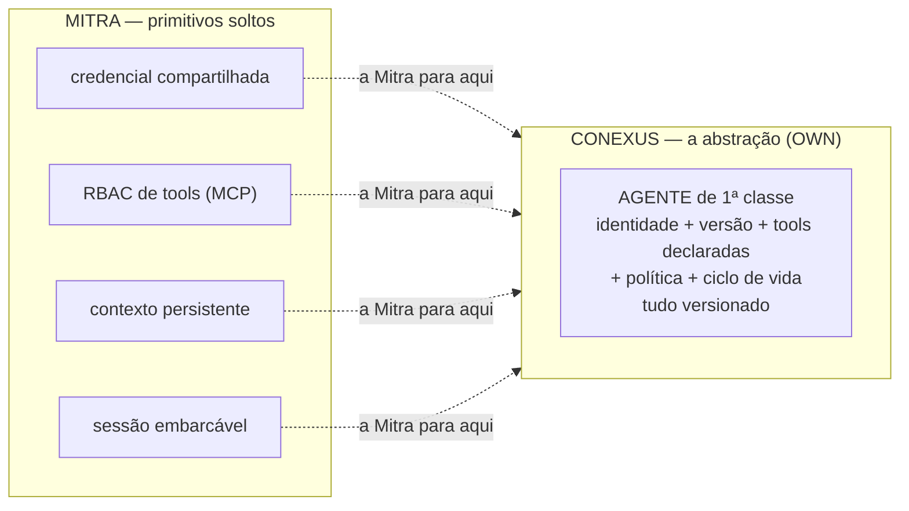
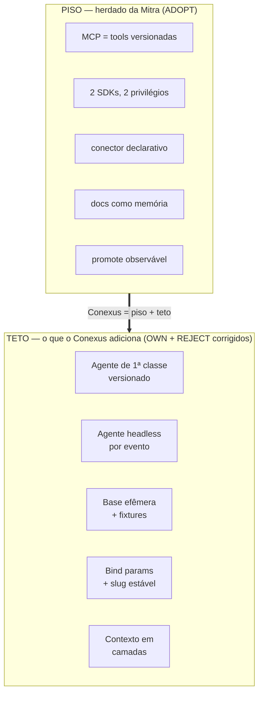

# 08 — Limites e gaps: onde a Mitra falha = onde o Conexus ganha

> Este documento inverte a lente. Os outros descrevem o que a Mitra faz bem (o piso do Conexus).
> Aqui estão os **REJECT** (o que ela faz mal — requisitos negativos) e os **OWN** (o que ela não
> tem — as apostas). Juntos, são o esqueleto do que o Conexus precisa ser para superá-la.

## As apostas — o que a Mitra NÃO tem (OWN)

### 1. Não existe a abstração "Agente" — a maior lacuna

A Mitra tem todos os **primitivos** de um agente (credencial compartilhada, RBAC de tools via MCP,
contexto persistente, sessão embarcável) e **não tem a abstração**. Não existe entidade com
identidade, versão, conjunto de tools declarado e ciclo de vida próprios. *"O agente da Mitra é uma
convenção montada à mão dentro de um app"* — o system prompt é remontado à mão por cada app, a cada
thread. → [§30](../../research/MITRA-INSPIRATION-MAP.md), [§31.6](../../research/MITRA-INSPIRATION-MAP.md).

**Sub-lacunas relacionadas (todas OWN):**
- **Sem IA no SDK de backend** — agente de domínio server-side é território livre.
- **Contexto único por projeto** — sem escopo por agente/tarefa. Conexus: contexto em camadas
  plataforma → projeto → agente → tarefa.
- **WS agêntico exige usuário logado — sem agente headless.** Mata cron/webhook/evento. Conexus
  precisa de agente por evento com **identidade de serviço**. (É um REJECT que vira OWN.)

## Os requisitos negativos — o que a Mitra faz mal (REJECT)

Cada linha é um "não repetir isto". Agrupados por gravidade.

### Segurança — os graves

| # | Falha da Mitra | Por que é grave | Requisito Conexus | Evidência |
|---|---|---|---|---|
| S1 | **SQL por interpolação de string** — `{{param}}` é substituição textual, não prepared statement (um apóstrofo quebra a query) | O SDK é público e o id é numérico e sequencial | **Bind parameters reais**; opcional = `(:x IS NULL OR col=:x)` | [§34.4](../../research/MITRA-INSPIRATION-MAP.md), [OBS-46](../../conexus/17-log-observacao-mitra.md) |
| — | **Corrigido 11/08:** a sanitização **não** vive só no cliente. Há guarda server-side que recusa placeholder em posição estrutural (*"detectou que `{{linhas}}` era um fragmento de SQL, não um valor parametrizável"*) | O buraco remanescente é de **escaping de valor**, não de estrutura — falha menor do que este doc afirmava | Adotar a invariante (placeholder nunca vira sintaxe) **com a primitiva de lote correspondente** — senão o autor inventa slots fixos | [OBS-53](../../conexus/17-log-observacao-mitra.md), + 3ª evidência independente: etapa de validação com estado próprio na UI (`validated_script` × `invalid_script` × `not_allowed_query`) em [OBS-67.3](../../conexus/17-log-observacao-mitra.md) |
| S2 | **Sem ambiente de teste — banco de DEV é o banco** | SF destrutiva "em dev" apaga produção | **Base efêmera + fixtures** por tarefa | [§33](../../research/MITRA-INSPIRATION-MAP.md) |
| — | **Atenuado 11/08:** a plataforma **bloqueia `DROP` por padrão** e exige confirmação explícita (*"esvaziei as linhas, mas a tabela vazia continua lá"*) | Existe atrito no caminho destrutivo — a camada de dados não é ingênua como este doc sugeria | O guarda evita o acidente grosseiro; **não substitui ambiente**. S2 continua de pé, com peso menor | [OBS-60](../../conexus/17-log-observacao-mitra.md) |
| S3 | Token repassado por `postMessage` com `targetOrigin:"*"` | Vaza token para qualquer frame ouvinte | **Origem explícita** sempre | [§32.4](../../research/MITRA-INSPIRATION-MAP.md) |
| S4 | Credencial de produção colada no chat; 1 token → 6 empresas | Segredo em canal errado, escopo largo demais | **Canal dedicado**, escopo por empresa, ambiente explícito | [§15](../../research/MITRA-INSPIRATION-MAP.md) |
| S5 | Chave de LLM no cliente / SF pública com segredo | Segredo exposto no bundle | Credencial de modelo **sempre** server-side | [§13](../../research/MITRA-INSPIRATION-MAP.md) |
| S6 | Owner/Admin do workspace entra em todo projeto como dev | Privilégio implícito não-revogável quebra segregação | Privilégio **explícito e auditável** | [§33](../../research/MITRA-INSPIRATION-MAP.md) |
| S7 | `X-TenantID` como única fronteira de tenancy | Header não é fronteira de segurança | Fronteira **no servidor** | [§32.3](../../research/MITRA-INSPIRATION-MAP.md) |
| S8 | `/public/` do bucket legível sem URL assinada | Vazamento por descuido como default | **Privado por padrão**, público opt-in assinado | [§32.2](../../research/MITRA-INSPIRATION-MAP.md) |
| S9 | **JWT de runtime no fragmento da URL do preview** (`#token=...`) | Fica em histórico, sugestão de barra, print e ombro; fragmento não vai no `Referer` mas vive no cliente | Sessão por **cookie `HttpOnly` + `SameSite`**; URL nunca carrega credencial | [OBS-36](../../conexus/17-log-observacao-mitra.md) |

### Operação e versionamento

| # | Falha | Por que | Requisito Conexus | Evidência |
|---|---|---|---|---|
| O1 | **Banco e SFs não versionados; mudança vale na hora** | Incompatível com operação séria | **Migration como gate**, não log pós-fato | [§33](../../research/MITRA-INSPIRATION-MAP.md) |
| O2 | Dry-run de migration só dentro do promote | Schema quebrado descoberto no meio do deploy | Dry-run **antes** do deploy | [§27](../../research/MITRA-INSPIRATION-MAP.md) |
| O3 | Smoke test contra produção | Só "seguro" porque as SFs são SELECT | Asserção de **valor** em base efêmera | [§34.9](../../research/MITRA-INSPIRATION-MAP.md) |
| O4 | Duplicação de projeto leva **dados** junto | Duplicar p/ outro cliente vaza dados do primeiro | Duplicar **pergunta** sobre dados, default "não" | [§33](../../research/MITRA-INSPIRATION-MAP.md) |
| O5 | `/cancel` que a UI diz não poder cancelar | Contrato inconsistente | Contrato honesto ou não expõe | [§27](../../research/MITRA-INSPIRATION-MAP.md) |
| **O1-ajuste** | *Precisão, não novo gap:* existe **auditoria de dado** — `db_action_log` com `log_operation` / `log_user_id` / `log_user_email` / `old_values` / `new_values`. O gap do O1 é de **artefato** (SF, schema, migration), não de linha | Evita pedirmos ao Conexus o que a Mitra já entrega e errarmos o alvo do requisito | O1 permanece, redigido como **versionamento de artefato**; auditoria de dado vira **ADOPT** | [OBS-67.2](../../conexus/17-log-observacao-mitra.md) |
| **Ganho** | Execução com **sucesso parcial** de primeira classe: `accepted_lines` / `rejected_lines` / `reason_for_rejections` / `execution_time` / `run_by` | O agente reconstruiu esse modelo do zero no M2 por não ter acesso a ele — e reconstruiu igual | **ADOPT + expor ao artefato do app**, não só ao pipeline de ingestão (entrada direta do T13) | [OBS-67.1](../../conexus/17-log-observacao-mitra.md) |

### Contrato de artefato e protocolo

| # | Falha | Por que | Requisito Conexus | Evidência |
|---|---|---|---|---|
| C1 | **`serverFunctionId` numérico no cliente** → `sf-ids.ts` gerado | Promote/duplicação vira remapeamento manual; o próprio prompt avisa "NUNCA IDs hardcoded" | **Slug estável** por nome | [§32.3](../../research/MITRA-INSPIRATION-MAP.md), [§34.3](../../research/MITRA-INSPIRATION-MAP.md) |
| C2 | Três sintaxes de binding (`event.x` textual / global / `{{x}}`) | Inconsistência cara e confusa | **Uma só** sintaxe | [§34.4](../../research/MITRA-INSPIRATION-MAP.md) |
| C3 | Código de job como string em template literal | Frágil (a própria Mitra documenta o `\s`→`s`) | **Arquivo real** | [§34.6](../../research/MITRA-INSPIRATION-MAP.md) |
| C4 | `input` de tool truncado exigindo regex tolerante | Protocolo entrega dado corrompido | Input **íntegro**; se grande, referenciar por id | [§31.6](../../research/MITRA-INSPIRATION-MAP.md) |
| C5 | `loadHistory()` devolve tool call como **texto cru** | Força o cliente a re-parsear o que era estruturado | Histórico **tipado na origem** | [§31.6](../../research/MITRA-INSPIRATION-MAP.md) |
| C6 | Rename `connection`↔`integrationSlug` vazando no wire | Contrato de API divergente do corpo | **Versionar** o contrato de API | [§20](../../research/MITRA-INSPIRATION-MAP.md) |
| **C7** 🔴 | **`runQueryMitra` corta em 2.000 linhas e devolve `rowCount: 2000` como se fosse o total.** `LIMIT 3000` também devolve 2.000. Nenhum sinal de corte — sem flag, sem `hasMore` | É o mesmo teto silencioso da paginação do ERP, agora na **função de consulta da própria SDK**. Uma auditoria que varre `INFORMATION_SCHEMA` (322 tabelas > 2.000 colunas) roda sobre 2/3 do schema e **reporta verde**. Falsa garantia é pior que garantia ausente | Teto **explícito no contrato**: ou devolve o total real, ou devolve `truncado: true`. E a primitiva de leitura completa pagina até página curta, **exige `ORDER BY`** (sem ordem estável a paginação repete e pula linha) e **recusa SQL que já traga `LIMIT`** | [OBS-69.1](../../conexus/17-log-observacao-mitra.md) |

### Experiência e observabilidade

| # | Falha | Por que | Requisito Conexus | Evidência |
|---|---|---|---|---|
| E1 | **Erro colapsado em estado vazio** — na UI (aba Código) e **também no dado** | Sessão expirada, 403 e "projeto vazio" renderizam a MESMA tela. Na camada de dado, `[]` por falha de rede = `[]` por fim de coleção, e o importador declara cobertura completa mentindo | `vazio` / `carregando` / `falhou` = **3 estados**. Cobertura só é `completa` por **evidência positiva** de fim; ausência de erro não é evidência; `desconhecido` é um terceiro valor real | [§34.12](../../research/MITRA-INSPIRATION-MAP.md), [OBS-49](../../conexus/17-log-observacao-mitra.md) |
| E2 | Painel de Git morto (`/api/e2b-git/*` devolve o SPA) | Rota crítica degrada em silêncio | Rota indisponível **diz** que está | [§34.12](../../research/MITRA-INSPIRATION-MAP.md) |
| E3 | Zero gestão/telemetria de contexto na UI | Usuário não vê contexto restante nem quando compactou | Expor estado de contexto | [§26](../../research/MITRA-INSPIRATION-MAP.md) |
| E4 | `AskUserQuestion` sem bloqueio mecânico (só instrução) | Tool depois dela executa trabalho não autorizado | **Bloqueio mecânico** no harness | [§34.10](../../research/MITRA-INSPIRATION-MAP.md) |
| E5 | Refresh de sessão por iframe invisível | Quebra com política de cookies 3rd-party | **Refresh token** | [§29](../../research/MITRA-INSPIRATION-MAP.md) |
| E6 | Encoding do MySQL não aceita acento (guardou `Reativacao`) | Defeito de plataforma vazando pro dado | **UTF-8 fim a fim** | [§34.8](../../research/MITRA-INSPIRATION-MAP.md) |
| — | **Contestado 11/08:** em outro projeto, o banco é `utf8mb4` ponta a ponta e o acento sobrevive em DML, em parâmetro de SF e em dado de API externa | E6 provavelmente **não é limitação de plataforma**, e sim collation herdada de como aquele banco foi criado — falha de *default*, não de capacidade | Reclassificar; o requisito (UTF-8 fim a fim) não muda | [OBS-60](../../conexus/17-log-observacao-mitra.md) |

## O diagrama do diferencial

## Resumo executivo

- **6 apostas OWN** — todas convergem para uma: **agente como objeto de 1ª classe, versionado,
  com identidade de serviço e contexto em camadas.** É o produto.
- **~23 REJECT** — 9 de segurança (S1 e S2 são os que mais importam), o resto operação/contrato/UX.
  Nenhum é caro de acertar; a Mitra os tem por dívida de plataforma low-code, não por necessidade.
- **A regra de ouro**: onde a Mitra escolheu conveniência de plataforma sobre correção (SQL string,
  id numérico, banco único, header como tenancy), o Conexus escolhe correção. O custo é pequeno; o
  ganho de confiança operacional é o argumento de venda.

*Todos os vereditos com link de evidência em [`DECISION-REGISTER.md`](DECISION-REGISTER.md).*
