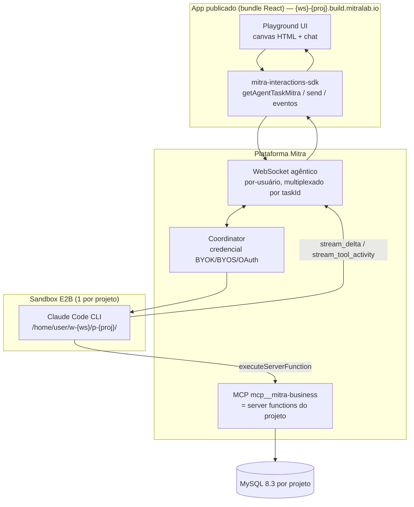

# Mitra — Agente embarcado (Generative UI / Playground)

> **O que este documento cobre.** O agente que roda **dentro de um app publicado** — não o
> construtor. A comunidade Mitra chama de "Playground": um app onde a IA não só conversa, ela
> **investiga os dados via SQL, narra o raciocínio em tempo real e desenha uma tela HTML** no canvas.
> O app fala com o mesmo backend agêntico da Mitra pelo **WebSocket por-usuário**, via o
> `mitra-interactions-sdk`. Este doc documenta esse stack **e** o protocolo de fio que foi capturado
> **ao vivo** numa sessão de operação real da plataforma.
>
> **Natureza da evidência.** Diferente dos docs 00–08 (que derivam do
> [`MITRA-INSPIRATION-MAP.md`](../../research/MITRA-INSPIRATION-MAP.md) congelado), este doc é
> **evidência primária nova**, coletada em **2026-08-11** operando a plataforma logada: projeto
> `Playground BI-Investigacao` (workspace `146638`, projeto `55878`), interceptando os frames do
> WebSocket agêntico no navegador. Onde confirma o mapa, é reforço; onde acrescenta, está marcado
> `[NOVO 2026-08-11]`.

Relacionados: [01 harness agêntico](01-harness-agentico.md) · [02 registro de artefatos](02-registro-artefatos.md) · [03 camada de dados](03-camada-dados.md) · [06 runtime publicado](06-runtime-publicado.md) · [08 limites e gaps](08-limites-e-gaps.md).

---

## 1. O que é

Dois agentes, um backend. A Mitra reusa a **mesma infra agêntica** em dois lugares:

| | Agente **construtor** (doc 01) | Agente **embarcado** (este doc) |
|---|---|---|
| Onde roda | Studio, enquanto você constrói | Dentro do app publicado, para o usuário final |
| Cliente | UI do Studio (Nuxt) | `mitra-interactions-sdk` no bundle React do app |
| Tools | as server functions do projeto via MCP `mcp__mitra-business` | as server functions do projeto via MCP `mcp__mitra-business` |
| Transporte | WebSocket agêntico por-usuário | **o mesmo** WebSocket agêntico por-usuário |
| Modelo | Claude Code em sandbox E2B | Claude Code em sandbox E2B |

O "agente embarcado" **não é uma abstração nova de plataforma** — é o agente construtor exposto ao
runtime do app por um SDK mais restrito. Isso confirma o fato #7 do [OVERVIEW](00-OVERVIEW.md): *não
existe a abstração "Agente"*; o app monta a experiência à mão sobre o WS. O Playground é a receita de
como montar bem (narração + tools + canvas HTML), entregue pela Mitra como **prompt de missão** que o
construtor executa.

---

## 2. Como funciona



**Ciclo de uma pergunta:** usuário pergunta → SDK `send()` → Coordinator injeta na sessão Claude Code
→ agente chama `consulta_livre`/`schema_resumo` (SFs, via MCP) → cada chamada volta como
`stream_tool_activity` → agente narra (`stream_delta`) → ao final chama `playground_salvar_html`
(desenha o canvas) e `playground_renomear` (título do estudo) → `turnEnd`.

**Autenticação do WS `[NOVO 2026-08-11]`:** o WS conecta com `userId` da **sessão logada** (visto:
`[Mitra WS] Connecting with userId=152085`). Confirma o gap do doc 06: **o WS agêntico só aceita
sessão de usuário logado** — token de integração dá "conexão fechada". Em app publicada o
`agentWsUrl` vem de `window.__mitraEnv`; no Studio (builder) `window.__mitraEnv` é **`null`**
(confirmado ao vivo) e a URL vem da config do Studio.

**Resiliência `[NOVO 2026-08-11]`:** o WS é **uma conexão por usuário multiplexando várias tasks** —
cada frame carrega `taskId`, e o cliente mantém um mapa de streams ativos. Na sessão, o mesmo socket
carregava **duas** tasks simultâneas (dois projetos do mesmo usuário). Em desconexão (`code=1006`) há
reconexão com backoff (`Reconnecting in 2925ms (attempt 1)`) e **"F5 recovery — active streams"**
que reata os streams em andamento sem perder o turno.

---

## 3. Contratos exatos

### 3.1 Ciclo de vida da task (fio do WS) `[NOVO 2026-08-11]`

Sequência real observada ao enviar a primeira mensagem:

1. **Task otimista** — o cliente cria `optimistic-<epochMs>` e persiste no `localStorage`
   (`userId`, `ws`, `pj`, `projects[]`) antes de qualquer resposta do servidor.
2. **`sendTaskCreate`** — `{ agentType:'claudecode', provider:'anthropic',
   model:'anthropic/claude-opus-5:high', language:'pt-BR', isWhiteLabel:true }`.
3. Servidor devolve o **taskId real** (ex.: `EcFJk2N6Xb3MASBJNeKC`), que substitui o otimista.
4. **`sendUserInput`** — `{ agentType, provider, model, taskId, isWhiteLabel }` com o prompt.
5. **`streaming_state`** → cliente ativa "thinking".

**Formato do `modelId` no fio:** `provider` + `model` = `provider/modelo:esforço` — ex.
`anthropic/claude-opus-5:high`. (O label da UI, "Claude Opus 5 High **Sub**", indica a **origem**
`subscription`; o formato `origem:provider:modelo:esforço` do prompt de missão é a forma **de alto
nível**, o fio usa `provider/modelo:esforço` + campos `provider`/`isWhiteLabel` separados.)

**Governança do seletor:** logs `AgentSelectorLock` / `manageModelsLocked` — em conta white-label o
modelo pode ser **travado**. `isWhiteLabel:true` viaja em toda mensagem. Há `POST
/api/firebase/app-check-token` (App Check, anti-abuso) no fluxo.

### 3.2 Eventos do WS (tipos de fio reais) `[NOVO 2026-08-11]`

| `type` do frame | Payload | Vira, no SDK |
|---|---|---|
| `connected` | `{ userId, message }` | (handshake) |
| `streaming_state` | estado do stream por task | `statusChange` |
| `stream_delta` | `{ delta }` (texto; usar só `kind==='text'`) | `delta` |
| `stream_tool_activity` | `{ tool, input, content, description }` | `tool` |
| `stream_tool_activity_update` | `{ toolIndex, bashOutput }` (saída incremental) | (atualiza o passo) |
| `heartbeat` | — | (keepalive) |
| `turn_started` | início de turno | `turnStart` |
| `stream_end` | fim do stream do turno | `turnEnd` |
| `build_status` | progresso do `npm run build` | (UI de build) |
| `preview_ready` | app publicado/preview no ar | (habilita canvas/preview) |
| `message` / `message_status` | mensagem persistida + status | (histórico) |

Os seis últimos foram capturados **na fase de build** (o construtor rodando `build`/`share`);
`turn_started`/`stream_end` são os limites de turno de fio (o SDK expõe como `turnStart`/`turnEnd`),
`build_status`/`preview_ready` alimentam a UI de deploy, e `message`/`message_status` são a
persistência do histórico. Todo frame carrega `taskId` e `timestamp`. O `input` do `stream_tool_activity` **chega inteiro no
fio** (capturamos o SF probe completo); a truncagem que o prompt de missão alerta é do **evento
`tool` do SDK de alto nível**, não do frame cru — logo a regra "nunca `JSON.parse`, extraia por regex
tolerante" vale para o consumidor do SDK.

Exemplo real (probe do agente, task nossa):
```json
{"type":"stream_tool_activity_update","payload":{"toolIndex":26,
 "bashOutput":"VERSION/VAR_USER -> {\"status\":\"success\",\"result\":{\"executionId\":\"…\",
   \"executionStatus\":\"COMPLETED\",\"output\":{\"rowCount\":1,\"rows\":[{\"V\":\"8.3.0\",\"U\":7}]},
   \"durationMs\":11}}"},"taskId":"EcFJk2N6Xb3MASBJNeKC"}
```

### 3.3 SDK de runtime — `mitra-interactions-sdk` (app publicado) `[NOVO 2026-08-11 — código real capturado]`

O cliente do agente embarcado foi **capturado ao vivo** enquanto o construtor o escrevia (frames
`stream_tool_activity`, campo `codeContent`). Superfície do SDK confirmada por `import` real:
`executeServerFunctionMitra`, `getAgentTaskMitra`, `manageAgentCredentialMitra`.

**(a) Sessão do agente — `getAgentTaskMitra`** (arquivo `hooks/useAgentChat.ts`):
- `getAgentTaskMitra({ create:true, agentType:'claudecode', modelId })` → sessão. Reabrir:
  `getAgentTaskMitra({ taskId })` (reconecta inclusive stream ativa).
- Eventos: `taskCreated` (salve `task.id`), `turnStart`, `delta({delta,kind})` (só `kind==='text'`),
  `tool({tool,input})`, `turnEnd({content})`, `error`, `statusChange`. Métodos `send()`, `cancel()`,
  `loadHistory()`.
- `configureSdkMitra({ agentWsUrl })` quando fora de app publicada (dentro, vem de `window.__mitraEnv`).
- `loadHistory()` devolve tool calls como **texto cru** `mcp__…{json}` — detectar e converter em
  segmentos de tool, nunca renderizar como fala.

**(b) Modelo e credencial — `manageAgentCredentialMitra`** (arquivo `lib/agente-modelo.ts`). Quatro
ações reais capturadas: `list_models`, `list_providers`, `auth`, `connect`. **O `modelId` nunca é
hardcoded** — sai de `list_models`, que só devolve modelos de providers com credencial conectada;
lista vazia ⇒ usuário não conectou ⇒ o chat oferece o fluxo de conexão. Preferência de seleção:
assinatura Claude (`^subscription:anthropic` | `/claude/`) > API key Anthropic > o que houver.

```ts
export async function resolverModelo() {
  const r = await manageAgentCredentialMitra({ action: 'list_models' });   // só providers conectados
  return melhorModelo(r?.providers || []);                                 // assinatura Claude primeiro
}
```

**(c) Fluxo de credencial no chat** (`components/CredencialCard.tsx`) — oferecido **dentro** do chat
quando um `error` menciona credencial. Etapas `inicio → codigo → conectando`:
`iniciarConexaoClaude()` = `manageAgentCredentialMitra({action:'auth', target:'claude'})` →
`{ authUrl, state }` → `window.open(authUrl)` → usuário autoriza e **cola o código** →
`concluirConexaoClaude(code, state)` = `manageAgentCredentialMitra({action:'connect', code, state})`.
Status por polling: `GET /api/mitra-agent/auth/{claude,openai}/status`.

**(d) Execução de SF — `executeServerFunctionMitra`** (`lib/sf.ts`). O `output` chega em **três
formatos** conforme o caminho, e um normalizador defensivo cobre os três (a inconsistência do §3.4):

```ts
import { executeServerFunctionMitra } from 'mitra-interactions-sdk';
export function normalizarSaida(bruto) {           // objeto (autenticado) | string JSON (público) | {result:[…]}
  let s = bruto;
  if (typeof s === 'string') { try { s = JSON.parse(s); } catch {} }
  if (s && Array.isArray(s.result)) return s.result;
  return s;
}
export async function chamarSF(serverFunctionId, input) {
  const res = await executeServerFunctionMitra({ serverFunctionId, input });
  if (res?.result?.executionStatus === 'FAILED') throw new Error(res.result.error || '…');
  return normalizarSaida(res?.result?.output);
}
```
A **rota pública** não usa o SDK (precisa funcionar sem token): `POST
${VITE_MITRA_BASE_URL}/public/serverFunction/${projectId}/${serverFunctionId}/execute` (fetch cru).
Os ids de SF vêm de um módulo `sf-ids.ts` gerado do registry — `SF` (id por nome) e `SF_ROTULO`
(id → rótulo amigável), **nunca digitados à mão**.

**(e) Motor de segmentos do chat** (`hooks/useAgentChat.ts`) — onde mora a qualidade percebida. Um
turno é uma **lista ordenada de segmentos**, não um blocão:
```ts
type Seg = { t:'md'; c:string }
         | { t:'tool'; label:string; n:number;      // n = "×N" chamadas repetidas da mesma tool
             det?:string|null; mono?:boolean;         // det = título humano ou SQL (mono)
             t0?:number; pulse?:number };             // t0 = cronômetro; pulse = re-key do ícone
```
A lista viva do turno **mora num `ref`** (fonte da verdade, mutada em ordem síncrona) e o render é
disparado por um contador — elimina a corrida entre drenar o buffer de texto e a chegada de um evento
`tool`. Persistência **compacta** (só o `label` da tool; o ícone resolve no render), últimas 60 msgs,
dreno de streaming a cada 24 ms. O `input` do evento `tool` chega truncado ⇒ `tool-parse.ts` extrai
campos por **regex com fecha-aspas opcional** (`"${chave}"\s*:\s*"((?:[^"\\]|\\.)*)`), **nunca**
`JSON.parse`.

**(f) Contexto injetado na 1ª mensagem** (`lib/agente-contexto.ts`) — "a alma da velocidade". Sem
ele o agente gasta minutos se orientando. Três blocos: **TOKENS** (design system — hex, fonte,
radius, sombra, para o canvas sair no DS e não genérico), **SCHEMA** inline (tabelas-núcleo com
colunas; apoio só nome) e **CONVENCOES** (identificadores case-sensitive/maiúsculas, datas VARCHAR
`'YYYY-MM-DD'`, `SUBSTRING` para agrupar por mês, período dos dados). Ids de SF do registry.

### 3.4 SDK de build — `mitra-sdk` (só no sandbox, privilegiado) `[NOVO 2026-08-11]`

Superfície completa capturada do `setup-backend.mjs` real (import único do pacote `mitra-sdk`):

```js
import {
  configureSdkMitra,
  runDdlMitra, runDmlMitra, runQueryMitra,                 // dados, 3 níveis de privilégio
  createServerFunctionMitra, updateServerFunctionMitra,     // SF: cria / atualiza (por nome = idempotente)
  listServerFunctionsMitra, deleteServerFunctionMitra,
  togglePublicExecutionMitra,                               // marca SF como executável sem login
  listProfilesMitra, createProfileMitra,                    // RBAC por perfil
  setProfileServerFunctionsMitra, setProfileSelectTablesMitra, setProfileUsersMitra,
  listProjectUsersMitra,
  updateAdditionalInstructionsMitra, updateAdditionalBusinessInstructionsMitra, // instruções do agente
} from 'mitra-sdk';

configureSdkMitra({ baseURL: MITRA_BASE_URL, token: MITRA_TOKEN, integrationURL: MITRA_BASE_URL_INTEGRATIONS });

// registrar SF:  createServerFunctionMitra({ projectId, name, type:'SQL', code, description }) → { result:{ serverFunctionId } }
// dados (dentro de SF JS, via require('mitra-sdk')):
const r = await sdk.runQueryMitra({ projectId, sql });  // read  → { result:{ rows, rowCount } }
await sdk.runDmlMitra({ projectId, sql });               // write → { result:{ affectedRows } }
await sdk.runDdlMitra({ projectId, sql });               // schema (só build)
```

- **Três níveis de privilégio de dados no próprio SDK:** `runDdlMitra` (DDL/schema) ⊃ `runDmlMitra`
  (INSERT/UPDATE/DELETE) ⊃ `runQueryMitra` (SELECT). Espelha exatamente o `runDdl/runDml/runQuery` de
  C-005. O app publicado **não** recebe esses — recebe só `mitra-interactions-sdk` (executa artefato
  por id). Confirma o fato #3 do OVERVIEW.
- **RBAC por perfil `[NOVO 2026-08-11]`:** existe um modelo de permissão real. Um *profile* liga
  **{usuários} × {server functions permitidas} × {tabelas com SELECT liberado}**:
  `createProfileMitra`, `setProfileServerFunctionsMitra`, `setProfileSelectTablesMitra`,
  `setProfileUsersMitra`, `listProfilesMitra`, `listProjectUsersMitra`. `togglePublicExecutionMitra`
  abre uma SF para execução **sem login** (as rotas públicas do Playground).
- **Instruções adicionais do agente `[NOVO 2026-08-11]`:** `updateAdditionalInstructionsMitra` e
  `updateAdditionalBusinessInstructionsMitra` injetam instruções/regras de negócio na sessão do
  agente — o embrião de uma "camada de regras" por projeto (insumo direto para o Tópico 15).
- **Idempotência (confirma doc 02):** tabelas com `CREATE TABLE IF NOT EXISTS` (reexecutar nunca
  apaga dado de usuário); SFs atualizadas **por nome** (`update` se já existir). O `setup-backend.mjs`
  é seguro para rodar N vezes; flag `--dominio` recria só o dataset de investigação.
- **Env vars do sandbox:** `MITRA_BASE_URL`, `MITRA_TOKEN`, `MITRA_BASE_URL_INTEGRATIONS`,
  `MITRA_PROJECT_ID`. A URL de integrações é **apartada** da base.
- **Execução direta (o que o `interactions-sdk` faz por baixo):**
  `POST ${MITRA_BASE_URL}/interactions/executeServerFunction`
  body `{ projectId, serverFunctionId, input }`, header `Authorization: <token>`.
- **Envelope de execução:**
  `{ status:'success', result:{ executionId, executionStatus:'COMPLETED',
     output:{ rowCount|affectedRows, rows }, durationMs } }`.
- **`serverFunctionId` é inteiro sequencial** por projeto (na sessão: `consulta_livre=5`,
  `schema_resumo=6`, … `playground_restaurar=18`). O frontend referencia a SF por esse número — é o
  "contrato exato com serverFunctionId numérico" que o prompt de missão manda front-loadar.
- **Inconsistência de serialização público × autenticado `[NOVO 2026-08-11]`:** a SF marcada com
  `togglePublicExecutionMitra` e executada **sem login** volta `output` como **string JSON**, não
  objeto (o próprio agente flagrou: *"o endpoint público funciona (HTTP 200) — mas devolve `output`
  como string JSON, não objeto. Detalhe importante para o frontend"*). O caminho autenticado devolve
  objeto. É a mesma **normalização defensiva inconsistente** que motivou a serialização global do
  C-005 / Tópico 8.
- **`runDdlMitra` bloqueia `DROP` por padrão `[NOVO 2026-08-11]`:** *"A plataforma bloqueia DROP por
  padrão — correto"* (agente). DROP de tabela só sob flag explícita e checando existência. Safety
  default no nível da plataforma.
- **RBAC é opcional:** setup emitiu *"aviso: perfil não configurado — segue sem bloquear"*. Sem
  profile, todas as SFs ficam acessíveis ao usuário logado; a restrição é opt-in.

### 3.5 Modelo de programação de uma Server Function `[NOVO 2026-08-11]`

Do código-fonte real das SFs do Playground:

- **Input** chega no global **`event`** (ex.: `const { consulta } = event;`). **Retorno** é um objeto
  simples (a plataforma envelopa).
- **SF tipo `SQL`**: o `code` é SQL com **interpolação `{{campo}}`** e binds de sistema **`:VAR_USER`**
  (= id do usuário logado; no probe resolveu `7`). **Multi-statement executa mas o SELECT final é
  descartado** — só volta `affectedRows`. → não dá para `INSERT …; SELECT LAST_INSERT_ID()`.
- **SF tipo JS**: `require('mitra-sdk')`, usa `runQueryMitra`/`runDmlMitra`. Placeholder
  **`__PROJECT_ID__`** é substituído no provisionamento. **SQL é montado por concatenação de string
  com um escaper manual `lit()`** (`replace(/\\/g,'\\\\').replace(/'/g,"''")`) — **não há bind
  params reais**.
- **Provisionamento:** um `setup-backend.mjs` lê cada `backend/sf/*.js` via `readFileSync` e chama
  `createServerFunctionMitra`. Por isso os regexes das SFs podem usar escape simples — **não passam
  por um template literal JS** (a armadilha do `\s`→`s` só existe se a SF for embutida inline num
  script; lida de arquivo, some).

Exemplo — guardas do `consulta_livre.js` (SF de leitura livre):
```js
const { consulta } = event;
// 1) rejeita comentários  (--  #  /*  */)
// 2) 1 statement (tolera ; final, senão bloqueia)
// 3) exige  ^(select|with)\b
// 4) blocklist \b(insert|update|delete|drop|truncate|alter|create|replace|
//    grant|revoke|rename|lock|unlock|call|execute|handler|prepare|commit|
//    rollback|savepoint|shutdown|kill|use)\b
// 5) LIMIT 200 forçado
// erro → { ok:false, erro, dica }
```

### 3.6 Layout do sandbox e do app publicado `[NOVO 2026-08-11]`

- **Sandbox:** `/home/user/w-{ws}/p-{proj}/` — ex. `/home/user/w-146638/p-55878/`. Contém
  `frontend/` (bundle React/Vite), `backend/sf/*.js` (as SFs), `backend/seed-dominio.mjs` (seed 3NF),
  `setup-backend.mjs`, e **docs de planejamento versionados** (`design.md`, `ux.md`,
  `featuresearquitetura.md`, `tasks.md`) que o agente relê como memória (confirma doc 07).
- **Scaffold do frontend `[NOVO 2026-08-11]`:** template **`react-ts-tailwind`** (React + TypeScript +
  Tailwind + Vite; `index.html` com `<div id="root">` + `/src/main.tsx`). Usa
  `verbatimModuleSyntax` — por isso o `ChatPanel.tsx` redeclara os tipos `Seg`/`Msg` localmente (import
  de `interface` entre arquivos quebra em runtime). Confirma o "scaffold/UI-kit byte-idêntico" do fato
  #6 do OVERVIEW. Estrutura capturada: `src/lib/` (sf, tool-parse, markdown, agente-contexto,
  agente-modelo, sf-ids), `src/hooks/useAgentChat.ts`, `src/components/` (ChatPanel, CredencialCard).
- **Sandbox do agente *embarcado* (por task) `[NOVO 2026-08-11]`:** diferente do builder — layout
  `/home/user/tasks/{taskId}/`, um diretório por task, com um `.env` contendo `MITRA_PROJECT_ID`. O
  builder mora em `w-{ws}/p-{proj}/`; o analista embarcado roda por-task, isolado.
- **App publicado:** `https://{ws}-{proj}.build.mitralab.io` — ex.
  `https://146638-55878.build.mitralab.io`. Expõe `window.__mitraEnv = { apiBaseURL, agentWsUrl }`.
- **Endpoints de produção `[NOVO 2026-08-11]`:** `apiBaseURL = https://api2.mitrasheet.com:4133`;
  `agentWsUrl` do runtime = `wss://mitra-agent-websocket-production.up.railway.app/sdk-ws` (o WS
  agêntico do app publicado é **hospedado no Railway**, apartado da API). Preview do Studio em
  `/v1/w/{ws}/p/{proj}/preview/index.html` (redireciona p/ `/w/{ws}` se aberto standalone — guarda de SPA).
- **Armadilha do SPA (confirmada por um verificador que o agente escreveu):** o servidor devolve o
  **mesmo `index.html` para qualquer caminho** (200 até em rota inexistente), e rota atrás do guard de
  login **descarta o `?code=` do OAuth silenciosamente** (200 → redireciona `/login`). *"HTTP 200 não
  prova nada."* Verificação séria roda o **bundle publicado num DOM real (jsdom)** e olha o que
  renderizou + onde a URL parou — não o status HTTP nem o código-fonte local.

### 3.7 Protocolo de turno (confirmado ao vivo)

Primeiras narrações reais do agente construindo o Playground, em ordem: **`SYNC feito (já
atualizado)`** → survey do projeto → "projeto novo (só template)" → instalações em paralelo →
**cria `tasks.md`** com plano ordenado de 18 itens (TodoWrite) → **sonda a plataforma antes de decidir
arquitetura** ("SF JAVASCRIPT com `runQueryMitra` funciona (1.4s)"; "MySQL 8.3, `:VAR_USER` funciona,
multi-statement não retorna SELECT. Arquitetura definida") → escreve docs de planejamento → backend.
Confirma o SYNC-first e os passos BACKEND→FRONTEND→BUILD→SHARE do doc 01, e a **honestidade empírica**
do doc 07 (o agente testa a capacidade real da plataforma em vez de assumir).

### 3.8 Corrida ao vivo — o loop completo do analista embarcado `[NOVO 2026-08-11 — confirmado ponta a ponta]`

Abrimos o app publicado (`146638-55878.build.mitralab.io`, estudo `#/estudo/4`, task embarcada
`AkTMvv04aFKcrxMJ5Btj`), fizemos uma pergunta de negócio e **interceptamos o WS de runtime** nos dois
sentidos. O loop rodou inteiro, sozinho, sem parede de credencial (assinatura Claude conectada).

**Protocolo RPC client→server no WS de runtime** (distinto do fio do builder do §3.1): correlação por
`requestId`, o servidor devolve um frame `response` casado.
```json
// cliente → servidor
{ "type":"credentials", "requestId":"req-…", "payload":{ "action":"list_models", "data":{} } }
{ "type":"send_prompt", "requestId":"req-…", "payload":{ "prompt":"<system prompt do analista>" } }
// servidor → cliente
{ "type":"response", "requestId":"req-…", "ok":true, "data":{ … } }
```
`list_models` respondeu com o provider `anthropic-subscription` ("Anthropic Subscription") — é assim
que o `resolverModelo()` do §3.3(b) descobre que há assinatura conectada e nem oferece o `CredencialCard`.

**System prompt real injetado no analista** (frame `send_prompt`, início capturado) — a "receita
montada à mão" que a Mitra reentrega a cada sessão (e que o Conexus quer transformar em Agente de 1ª classe):
> Voce e o analista de dados do Playground. O usuario faz uma pergunta de negocio e voce investiga o
> banco, narra o raciocinio ao vivo e entrega uma tela de analise. === COMO AGIR NA PLATAFORMA === Voce
> atua exclusivamente pela ferramenta `mcp__mitra-business__executeServerFunction`. A chave dos
> argumentos e "input" [...]. Nao existe outra forma de acessar os dados. Nao procure outras ferramentas,
> nao liste projetos, nao leia arquivos, nao explore [...]

**O loop, confirmado com ids de SF reais:**

1. **13× `executeServerFunction` sf=5 (`consulta_livre`)** — investigação SQL pura, **zero exploração**
   (o contexto injetado do §3.3(f) já entrega SCHEMA + CONVENÇÕES). Cada chamada carrega um `titulo`
   humano que vira o rótulo do passo no chat (com cronômetro e folding ×N do §3.3e). Títulos reais:
   *"margem por categoria de produto"*, *"impacto dos descontos por canal de venda"*, *"desconto e venda
   abaixo da tabela por vendedor"*, *"evolução do desconto do Rafael Nogueira"*, *"produtos vendidos
   abaixo do custo"*, entre outros.
2. **`executeServerFunction` sf=12 (`playground_salvar_html`)** — `input:{ playgroundId:4, html:"…" }`.
   Desenha o canvas: **7160 chars de HTML self-contained** que **honra os DESIGN TOKENS injetados** —
   `background:#0B0E14; color:#E7ECF5; font-family:Inter`, cards `#12161F`/borda `#232A38`, negativo
   `#F45B69`, alerta `#F5A524`, mono JetBrains — com KPIs, dois gráficos SVG inline, tabela de margem por
   categoria e bloco de insights. **Sem CDN, sem `<script>` externo** — renderiza em `<iframe srcdoc>`.
3. **`executeServerFunction` sf=10 (`playground_renomear`)** — `input:{ id:4, nome:"Vazamentos de margem
   por desconto" }`. Auto-renomeia o estudo pelo tema descoberto.
4. **`stream_end`** — turno encerra; o status do canvas vira **"atualizado 13:35"**.

Os ids batem com o registry (§3.4): SFs sequenciais 5–18, `consulta_livre`=5, `playground_renomear`=10,
`playground_salvar_html`=12. **Conclusão de negócio entregue** (2–3 frases + números): o analista achou
os padrões **plantados no `seed-dominio.mjs`** — Rafael Nogueira com 18% de desconto médio há 18 meses
(equipe ~2%, R$ 117,6 mil), devoluções por defeito concentradas em Eletrônicos (R$ 94,9 mil), metade dos
itens abaixo do preço de tabela (R$ 166 mil) — e recomendou três ações que "recuperam mais de R$ 350
mil". **Prova de que o contexto injetado (TOKENS + SCHEMA + CONVENÇÕES) basta para uma investigação de BI
autônoma e on-brand** — nenhuma tool nova, nenhum passo de setup, nenhuma leitura de arquivo.

---

## 4. Evidência

Sessão de operação ao vivo **2026-08-11**, conta logada (`userId 152085`, white-label), projeto
`Playground BI-Investigacao` (`ws 146638` / `proj 55878`, task `EcFJk2N6Xb3MASBJNeKC`). Coleta por
interceptação dos frames do WebSocket agêntico no navegador + leitura do console e da rede.

- **Console:** `handleWelcomeSend`; task otimista no `localStorage`; `sendTaskCreate` /
  `sendUserInput` com `provider/model/language/isWhiteLabel`; `streaming_state`; `AgentSelectorLock`;
  `POST /api/firebase/app-check-token`; reconexão `code=1006` + "F5 recovery — active streams".
- **Frames WS:** `connected` / `streaming_state` / `stream_delta` / `stream_tool_activity` /
  `stream_tool_activity_update` / `heartbeat`, multiplexados por `taskId` (2 tasks no mesmo socket).
- **Probe empírico do agente** (`_probe3.mjs`): MySQL **8.3.0**; `:VAR_USER` = `7`; multi-statement
  descarta SELECT; envelope de `executeServerFunction`.
- **Código-fonte de SF capturado:** `consulta_livre.js` (guardas), `playground_salvar_html.js` e
  `playground_restaurar.js` (`runQueryMitra`+`runDmlMitra`+`lit()`+`__PROJECT_ID__`).
- **Código-fonte do FRONTEND capturado ao vivo (campo `codeContent` dos frames):** `lib/sf.ts`
  (`executeServerFunctionMitra` + `normalizarSaida` + rota pública), `hooks/useAgentChat.ts`
  (`getAgentTaskMitra` + motor de segmentos `Seg`/`Msg` + persistência compacta), `lib/agente-modelo.ts`
  (`manageAgentCredentialMitra` ações `list_models`/`list_providers`/`auth`/`connect`),
  `components/CredencialCard.tsx` (fluxo `auth→connect` no chat), `lib/tool-parse.ts` (regex tolerante),
  `lib/markdown.ts`, `lib/agente-contexto.ts` (TOKENS+SCHEMA+CONVENCOES). Evidência bruta em
  `scratchpad/evidencia-frontend-p55878.md`.
- **Endpoints:** `/api/mitra-agent/keys`, `/auth/{claude,openai}/status`, `/files/{ws}/{pj}`,
  `/api/e2b-git/{ws}/{pj}/metadata`, `POST /interactions/executeServerFunction`,
  `POST /public/serverFunction/{projectId}/{sfId}/execute` (rota pública sem login). **Produção:**
  `apiBaseURL https://api2.mitrasheet.com:4133`; WS de runtime `wss://mitra-agent-websocket-production.up.railway.app/sdk-ws`.
- **Corrida ao vivo do agente embarcado (task `AkTMvv04aFKcrxMJ5Btj`, estudo `#/estudo/4`):** WS de
  runtime interceptado nos dois sentidos (`window.__pubCap`/`__pubSent`). Capturado: o RPC
  `credentials`/`send_prompt`/`response` (por `requestId`), o **system prompt real** injetado no analista,
  o loop **13× `consulta_livre` (sf=5) → `playground_salvar_html` (sf=12) → `playground_renomear` (sf=10)
  → `stream_end`**, o **canvas de 7160 chars** honrando os design tokens, e a conclusão de negócio com os
  padrões plantados no seed. Bruto em `scratchpad/evidencia-frontend-p55878.md` (seção "Corrida ao vivo").

---

## 5. Decisão Conexus

O agente embarcado **valida no laboratório** decisões que já tínhamos tomado e acende gatilhos:

| Achado Mitra | Veredito Conexus | Onde |
|---|---|---|
| Dois SDKs, poder no build (`runDml`/`runQuery`) e runtime só executa por id | **ADOPT (confirma C-005).** Nosso SDK build (`runDdl/runDml/runQuery` + `executeCandidate`) vs runtime (`execute(slug,input)`) é a mesma partição, com o privilégio mais explícito (roles reais por kind). | [C-005](../../conexus/06-registro-artefatos.md) |
| SQL montado por interpolação `{{}}` + escaper manual `lit()`, sem bind real | **REJECT (confirma a crítica de C-005).** Mitra deixa a injeção na mão do autor da SF. Conexus usa **bind params reais** via parser pinado; `:param` nunca vira interpolação. | [C-005](../../conexus/06-registro-artefatos.md) |
| Multi-statement executa e **descarta** o SELECT final, em silêncio | **OWN.** Footgun. Conexus proíbe multi-statement no kind `query` (gramática de 1 statement) e falha explícito, nunca silencioso. | C-005 |
| DB por projeto = **MySQL 8.3** | **Insumo p/ Tópico 6.** Confirma "um banco por projeto". Conexus decide Postgres × MySQL com este dado na mesa (Mitra prova MySQL; nós já inclinamos a Postgres por DDL transacional — ver C-005). | Tópico 6 (pendente) |
| WS agêntico **só** com sessão de usuário logado; multiplexado por `taskId`; F5 recovery | **ADOPT como requisito de runtime publicado.** O runtime do agente embarcado precisa de sessão autenticada + reconexão que reata stream. Deriva o `deployment`/allow-list server-side de C-005. | [C-002](../../conexus/04-runtime-agente.md), Tópico 12 |
| `modelId` no fio = `provider/modelo:esforço` + `provider`/`isWhiteLabel`; seletor travável | **ADOPT (confirma C-002 HAR-11).** Multi-modelo por papel + governança de seleção (lock white-label) é exatamente o nosso "identidade runtime ≠ modelo". | [C-002](../../conexus/04-runtime-agente.md) |
| Sem abstração "Agente" — Playground é receita montada à mão via prompt de missão | **OWN (a aposta central).** Conexus faz o **Agente de 1ª classe** (identidade, versão, tools, headless, contexto em camadas) — o que a Mitra reentrega como prompt toda vez. | Tópico 9 (pendente) |
| App publicado atrás de SPA catch-all: 200 pra tudo, code do OAuth some | **OWN.** Roteamento do runtime publicado do Conexus serve artefato por deployment e responde 404 de verdade; callback de OAuth não fica atrás do guard. Sem precisar de verificador jsdom. | Tópicos 7, 12 |
| `tasks.md` + docs de planejamento versionados relidos como memória | **ADOPT (confirma C-003 HAR-7 e Tópico 13).** Checklist vivo durável. | [C-003](../../conexus/03-requisitos.md), Tópico 13 |
| **RBAC por perfil**: profile liga {usuários}×{SFs}×{tabelas SELECT}; `togglePublicExecution` p/ rota sem login | **ADOPT como prova de RC-1.** A Mitra **já tem** audiência por artefato e por tabela — valida que a nossa RC-1 (audiência + tenant binding) é capacidade real e necessária, não teórica. Conexus a promove a 1ª classe (role de banco por kind + audiência declarada). | C-005 (RC-1), Tópico 12/14 |
| `updateAdditionalBusinessInstructionsMitra`: regras de negócio injetadas na sessão do agente | **Insumo p/ Tópico 15 (cérebro da empresa).** É estrutura de "instrução extra" por projeto, sem atravessar projetos nem carregar processo — exatamente a metade que falta e que o Conexus vai OWN. | Tópico 15 |

---

## 6. Ideias de melhoria (onde o Conexus ganha)

1. **Bind params reais no lugar de `lit()`.** O escaper manual da Mitra é uma linha de código entre
   o dado do usuário e um `DELETE`. Conexus: driver placeholders, gramática de 1 statement, sem
   identificadores dinâmicos. A SF de "consulta livre" vira **kind `query` com role read-only** — a
   segurança é a role do banco, não uma blocklist de regex que o autor pode esquecer.
2. **Multi-statement explícito, nunca silencioso.** Se o kind não permite, rejeita na compilação; se
   permite (migration), roda em transação e devolve todos os result sets.
3. **Envelope discriminado global** (já em C-005) em vez de `{ok:false, erro, dica}` ad-hoc por SF: o
   contrato de erro é da plataforma, não reinventado em cada arquivo.
4. **Verificação de deploy sem gambiarra jsdom.** Porque o runtime publicado do Conexus tem
   roteamento real e registry de artefatos versionado, um smoke test bate no artefato certo do
   deployment — não precisa renderizar o bundle num DOM pra descobrir se a rota existe.
5. **Agente de 1ª classe.** Transformar a "receita Playground" (narração + tools + canvas) em uma
   capability declarável do Agente, com contexto em camadas injetado pela plataforma — não um prompt
   de 7 KB que o usuário cola e o construtor reimplementa do zero a cada projeto.

> **Nota de método.** O próprio agente da Mitra, ao receber a missão, **sondou a plataforma antes de
> decidir** (rodou SFs de teste para medir capacidade real e as apagou). É a mesma ética adversarial
> que usamos no Conexus: evidência primária antes de decisão. Bom sinal de que a receita é sólida — e
> confirmação de que a diferença competitiva não está em "ter um agente", e sim em **promover a
> receita a abstração**.
