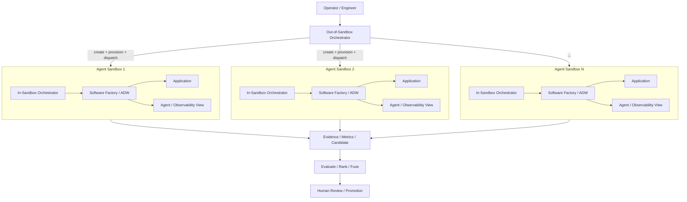
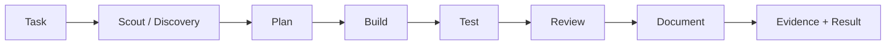

> **Registro Conexus 2026-08-11.** Síntese estruturada do vídeo "Factory in a Box"
> (IndyDevDan/disler) + 14 prints; repo de referência:
> https://github.com/disler/inkwell-agent-sandboxes-and-software-factory (stack: exe.dev +
> Pi + Claude Code como orquestradores + OpenRouter provisioned keys).
>
> **Cruzamento com decisões C-000..C-007** (análise 2026-08-11): ~13 de 18 princípios do §25
> já cobertos (control/execution plane = C-002; gates mecânicos = C-002/C-003; credencial
> curta = C-004; HITL por risco = C-007 approvalFloor; "specialization is your product" =
> C-001). Terceira evidência independente do stack Pi + sandbox + orquestrador externo.
>
> **Inputs absorvidos**: tópico 10 — chave de LLM provisionada POR RUN com spend cap e
> revogação no teardown ("provisioning key never crosses") + rosters de modelo por fase
> swappable per run; tópicos 9/10 — Best-of-N como padrão OPCIONAL do hub (seam; gatilho =
> tarefa de alto valor ou falha repetida; `executeCandidate` C-005 é meio caminho); tópico
> 13 — UI de observabilidade da factory (fases, gates pass/fail, agent calls, tokens, custo,
> retries por run). exe.dev avaliado e DESCARTADO como provider (fechado, flat fee, pooled)
> — ver [C-008](../conexus/05-sandbox.md).
>
> **Desdobramento (2026-08-11, mesma data):** esta análise motivou a **C-008** (supersede
> C-004) — worker em microVM E2B alugada com agency completa, invariante de segredo desdobrado
> (durável × capability por run, o padrão "provisioning key never crosses" deste vídeo virou
> normativo), git mediado pelo hub, ativação probe-gated `CX-SBX-E2B-01`. Detalhe em
> [05-sandbox.md](../conexus/05-sandbox.md) e linha C-008 no
> [DECISOES.md](../conexus/DECISOES.md).
# Factory in a Box — síntese técnica estruturada do vídeo

## 0. Natureza deste documento

Este documento reorganiza a transcrição e os 14 prints do vídeo em uma referência técnica. O objetivo é preservar as ideias materialmente relevantes, remover repetição, autopromoção, hype e digressões, e distinguir:

1. **Princípios arquiteturais transferíveis** — ideias que podem ser aplicadas independentemente de ferramenta/provedor.
2. **Padrões operacionais** — formas concretas de executar o sistema.
3. **Implementação de referência do autor** — Claude Code, Pi, exe.dev, Herder, OpenRouter etc.; são exemplos, não requisitos.
4. **Exemplos temporais de modelos** — úteis para entender a estratégia, mas não devem ser congelados como arquitetura.
5. **Opiniões/afirmações fortes do autor** — devem ser tratadas como heurísticas ou hipóteses, não como fatos universais.

---

# 1. Tese central

A ideia central do vídeo é mover a execução de agentes de desenvolvimento para **ambientes computacionais dedicados, isolados e descartáveis/duráveis**, chamados no vídeo de **agent sandboxes**, e executar dentro deles não apenas um coding agent, mas uma **software factory completa**.

A unidade de trabalho deixa de ser:

> humano → um agente → código

E passa a ser algo mais próximo de:

> humano → orquestrador externo → N sandboxes → orquestradores internos → workflows de agentes + código determinístico → aplicação/testes/evidências → comparação/ranking/fusão → revisão humana

O objetivo declarado é retirar o humano do loop de execução rotineiro e deixá-lo principalmente nos pontos de maior valor: **definição, planejamento, constraints, revisão, validação e decisão**.

---

# 2. Conceito de Software Factory

No vídeo, uma **software factory** não é simplesmente um coding agent, um prompt, um conjunto de subagentes ou uma sequência informal de chamadas de LLM.

Ela é apresentada como a composição controlada de:

- agentes não determinísticos;
- código determinístico;
- workflows explícitos;
- gates/verificações;
- configuração de modelos;
- configuração de harnesses;
- ferramentas disponíveis aos agentes;
- prompts de sistema e de tarefa;
- testes;
- revisão;
- documentação;
- estado da execução;
- observabilidade;
- métricas de custo, tempo e tokens;
- mecanismos de entrega do resultado.

A ideia importante é **agents + code**, não apenas agents.

O autor argumenta que, quando existem dois ou mais agentes/workflows coordenados dessa forma, começa a surgir uma verdadeira fábrica de software: um sistema reutilizável que incorpora uma maneira específica de executar engenharia.

## 2.1 Controle da factory

A factory deve permitir controlar, por agente ou fase:

- qual harness/coding agent será usado;
- qual modelo será usado;
- nível de reasoning/thinking;
- ferramentas disponíveis;
- system prompt;
- task/user prompt;
- gates determinísticos;
- critérios de sucesso/falha;
- inputs e outputs esperados.

O ponto mais importante é que a engenharia do workflow pertence ao sistema, e não fica implícita dentro de um produto de terceiros.

---

# 3. Agent Sandbox: por que colocar a factory em uma máquina dedicada

O vídeo resume o valor de um agent sandbox em três propriedades:

## 3.1 Isolation

O agente recebe um ambiente separado da máquina principal e, principalmente, separado de sistemas sensíveis.

Objetivos:

- limitar o blast radius;
- evitar interferência entre humano e agente;
- evitar interferência entre execuções paralelas;
- controlar explicitamente quais credenciais e recursos entram no ambiente;
- permitir permissões mais amplas *dentro* de um perímetro controlado;
- possibilitar execuções destrutivas/testes sem comprometer o host.

A formulação correta é: **o blast radius deve ser limitado ao sandbox e aos recursos explicitamente concedidos a ele**. O vídeo às vezes usa a frase “blast radius zero”, mas tecnicamente o blast radius não é zero; ele é confinado pelo isolamento e pelas permissões.

## 3.2 Scale

O orchestrator pode criar N máquinas/sandboxes independentes e rodar trabalhos em paralelo.

Isso habilita:

- vários problemas simultaneamente;
- várias implementações do mesmo problema;
- experimentação em paralelo;
- Best-of-N;
- execução de diferentes model stacks;
- comparação de custo/qualidade/latência;
- aumento de throughput sem competir com os recursos da máquina do operador.

## 3.3 Agency / Autonomy

O agente passa a possuir um ambiente de desenvolvimento completo, semelhante ao que um engenheiro teria:

- sistema operacional;
- filesystem;
- shell;
- Git;
- dependências;
- processos;
- serviços;
- portas;
- aplicação;
- testes;
- ferramentas de desenvolvimento;
- acesso de rede conforme política;
- ferramentas de observabilidade;
- runtime dos agentes.

A tese é que **mais autonomia é aceitável quando o ambiente e as permissões têm limites fortes**.

---

# 4. Arquitetura em três níveis de orquestração

Os prints deixam esta parte especialmente clara.

```text
┌──────────────────────────────────────────────────────────────┐
│ Máquina / ambiente do operador                               │
│                                                              │
│  Out-of-Sandbox Orchestrator (x1)                            │
│           │                                                  │
└───────────┼──────────────────────────────────────────────────┘
            │ fan-out / lifecycle / fleet control
            ▼
┌──────────────────────────────────────────────────────────────┐
│ Agent Sandbox / VM #1                                       │
│                                                              │
│  In-Sandbox Orchestrator                                     │
│           │                                                  │
│           ▼                                                  │
│  Software Factory / ADW agents                              │
│  Scout → Plan → Build → Test → Review [→ Document]          │
│                                                              │
│  + application                                               │
│  + tests                                                     │
│  + logs/state                                                │
│  + observability                                             │
└──────────────────────────────────────────────────────────────┘

... repetido para Sandbox #2 ... Sandbox #N
```

## 4.1 Tier 1 — Out-of-Sandbox Orchestrator

Executa fora dos sandboxes, no ambiente de controle.

Responsabilidades mostradas/descritas:

- receber a intenção/prompt do operador;
- decidir/configurar a fan-out;
- criar ou selecionar sandboxes;
- preparar a execução;
- provisionar credenciais de curta duração;
- disparar os orchestrators internos;
- acompanhar o estado da frota;
- obter URLs/resultados;
- opcionalmente abrir SSH/shell/agent sessions;
- comparar/rankear resultados;
- destruir os sandboxes ao final;
- revogar credenciais.

Depois do kickoff, ele pode ficar praticamente ocioso enquanto cada sandbox trabalha de forma independente.

## 4.2 Tier 2 — In-Sandbox Orchestrator

É um agente/orquestrador residente dentro de cada sandbox.

Responsabilidades:

- conhecer o estado local daquele trabalho;
- iniciar e coordenar a software factory local;
- rodar o workflow apropriado;
- gerenciar os agentes/fases do sandbox;
- interagir com filesystem, app, testes e ferramentas locais;
- oferecer um ponto de entrada para intervenção/consulta posterior.

O vídeo demonstra que o operador pode posteriormente entrar no sandbox e conversar com esse orchestrator sobre uma execução que já aconteceu, por exemplo pedindo um resumo das mudanças.

## 4.3 Tier 3 — ADW / Factory Agents

São os agentes especializados que executam as etapas do workflow.

Nos diagramas aparecem:

- Scout;
- Plan;
- Build;
- Test;
- Review.

Em outro diagrama do vídeo, o Software Developer Life Cycle aparece como:

- Plan;
- Build;
- Test;
- Review;
- Document.

Portanto, **Scout** pode ser entendido como uma fase opcional de exploração/preflight antes do planejamento, e **Document** como uma fase posterior à revisão. A composição exata é configurável por tipo de trabalho.

---

# 5. O workflow deve representar trabalho real de engenharia

O vídeo rejeita a ideia de executar apenas uma sequência arbitrária de prompts. A factory deve modelar workflows reais que antes seriam executados por engenheiros.

Exemplos citados:

- feature development;
- redesign;
- bug fix;
- hotfix;
- production issue;
- support request;
- investigação;
- planejamento;
- implementação;
- testes;
- revisão;
- documentação.

A abstração utilizada é **AI Developer Workflow (ADW)**: um fluxo de desenvolvimento formado por agentes + código, com estado e gates explícitos.

---

# 6. Deterministic code around nondeterministic agents

Uma das ideias mais importantes do vídeo é não depender exclusivamente de comportamento probabilístico.

A software factory envolve agentes não determinísticos com componentes determinísticos, por exemplo:

- validação de formato;
- schemas/JSON;
- lint;
- testes;
- comandos reproduzíveis;
- checks;
- gates;
- status de fase;
- filesystem state;
- version control;
- run records;
- regras de retry/failure;
- coleta de outputs.

Exemplo mostrado: quando um agente produz JSON inválido, a execução detecta a falha e tenta corrigi-la em vez de simplesmente assumir sucesso.

Isso produz uma camada de engenharia em torno do modelo.

---

# 7. Best-of-N como padrão de execução

O principal padrão demonstrado é **Best-of-N**.

## 7.1 Fluxo

1. Existe uma única tarefa/prompt.
2. O orchestrator externo cria N sandboxes.
3. Cada sandbox recebe o mesmo problema.
4. Cada sandbox pode receber uma configuração diferente de modelos/harnesses/ferramentas.
5. Cada sandbox executa uma software factory completa.
6. Cada factory gera uma implementação/candidato independente.
7. Os resultados são observados e comparados.
8. Um ranking ou seleção é produzido.
9. Opcionalmente, elementos de vários resultados podem ser fundidos.
10. O melhor resultado é promovido ou usado como base para a próxima etapa.

Representação:

```text
                    ┌─ Factory A ─→ Candidate A
One Prompt ─ fanout ├─ Factory B ─→ Candidate B ─→ Evaluate/Rank ─→ Best result
                    ├─ Factory C ─→ Candidate C
                    └─ Factory N ─→ Candidate N
```

## 7.2 Por que Best-of-N é útil

- LLMs/agentes são não determinísticos.
- Nem toda execução termina com sucesso.
- Diferentes modelos/harnesses produzem diferentes soluções.
- Uma única direção não explora o espaço de soluções.
- Falha de uma variante não interrompe necessariamente o programa inteiro.
- O processo gera dados empíricos sobre qual configuração funciona melhor.

No demo, uma configuração falhou enquanto outras concluíram. O autor usa isso como argumento para manter múltiplos candidatos em paralelo.

## 7.3 Best-of-N não é apenas “rodar o mesmo agente N vezes”

A versão mais rica do padrão varia a **configuração da própria factory**, por exemplo:

- modelo por fase;
- harness por fase;
- ferramentas;
- thinking level;
- custo permitido;
- gates;
- velocidade desejada;
- restrição a open weights;
- política de execução.

---

# 8. Model Stack, não “um modelo favorito”

O autor recomenda abandonar a ideia de um único modelo padrão e manter um **model stack**.

A seleção deve acontecer por job/fase com base principalmente em três dimensões:

- **performance/quality**;
- **cost**;
- **speed/latency**.

Ele divide os modelos conceitualmente em três classes:

## 8.1 State of the Art / Frontier

Usados quando a tarefa realmente exige o máximo de capacidade disponível, especialmente orquestração complexa, problemas muito difíceis ou decisões de alto valor.

## 8.2 Workhorse

Modelos suficientemente fortes e economicamente eficientes para executar a maior parte do volume diário.

A imagem do vídeo chama esta região de **“daily 90%”**.

## 8.3 Lightweight

Modelos baratos ou locais, inclusive on-device, para tarefas simples, repetitivas ou altamente estruturadas.

A imagem chama essa camada de **“own-it floor”**.

## 8.4 Princípio

> Não selecionar um único compute. Compor diferentes tipos de compute conforme a necessidade do trabalho.

A factory deve permitir trocar modelos sem mudar a semântica do workflow.

---

# 9. Configurações de exemplo mostradas no vídeo

Estes nomes/modelos são **exemplos temporais do vídeo, não requisitos arquiteturais**.

Nos prints, um único prompt é distribuído para variantes chamadas aproximadamente:

### Budget / Default

- DeepSeek V4 Flash 0731
- Gemini 3.6 Flash
- GLM 5.2
- GPT 5.6 Luna

A transcrição em alguns pontos chama essa configuração de **Default**, enquanto o print a chama de **Budget**. Tratar a diferença como nomenclatura do demo.

### Deepest Seek

- DeepSeek V4 Flash 0731 como base dominante/única da configuração.

### Frontier

- Claude Opus 5
- Kimi K3
- GPT 5.6 Sol

### Open Weights

- DeepSeek V4 Flash 0731
- GLM 5.2
- Kimi K3

### Top Speed

- DeepSeek V4 Flash 0731
- Gemini 3.6 Flash
- GPT 5.6 Luna

A intenção do exemplo é mais importante que os nomes: **testar stacks diferentes contra o mesmo trabalho e medir o resultado real**.

---

# 10. Observability da Software Factory

A factory é tratada como um sistema que precisa ser observável, não uma caixa-preta.

O demo mostra uma UI na qual é possível inspecionar:

- incoming request;
- fases do workflow;
- estado de cada fase;
- agent calls;
- thinking/reasoning traces disponibilizados pela ferramenta;
- modelo por fase;
- harness/config;
- tools;
- prompts;
- gates;
- pass/fail;
- erros;
- retries/correções;
- outputs;
- logs;
- duração;
- tokens;
- custo/spend;
- arquivos/changes;
- estado global da execução.

Princípio destacado:

> “If you don’t measure it, you can’t improve it.”

O objetivo não é somente debugar. É gerar dados para melhorar a própria factory: qual model stack, workflow ou agente entrega maior qualidade por custo/tempo.

---

# 11. Um sandbox, dois planos de acesso

Um print mostra explicitamente **“One Sandbox — Two Ports”**.

Exemplo visual:

```text
Sandbox
 ├─ PUBLIC PORT  ─→ Application      (ex.: localhost:3000)
 └─ PRIVATE PORT ─→ Agent/Factory UI (ex.: localhost:8787)
```

A ideia é separar:

- **application plane**: app/resultado que pode ser exposto;
- **agent/operations plane**: visão interna da factory, protegida/autenticada.

Isso permite observar a aplicação e, separadamente, observar/controlar o sistema de agentes que a produziu.

---

# 12. Agentic access / capacidade de entrar nas caixas

Autonomia não significa impossibilidade de intervenção.

O vídeo mostra três níveis de acesso humano/agêntico:

1. acompanhar a factory por UI/observabilidade;
2. obter shell/SSH em cada sandbox;
3. abrir uma sessão interativa com o orchestrator que vive dentro do sandbox.

O autor usa um terminal multiplexer (**Herder**) para abrir várias sessões em grid e interagir com múltiplos sandboxes ao mesmo tempo.

O princípio transferível é:

> qualquer infraestrutura usada por agentes deve também possuir uma camada de acesso programável/agêntico para inspeção, recuperação, debugging e intervenção.

Não depender de clicar manualmente em painéis de infraestrutura para operar uma frota de agentes.

---

# 13. Segurança e ciclo de credenciais

Os prints acrescentam um padrão importante: **Short-Lived Keys Only**.

Fluxo mostrado:

```text
HOST
  Provisioning Key
       │
       │ mint
       ▼
SANDBOX
  Runtime Key Active
       │
       │ teardown
       ▼
HOST / CONTROL PLANE
  Revoke
```

Regra explícita do diagrama:

> **The provisioning key never crosses**.

Isto significa:

- a credencial de provisionamento/root permanece no control plane;
- para cada sandbox/run é criada uma credencial limitada de runtime;
- a credencial recebe limites adequados ao trabalho;
- no teardown, ela é revogada;
- credenciais órfãs devem ser detectadas e removidas.

No demo, o autor usa **OpenRouter provisioned keys** e menciona um limite de gasto de **US$ 50** para a chave de execução. O valor/provedor são apenas implementação de referência.

Princípios generalizáveis:

- least privilege;
- short-lived credentials;
- per-run/per-sandbox identity;
- budget caps;
- revocation on teardown;
- no long-lived master secret dentro do sandbox;
- auditoria de chaves órfãs;
- separação entre provisioner e runtime identity.

---

# 14. Lifecycle do sandbox

O sandbox pode ser efêmero ou durável, mas deve possuir lifecycle explícito.

Fluxo inferido do vídeo:

1. receive job;
2. choose factory/model configuration;
3. create sandbox/VM;
4. bootstrap filesystem/repository;
5. instalar/validar dependencies e skills necessários;
6. provisionar runtime credentials;
7. iniciar in-sandbox orchestrator;
8. iniciar factory/ADW;
9. subir application e observability endpoints;
10. executar o workflow;
11. coletar evidências/resultados/metrics;
12. comparar ou promover o resultado;
13. persistir o que for necessário;
14. teardown da VM, quando aplicável;
15. revoke da runtime key;
16. verificar ausência de recursos/segredos órfãos.

O vídeo menciona que alguns provedores mantêm VMs por períodos curtos, enquanto o provedor escolhido no demo permite sandboxes mais duráveis. O princípio é que **durabilidade deve ser uma política do workload**, não um acidente da infraestrutura.

---

# 15. Application layer + Agentic layer

Cada sandbox do demo contém, no mínimo, dois conjuntos de artefatos:

## Application layer

O software sendo construído/testado.

## Agentic layer

- orchestrator;
- software factory;
- ADW definitions;
- prompts;
- configs;
- agent harnesses;
- state;
- observability;
- workflows.

O autor enfatiza que a vantagem competitiva não está em “usar um agente”, mas em possuir uma camada agentic especializada que codifica a engenharia da equipe/produto.

---

# 16. Especialização como produto

Uma factory genérica é somente um ponto de partida.

O valor real surge ao especializar:

- workflow;
- prompts;
- tools;
- gates;
- knowledge/context;
- testes;
- conventions;
- harness behavior;
- model routing;
- economics;
- observability;
- recovery behavior;
- quality bar.

A frase conceitual do vídeo é:

> **Specialization is your product.**

Ou seja: o diferencial não é o modelo base, mas o sistema especializado construído ao redor dele.

---

# 17. O papel do humano

A regra mais repetida do vídeo é:

> “If you are inside the loop, you are the bottleneck.”

A interpretação útil não é remover o humano de tudo. O próprio autor reconhece exceções.

## Humano deve estar principalmente em:

- definição do problema;
- arquitetura;
- constraints;
- objetivos;
- planejamento de alto nível;
- criação/evolução da própria factory;
- revisão;
- validação;
- decisão de promoção/merge/deploy;
- investigação de falhas materiais;
- melhoria contínua do workflow.

## Agentes/factory devem absorver cada vez mais:

- execução repetível;
- implementação;
- experimentação;
- testes;
- revisão mecânica;
- documentação;
- exploração paralela;
- coleta de evidências;
- tarefas operacionais codificáveis.

## Exceção explícita do autor

Ao **“building the system that builds the system”**, especialmente trabalho novo sobre a própria harness/factory, pode fazer sentido ficar intensamente no loop: conversar, testar, ajustar e supervisionar.

Depois que o processo é entendido e codificado, ele deve gradualmente se tornar um workflow autônomo.

---

# 18. “Vibe coding” vs “agentic engineering”, segundo o autor

O autor faz uma distinção conceitual:

### Vibe coding

Não compreender com precisão o que o sistema faz e simplesmente aceitar o resultado do agente.

### Agentic engineering

Compreender profundamente o sistema, os workflows, os limites, os agentes, os gates e as evidências a ponto de **não precisar observar cada ação individual**.

A frase central é:

> Vibe coding é não saber o que o sistema faz e não olhar. Agentic engineering é saber tão bem o que o sistema faz que você não precisa olhar continuamente.

O objetivo é **abstração baseada em controle e observabilidade**, não confiança cega.

---

# 19. “Scale compute to scale impact”

Outra tese recorrente:

> aumentar compute pode aumentar a quantidade de alternativas exploradas, o throughput, a qualidade selecionada e a velocidade de aprendizado.

No contexto de agentes, compute não significa apenas GPU/inference. Também significa:

- CPUs;
- VMs;
- sandboxes;
- processos paralelos;
- múltiplas instâncias de ferramentas;
- diferentes modelos;
- execução simultânea de workflows.

A ideia de Best-of-N depende diretamente disso.

O autor propõe pensar em um futuro de **abundant compute**: modelos fortes ficando mais baratos e inteligência sendo empurrada para tiers inferiores de custo.

---

# 20. Economics como parte da arquitetura

A factory deve observar não só “funcionou ou não”, mas:

- qualidade do resultado;
- runtime;
- tokens;
- spend;
- taxa de falha;
- necessidade de retries;
- velocidade;
- eficiência por configuração;
- custo por tarefa bem-sucedida.

A execução de variantes produz dados reais para responder:

- preciso de frontier aqui?
- um workhorse resolve com qualidade suficiente?
- qual harness funciona melhor para esta fase?
- qual stack entrega a melhor relação quality/cost/speed?

Isso transforma model choice de opinião em um problema de roteamento e medição.

---

# 21. Failure is expected, not exceptional

No demo, uma das fábricas falha por não conseguir produzir o formato esperado, enquanto as demais continuam.

Isso demonstra algumas propriedades desejáveis:

- falha isolada por sandbox;
- falha de uma variante não destrói a execução global;
- observabilidade suficiente para explicar a falha;
- Best-of-N absorve parte da variância dos agentes;
- gates determinísticos impedem falso sucesso;
- sistema deve conseguir retry/repair quando apropriado;
- resultados incompletos não devem ser tratados como equivalentes a sucesso.

---

# 22. Reference stack usada no vídeo

Novamente: esta é a implementação escolhida pelo autor, não a essência da arquitetura.

## Sandbox / VM

- **exe.dev**
  - usado como provider de “computers for developers and agents”;
  - VMs/sandboxes isolados;
  - SSH;
  - endpoints/URLs;
  - possibilidade de ambientes descartáveis ou duráveis.

## Outer / inner orchestration

- **Claude Code** em parte da orquestração demonstrada.

## Agent SDK / custom harness

- **Pi** como agent SDK/harness customizável.

## Terminal/fleet interaction

- **Herder** como terminal multiplexer para observar/operar várias caixas.

## Model/API routing

- **OpenRouter** para provisionar acesso a múltiplos modelos e criar runtime keys limitadas.

## Software Factory

- “Super Simple Software Factory”, um projeto/template do próprio autor.

## Skills

O orchestrator é alimentado por skills, incluindo no demo:

- Herder;
- sandbox/exe.dev;
- Super Simple Software Factory;
- software factory orchestrator/composite skill.

O autor alerta para evitar composição excessiva entre skills porque pode criar dependency graphs difíceis de manter; considera aceitável quando tudo está unificado num mesmo monorepo/contexto.

---

# 23. Observação sobre containers

O vídeo apresenta a oposição “containers na sua máquina” vs “agent sandboxes/VMs” de forma bastante absoluta.

A ideia transferível por trás dessa retórica é válida:

- um container local isolado não resolve automaticamente fleet orchestration;
- não resolve automaticamente secret lifecycle;
- não oferece compute independente da máquina do operador;
- não oferece automaticamente uma máquina completa por agente;
- não oferece automaticamente autonomia operacional;
- não oferece automaticamente isolamento forte de kernel/host.

Porém, **containers também podem ser executados remotamente, orquestrados e escalados**, e podem fazer parte de uma arquitetura de sandbox. Portanto, não transformar a frase “containers não servem” em requisito técnico. O requisito real é obter as propriedades necessárias de **isolation + scale + agency + policy control**.

---

# 24. Opiniões fortes do autor que não devem virar regra sem validação

Estas ideias aparecem no vídeo e são relevantes para compreender a filosofia, mas devem ser tratadas como **heurísticas**, não verdades arquiteturais universais:

1. “Se você está no loop, você é o bottleneck.”
   - útil como direção para automação, mas não remove necessidade de checkpoints humanos proporcionais ao risco.

2. “Se você usa um agente para modificar diretamente application code, está desperdiçando tempo.”
   - afirmação deliberadamente provocativa. O sentido é incentivar construção de workflows reutilizáveis em vez de sessões ad hoc; não significa que edição direta por agente nunca seja apropriada.

3. “Blast radius is zero.”
   - tecnicamente deve ser entendido como blast radius **confinado**, não inexistente.

4. “The best engineers aren’t using containers.”
   - generalização retórica. O ponto material é entregar infraestrutura realmente isolada, escalável e autônoma, independentemente do mecanismo utilizado.

5. “One agent is not enough.”
   - muitas tarefas realmente ganham com múltiplas fases/agentes, mas a complexidade da factory deve ser proporcional ao problema.

---

# 25. Princípios arquiteturais extraídos, sem dependência de ferramenta

Se removermos nomes de produtos, modelos e marketing, o vídeo reduz-se a estes princípios:

1. **Trate execução agentic como um sistema de engenharia, não como uma conversa com um LLM.**
2. **Separe control plane de execution plane.**
3. **Dê a cada workload um ambiente computacional isolado e policy-bounded.**
4. **Construa workflows explícitos de engenharia com agentes + código determinístico.**
5. **Use agentes especializados por função/fase quando isso reduzir complexidade ou aumentar qualidade.**
6. **Mantenha estado, gates, evidências e observabilidade de cada run.**
7. **Faça model routing por tarefa/fase, não por preferência fixa.**
8. **Meça performance, cost e speed.**
9. **Use paralelismo/Best-of-N para explorar alternativas quando o valor justificar o compute.**
10. **Trate falhas de agentes como normais e isole-as.**
11. **Use credenciais de curta duração e identidade por execução.**
12. **Revogue tudo no teardown e detecte recursos órfãos.**
13. **Separe application plane de agent/operations plane.**
14. **Permita intervenção via UI, shell e agentic access sem tornar a intervenção obrigatória.**
15. **Codifique conhecimento e padrões da equipe na factory.**
16. **Human-in-the-loop deve ser dirigido por risco/valor, não existir em cada microação.**
17. **A factory deve ser substituível/configurável: modelos e providers são componentes, não a arquitetura.**
18. **Especialização do sistema ao domínio é a fonte principal de vantagem, não o modelo base.**

---

# 26. Arquitetura abstrata consolidada



Dentro de cada factory:



As fases são configuráveis por workflow; não precisam ser sempre todas executadas.

---

# 27. Control plane vs execution plane

Uma leitura arquitetural útil do sistema é:

## Control plane

- recebe intenção;
- cria sandboxes;
- distribui jobs;
- provisiona identities/secrets;
- acompanha fleet state;
- recebe métricas/resultados;
- seleciona/promove candidato;
- executa teardown/revoke.

## Execution plane

Em cada sandbox:

- repository/worktree;
- agent runtime;
- local orchestrator;
- software factory;
- application runtime;
- tests;
- tools;
- agent view;
- ephemeral runtime secrets.

Esta separação é mais importante que a escolha de exe.dev, Claude Code ou Pi.

---

# 28. O que o vídeo sugere como evolução natural de uma harness

Uma progressão implícita no vídeo é:

```text
Prompt
  ↓
Single Coding Agent
  ↓
Subagents
  ↓
Agent Chains
  ↓
Custom Agent Harness
  ↓
AI Developer Workflow
  ↓
Software Factory
  ↓
Software Factory inside isolated Agent Sandbox
  ↓
Fleet of Sandboxed Factories
  ↓
Parallel strategies / Best-of-N / automated evaluation
```

A evolução não é simplesmente “mais agentes”. É aumento gradual de:

- explicitness;
- control;
- repeatability;
- specialization;
- observability;
- isolation;
- automation;
- scale.

---

# 29. Critério real para “autonomia”

O vídeo associa autonomia à possibilidade de o agente executar sem supervisão contínua. Para isso ser engenharia e não confiança cega, o sistema precisa de:

- bounded environment;
- bounded permissions;
- bounded credentials;
- bounded spend;
- explicit workflow;
- deterministic gates;
- recoverability;
- auditability;
- observability;
- evidence;
- teardown;
- review/promotion policy.

Em outras palavras:

> autonomia deve ser consequência de containment + policy + evidence, não de permissões irrestritas.

---

# 30. Resumo executivo em 12 pontos

1. **Software factory = agents + deterministic code + explicit developer workflows.**
2. A factory deve executar em **ambientes isolados e completos**, não depender da máquina do operador.
3. O sandbox existe para entregar **isolation, scale e agency/autonomy**.
4. A arquitetura demonstrada tem **out-of-sandbox orchestrator → in-sandbox orchestrator → factory/ADW agents**.
5. O workflow base representa o SDLC: **Scout/Plan → Build → Test → Review → Document**.
6. O humano deve migrar de executor contínuo para **designer, planner, reviewer e validator**.
7. **Best-of-N** cria N sandboxes/factories para resolver o mesmo problema e depois comparar os candidatos.
8. **Model stack** substitui a fixação em um único modelo: frontier, workhorse e lightweight são roteados conforme a tarefa.
9. A factory precisa de **observabilidade profunda** de estado, gates, agentes, custo, tokens, duração, outputs e falhas.
10. Segurança depende de **short-lived runtime keys**, least privilege, spend caps e revogação no teardown.
11. Cada sandbox pode expor separadamente **application plane** e **private agent/operations plane**.
12. O diferencial competitivo é a **especialização da factory ao domínio e à engenharia da organização**, não o modelo ou provedor isolado.

---

# 31. Instrução sugerida para usar este material com outro agente

Ao analisar este documento, não trate as ferramentas, provedores ou modelos citados como requisitos. Extraia primeiro os **princípios, invariantes e propriedades desejadas**. Depois compare esses princípios com a arquitetura do projeto em questão e identifique:

- o que já existe;
- o que está parcialmente implementado;
- o que falta;
- o que é incompatível;
- o que seria duplicação desnecessária;
- quais ideias merecem experimento/spike;
- quais afirmações do vídeo precisam de validação técnica antes de adoção;
- quais conceitos podem simplificar a arquitetura em vez de adicionar camadas.

Não proponha adoção de tecnologia apenas porque aparece no vídeo. Preserve provider-neutrality onde ela for importante e use evidências para decidir entre alternativas.

