# Mitra — Referência Técnica (visão geral)

> **Propósito desta pasta.** Documentação técnica de engenharia reversa da plataforma **Mitra**
> (`agent.mitralab.io` — app-builder brasileiro guiado por IA), organizada por assunto para servir
> de **consulta** no desenho do **Conexus** (nossa harness).
>
> Não é o registro de descoberta — esse é o [Mitra Inspiration Map](influence-on-conexus.md#mitra-inspiration-map)
> (v0.9.0, cadeia de evidência congelada). Esta pasta **deriva** dele: reorganiza por tema, adiciona
> diagramas, e termina cada documento com o veredito para o Conexus. Toda afirmação factual aqui
> tem origem rastreável no mapa; quando divergir de uma leitura casual, o mapa prevalece.

## Como esta pasta está organizada

| # | Documento | O que responde |
|---|---|---|
| — | [Registro de Decisões](influence-on-conexus.md#registro-de-decisões--mitra--conexus) | **Comece aqui.** Todos os ~170 vereditos ADOPT/REJECT/OWN num só lugar, com link para a evidência |
| 00 | este arquivo | Mapa macro + glossário + os 7 fatos que você precisa saber antes de tudo |
| 01 | ``01-harness-agentico.md`` | Como o agente roda: E2B, Claude Code, `CLAUDE.md`, protocolo de turno, MCP |
| 02 | ``02-registro-artefatos.md`` | O que o agente cria: server functions, dataLoaders, dbActions, os dois SDKs |
| 03 | ``03-camada-dados.md`` | Onde os dados vivem: MySQL por projeto, migrations, teste, credenciais |
| 04 | ``04-integracao-externa.md`` | Como fala com o mundo: conectores declarativos, blueprints, túnel, o caso Sankhya |
| 05 | ``05-ciclo-de-vida.md`` | Do build ao ar: git por usuário, SYNC/SHARE, releases, promote DEV→PROD |
| 06 | ``06-runtime-publicado.md`` | O app final: SPA React, `__mitraEnv`, SDK de runtime, login/RBAC, chat-embed |
| 07 | ``07-padrao-de-projeto.md`` | Como um projeto real nasce: as 8 fases, docs de planejamento, testes, honestidade |
| 08 | [08 — Limites e gaps](#08--limites-e-gaps-onde-a-mitra-falha--onde-o-conexus-ganha) | Onde a Mitra falha = onde o Conexus ganha. Todos os REJECT + as apostas OWN |
| 09 | ``09-agente-embarcado.md`` | O agente **dentro** do app publicado (Playground/Generative UI) + protocolo WS capturado ao vivo |

Cada documento temático segue a mesma estrutura:
**O que é → Como funciona (diagrama) → Contratos exatos → Evidência (link do mapa) → Decisão Conexus → Ideias de melhoria.**

---

## Os 7 fatos que definem a Mitra

1. **A harness é o Claude Code CLI**, rodando num sandbox E2B efêmero, um por projeto. Não há
   agente proprietário — a inteligência é o CLI comercial dentro de um envelope da Mitra.
2. **O agente não tem "ferramentas" configuráveis.** As tools do agente **são** as server functions
   do projeto, expostas por um MCP server (`mcp__mitra-business`). Capacidade do agente = artefato
   versionado do projeto.
3. **Existem dois SDKs, com dois níveis de privilégio.** `mitra-sdk` (build) tem DDL/DML; o app
   publicado só recebe `mitra-interactions-sdk`, que só executa artefato registrado por id. **O
   poder mora no build, não no runtime.**
4. **Todo backend é serverless-gerenciado.** Não há `src/` de servidor. O "backend" são scripts Node
   que **provisionam** tabelas e server functions na plataforma, de forma idempotente, e são
   descartados (mas ficam versionados no git).
5. **Cada projeto tem seu próprio banco** (schema MySQL + container Docker), criado no `create`.
   Credenciais de integração ficam num servidor apartado.
6. **A qualidade não vem de um workflow engine.** Vem de quatro coisas empilhadas: um `CLAUDE.md`
   gerado pela plataforma (protocolo de turno rígido), documentos de planejamento versionados que o
   agente relê como memória, o SDK de build privilegiado, e um scaffold/UI-kit byte-idêntico.
7. **Não existe a abstração "Agente".** Nenhuma entidade com identidade, versão, conjunto de tools e
   ciclo de vida próprios. O "agente de negócio" da Mitra é uma convenção montada à mão dentro de
   cada app. **É exatamente aí que o Conexus tem espaço para existir.**

---

## Diagrama macro — os contêineres da plataforma (C4 nível 2)

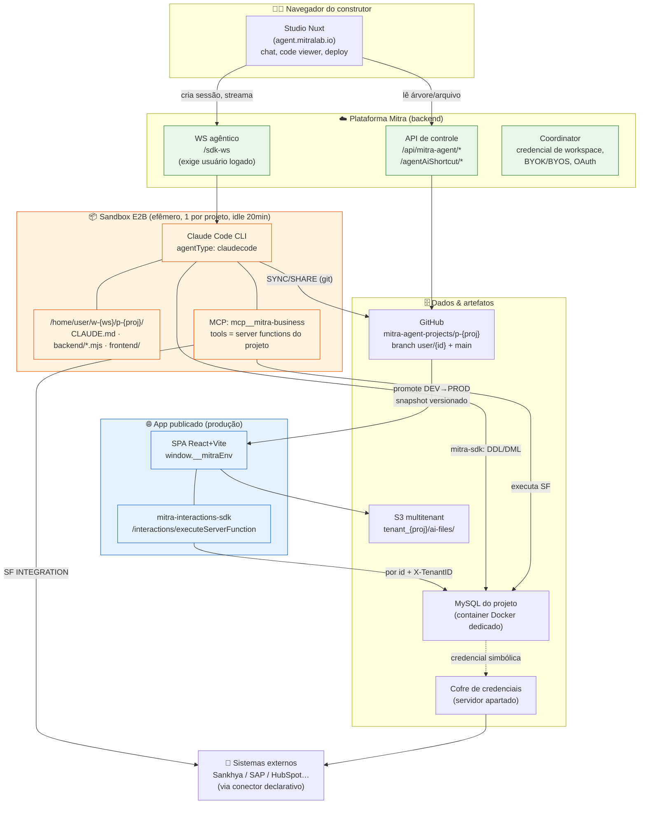

**Como ler o diagrama:**
- **Laranja** = efêmero (o sandbox some no idle; só o que foi para o GitHub sobrevive).
- **Verde** = privilegiado (build): pode DDL/DML, cria artefatos.
- **Azul** = restrito (runtime): só invoca artefato já registrado, por id.
- A fronteira de segurança é a linha `mitra-sdk` (verde) vs `mitra-interactions-sdk` (azul).

---

## O fluxo de um turno (do "oi" ao deploy)

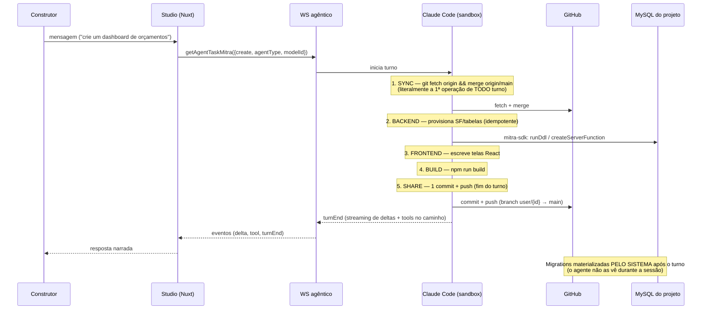

---

## Glossário

| Termo | Significado |
|---|---|
| **Server Function (SF)** | Unidade de lógica de backend registrada no projeto. Três tipos: `SQL`, `JAVASCRIPT`, `INTEGRATION`. Invocada por id numérico + input. É a única superfície de execução do app. |
| **dataLoader** | Registry irmão da SF, para ingestão (ETL) de fonte externa. |
| **dbAction** | Registry irmão da SF, para operação de dados. `executeDbAction({projectId, dbActionId, input})`. |
| **`mitra-sdk`** | SDK de **build**. Roda no sandbox e dentro de SFs JAVASCRIPT. Privilegiado: DDL, DML, criar/atualizar SF. |
| **`mitra-interactions-sdk`** | SDK de **runtime**. Roda no browser do app publicado. Restrito: só executa artefato registrado. |
| **`mcp__mitra-business`** | O MCP server que expõe as server functions do projeto como tools do agente. A superfície de ação do agente. |
| **Perfil (de IA / de app)** | Unidade de RBAC: define quais tabelas/SFs/telas um grupo pode usar. O RBAC do agente reusa o mesmo Perfil do app. |
| **SYNC / SHARE** | Início e fim obrigatórios de todo turno. SYNC = `git fetch + merge origin/main`. SHARE = 1 commit + push. |
| **Promote** | Publicação DEV→PROD: PROD é um projeto forkado e ligado ao DEV; deploy por snapshot versionado, 12 steps observáveis. |
| **`window.__mitraEnv`** | Config de runtime (apiBaseURL, agentWsUrl) injetada no HTML no momento do publish. |
| **E2B** | Provedor de sandbox cloud onde o Claude Code roda. Um sandbox por projeto, descartado após 20 min idle. |
| **modelId** | String `origem:provider:modelo:esforço`, ex. `subscription:anthropic:claude-fable-5:medium`. |
| **Conexus** | Nossa harness (a ser desenhada). O alvo de todas as decisões deste registro. |

---

## O que fazer com isto

1. Ler o [Registro de Decisões](influence-on-conexus.md#registro-de-decisões--mitra--conexus) inteiro uma vez — é a lista de compras.
2. Para cada área que o Conexus for atacar, abrir o documento temático correspondente: ele tem o
   diagrama, os contratos exatos, e a seção *Ideias de melhoria* onde suas próprias ideias entram.
3. As linhas **OWN** do registro são as apostas do Conexus. As **REJECT** são os requisitos
   negativos. Juntas, elas são o esqueleto do que o Conexus precisa ser para superar a Mitra —
   consolidadas em [08 — Limites e gaps](#08--limites-e-gaps-onde-a-mitra-falha--onde-o-conexus-ganha).


---

# 01 — Harness agêntico

> Como o agente da Mitra efetivamente roda: onde executa, o que lê, como age, e como um turno é
> disciplinado. Fonte: `§2`,
> `§20–22`, `§26`,
> `§30–31`, `§34`.

## O que é

A harness da Mitra **não é um agente proprietário**. É o **Claude Code CLI** (comercial) rodando
dentro de um **sandbox E2B** efêmero, um por projeto, no diretório `/home/user/w-{ws}/p-{proj}/`.
A Mitra não escreveu o loop agêntico — ela envelopou o CLI e o alimenta com contexto, tools e um
protocolo de turno.

`agentType` disponíveis: `claudecode` (default) · `codex` · `opencode-cli` · `opencode-sdk`.
`modelId` é uma string única `origem:provider:modelo:esforço` — ex.
`subscription:anthropic:claude-fable-5:medium`.

## Como funciona

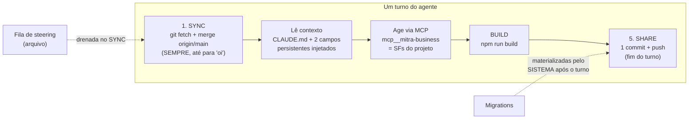

### As três fontes de contexto do agente

1. **`CLAUDE.md`/`AGENTS.md`** — arquivo versionado no repo do projeto, gerado pela plataforma.
   Contém o protocolo de turno (ver abaixo). Precedência de arquivo sobre regra genérica.
2. **Dois campos de texto persistentes** — "Diretrizes para a IA" + "Considerações Adicionais",
   concatenados a **toda** mensagem. É o "system prompt" editável pelo construtor.
3. **Perfil de IA** — o RBAC que limita quais tabelas e server functions o agente pode tocar
   (ver ``02`` e ``06``).

### O protocolo de turno (do `CLAUDE.md` real do projeto 55833)

Ordem obrigatória, **todo turno, inclusive para "oi" ou "qual a cor X?"**:

```
1. SYNC     git fetch origin && git merge origin/main   ← 1ª operação literal do turno
2. BACKEND  provisiona SF/tabelas (idempotente)
3. FRONTEND escreve telas
4. BUILD    cd frontend && npm run build
5. SHARE    git add -A → 1 commit → push (branch user/{id} → main)
```

Regras críticas capturadas verbatim:
- *"Pular SYNC = mentir sobre o estado real. Pular SHARE = trabalho órfão que some no idle de 20min."*
- **SHARE é UM commit no fim**, não um por arquivo.
- **`AskUserQuestion` deve ser a ÚLTIMA ação da resposta.** Motivo declarado: *"O sistema NÃO
  bloqueia tools posteriores — qualquer ação DEPOIS de `AskUserQuestion` será EXECUTADA no sandbox
  antes da resposta do usuário, gerando trabalho não autorizado e estado divergente."*
- Após **3 tentativas** falhas, PARAR e escalar com dossiê estruturado.
- Conflito de merge → sempre `AskUserQuestion` em linguagem de negócio, nunca resolver sozinho.

> **Correção 2026-08-11 (sonda do `tópico 16`, OBS-10).**
> Este doc trata a pausa da Mitra como sendo sempre "por prompt, não por mecanismo". São **dois
> regimes distintos na mesma plataforma**: `AskUserQuestion` é mitigação por prompt (o sistema não
> bloqueia tools posteriores), mas **tool approval tem gate mecânico** — componente `.agent-approval`
> com `requestId`, três escopos (`allow_once` / `allow_session` / `deny`) e o input da tool visível
> antes de decidir. O STRENGTHEN do Conexus fica mais preciso: **pôr pergunta no mesmo regime
> mecânico em que a Mitra já pôs aprovação**, não inventar o mecanismo do zero.

### A superfície de ação: MCP, não SQL

O agente **não tem uma tool de SQL genérica**. Suas tools **são** as server functions do projeto,
expostas por um único MCP server por domínio, `mcp__mitra-business__executeServerFunction`.

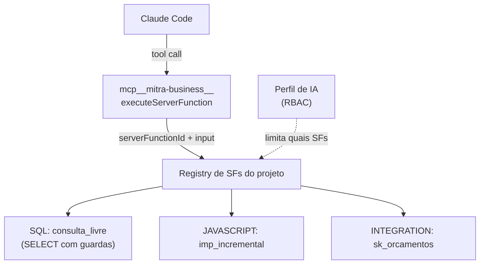

Consequência de design: **a capacidade do agente é um artefato versionado, revisável e
permissionável** — não uma configuração solta. Para dar uma habilidade nova ao agente, cria-se uma
server function; ela nasce auditável e sob RBAC.

> **Correção 2026-08-11 (OBS-20).** O mapa v0.9.0 afirma duas vezes *"sem `WebSearch`/`WebFetch`
> neste build"*. **Existe acesso à web**: rótulo de tool **"Acessando URL"** observado ao vivo
> buscando `developer.sankhya.com.br/llms.txt` e as páginas de referência do fornecedor — e foi isso
> que permitiu **provar o ambiente sandbox sem emitir uma requisição ao ERP** (OBS-21). A superfície
> de ação continua sendo MCP para dados; web é superfície de **leitura de documentação**. Veredito
> Conexus: **ADOPT com allowlist de domínio**. Detalhe a copiar: o agente procurou o `llms.txt` antes
> de ler a doc — sabe buscar o índice antes do conteúdo.

## Contratos exatos

```js
// Abrir/reabrir sessão (mitra-interactions-sdk, lado do app)
getAgentTaskMitra({ create: true, agentType: 'claudecode', modelId })  // → { taskId }
getAgentTaskMitra({ taskId })                                          // reconecta, inclusive stream ativa

// Eventos do stream
taskCreated | turnStart | delta({delta, kind}) | tool({tool, input}) | turnEnd({content}) | error | statusChange
// (usar SÓ kind === 'text' nos deltas)

// Controle
send() · cancel() · loadHistory()
```

⚠️ Armadilhas documentadas pela própria Mitra (ver ``08``):
- O WS agêntico **só aceita usuário logado** (token de integração → "conexão fechada"). **Sem agente
  headless** — mata cron/webhook.
- O `input` do evento `tool` chega **truncado** — a Mitra manda nunca dar `JSON.parse`, extrair por
  regex tolerante. Sintoma de protocolo fraco.

## Evidência

- Harness = Claude Code / E2B: `§2`, `§20`, `§21`
- Protocolo de turno / `CLAUDE.md`: `§34.10`
- MCP como superfície de tools: `§31.2`
- Contexto injetado (2 campos + Perfil): `§31.3–31.5`
- Sessão/eventos/streaming: `§16.5`, `§20`, `§26`

## Decisão Conexus

| Padrão | Veredito |
|---|---|
| Tools do agente = server functions via MCP | **ADOPT** — melhor decisão da Mitra |
| Um MCP server por domínio | **ADOPT** |
| Sem SQL direto p/ o agente de negócio | **ADOPT** (guarda-corpo) |
| `CLAUDE.md` por projeto como contexto versionado | **ADOPT** |
| Steering por fila em arquivo, drenada no SYNC | **ADOPT** |
| `taskId` = sessão contínua sem limite de turnos | ADOPT |
| Telemetria de token por turno **e** sessão | ADOPT |
| `AskUserQuestion` encerra o turno (mitigação por prompt) | **REFERENCE + STRENGTHEN** → bloqueio mecânico |
| Tool approval **com** gate mecânico, 3 escopos, input visível (OBS-10) | **ADOPT** — é o modelo que a pergunta deve seguir |
| Acesso à web para doc oficial do fornecedor (OBS-20) | **ADOPT** com allowlist de domínio |
| Compactação delegada ao CLI, sem expor estado ao usuário | ADAPT |
| WS exige usuário logado (sem headless) | **REJECT → OWN** (agente por evento) |
| `input` de tool truncado / `loadHistory` texto cru | **REJECT** (protocolo íntegro, histórico tipado) |
| **Não existe entidade "Agente"** de 1ª classe | **OWN** — a aposta central do Conexus |

## Ideias de melhoria (Conexus)

- **Agente como objeto de 1ª classe**: identidade, versão, conjunto de tools declarado, política e
  ciclo de vida próprios — versionado. A Mitra tem os primitivos (MCP, RBAC de tools, contexto
  persistente, sessão embarcável) mas **não a abstração**. É onde diferenciamos. → ``08``
- **Contexto em camadas**: plataforma → projeto → agente → tarefa. A Mitra tem contexto único por
  projeto.
- **Carregamento de contexto determinístico no harness**, não um pedido ao modelo: se o arquivo
  existe no path convencionado, ele entra. (A Mitra admite que a leitura do `CLAUDE.md` "não é
  garantida" — ver ``08``.)
- **Bloqueio mecânico** para o problema do `AskUserQuestion`, em vez de instrução no prompt.
- **Agente headless com identidade de serviço** para cron/webhook/evento — o que o WS logado-only
  da Mitra impede.
- **_(seu espaço para ideias)_**


---

# 02 — Registro de artefatos (server functions)

> O que o agente cria e como o app o consome. É o núcleo técnico da Mitra. Fonte:
> `§21`, `§23`,
> `§32.3`, `§34`.

## O que é

O backend de um app Mitra não tem servidor próprio. Tem um **registro de artefatos executáveis**,
todos endereçados por **id numérico + input**. Três registries irmãos:

| Registry | Papel | Assinatura de runtime |
|---|---|---|
| **`serverFunction`** | lógica (query, job, chamada externa) | `executeServerFunction({projectId, serverFunctionId, input})` |
| **`dataLoader`** | ingestão / ETL de fonte externa | (id + input) |
| **`dbAction`** | operação de dados | `executeDbAction({projectId, dbActionId, input})` |

Server function tem **três tipos**, e é aqui que mora a maior inconsistência da plataforma:

| Tipo | O `code` é… | Binding de parâmetro |
|---|---|---|
| `SQL` | uma string SQL com `{{x}}` | `{{x}}` mustache, **sempre entre aspas** |
| `JAVASCRIPT` | um script Node (com `require('mitra-sdk')`) | `event.x` como variável global |
| `INTEGRATION` | um **JSON** `{connection, method, endpoint, body}` | `event.x` textual dentro da string |

**Nenhum dos três é bind parameter de verdade — todos são interpolação de string.** Ver
[08 — Limites e gaps](#08--limites-e-gaps-onde-a-mitra-falha--onde-o-conexus-ganha) para o risco de injeção.

## Como funciona

### Os dois SDKs — a fronteira de privilégio

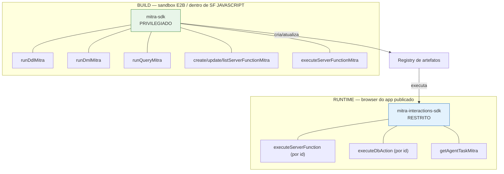

> **O poder mora no build, não no runtime.** O agente tem DDL/DML arbitrário porque fala pela API
> autenticada com `MITRA_TOKEN` + `MITRA_PROJECT_ID` — **nunca vê a senha do banco**, e o escopo
> é garantido do lado do servidor. O app publicado só recebe o SDK restrito.

### Provisionamento idempotente — "o script é a versão"

Como as SFs **não são versionadas** pela plataforma (mudança vale na hora, ver
``03``), o agente resolve versionamento com um **script idempotente** que
recria o estado:

```js
const existentes = await listServerFunctionsMitra({ projectId });
const mapa = {}; for (const sf of existentes) mapa[sf.name] = sf.id;

for (const def of TODAS) {
  if (mapa[def.name])  await updateServerFunctionMitra({ projectId, serverFunctionId: mapa[def.name], code: def.code, ... });
  else                 await createServerFunctionMitra({ projectId, ...def });
}
```

Propriedades: idempotência por **`name`** (id é detalhe), DDL sempre `CREATE TABLE IF NOT EXISTS`,
e aditividade declarada no cabeçalho do arquivo (`add-analytics.mjs`: *"NAO executa DDL, NAO toca em
dados, NAO altera as SFs de importacao"*).

### O elo `sf-ids.ts` — codegen para contornar a plataforma

O SDK "não expõe variáveis", então o script **gera** um arquivo TS mapeando nome→id para o frontend:

```js
writeFileSync('../frontend/src/lib/sf-ids.ts',
  '// GERADO — nao editar a mao\nexport const SF = ' + JSON.stringify(ids, null, 2) + ' as const;\n');
```

Resultado: `{ "sk_vendedores": 2, … "dash_kpis": 13, … "int_cobertura": 40 }`. **Isto é uma
gambiarra forçada pela API de ids numéricos** — ver decisão abaixo.

### Composição analítica — fragmentos SQL nomeados

As 28 SFs analíticas não são 28 queries escritas à mão. São constantes compostas:

```js
const DIAS_PARADO = `DATEDIFF(CURDATE(), o.DTALTER)`;
const FAIXA = `CASE WHEN ${DIAS_PARADO} <= 3 THEN 'Janela de ouro' … END`;
const BASE  = `FROM ORCAMENTOS o JOIN … WHERE o.PENDENTE='S' AND o.TEM_DERIVADO='N'`;
const fVend = `AND ('{{vendedor}}'='' OR o.CODVEND='{{vendedor}}')`;
// dash_por_vendedor recebe fCli, fFaixa, fMes — MAS NÃO fVend
```

Duas regras de ouro:
- **"A SF de X nunca recebe o próprio `{{x}}`"** → clicar num vendedor filtra os outros gráficos
  sem apagar o próprio. Cross-filter de BI inteiro resolvido em uma linha.
- **Contrato de coluna `name` / `value` / `code`** → um `Chart.tsx` genérico consome qualquer SF de
  gráfico sem adaptador; `code` carrega a chave para o drill.

### Parâmetro opcional — o idioma da ausência de bind

```sql
AND ('{{vendedor}}'='' OR o.CODVEND='{{vendedor}}')
```

Uma SF serve filtrada e não-filtrada; o frontend sempre manda todas as chaves, vazias quando não
aplicáveis.

## Contratos exatos

```js
// Runtime (app) — envelope de resposta
executeServerFunction({ projectId, serverFunctionId, input })
// → { result: { executionId, executionStatus: 'SUCCESS'|'FAILED', error?, output: { rowCount, rows } } }
executeDbAction({ projectId, dbActionId, input })
executeServerFunctionAsync(...) ; stopServerFunctionExecution(...)   // execução longa cancelável

// Normalizador defensivo real (o output vem em 3 formas: string JSON / {result:[]} / objeto)
function extractOutput(res) {
  let o = res?.result?.output;
  if (typeof o === 'string') { try { o = JSON.parse(o); } catch {} }
  if (o && Array.isArray(o.result)) return o.result;
  return o;
}
```

## Evidência

- Três registries + envelope: `§32.3`, `§33`
- Dois SDKs: `§34.1`
- Provisionamento idempotente + `sf-ids.ts`: `§21`, `§34.3`
- Três sintaxes de binding: `§34.4`
- Fragmentos SQL + cross-filter: `§34.7`
- Normalizador de output: `§34.8`

## Decisão Conexus

| Padrão | Veredito |
|---|---|
| Três registries por id + input; nenhum SQL do cliente | **ADOPT** |
| Envelope `{executionId, executionStatus, output}` | **ADOPT** (auditoria de graça) |
| Async + stop de execução | **ADOPT** |
| Dois SDKs (build privilegiado / runtime restrito) | **ADOPT** (arquitetura central) |
| Provisionamento idempotente por `name` | **ADOPT** |
| Fragmentos SQL + "X nunca filtra X" + contrato `name/value/code` | **ADOPT** |
| Upsert em chunk + cursor derivado (ver ``04``) | **ADOPT** |
| `serverFunctionId` numérico no cliente → `sf-ids.ts` gerado | **REJECT** → slug estável |
| Três sintaxes de binding | **REJECT** → uma só |
| SQL por interpolação + regex-sanitize no cliente | **REJECT** → bind params reais |
| Código de job como string em template literal | **REJECT** → arquivo real |

## Ideias de melhoria (Conexus)

- **Chave natural desde o dia 1**: se a API expusesse `callFunction('dash_kpis')`, o `sf-ids.ts` não
  existiria. Artefatos endereçáveis por slug estável, nunca por id auto-incremento — some com o
  remapeamento manual em cada promote/duplicação.
- **Uma sintaxe de binding, com bind params reais**. Parâmetro opcional vira `(:vendedor IS NULL OR
  col = :vendedor)` — mesmo idioma, **sem** superfície de injeção.
- **Código de job é arquivo de verdade**, não string de template literal (a própria Mitra documenta
  a armadilha do `\s` que vira `s`).
- **Versionamento nativo de artefato** no harness, para o script idempotente deixar de ser
  necessário como muleta de versão.
- Manter o **contrato de coluna `name/value/code`** e a **regra do cross-filter** como convenção de
  primeira classe do nosso layer de visualização.
- **_(seu espaço para ideias)_**


---

# 03 — Camada de dados

> Onde os dados do projeto vivem, como o schema evolui, e por que a ausência de ambiente de teste é
> o maior risco da plataforma. Fonte: `§26–27`,
> `§33`, `§34`.

## O que é

Cada projeto Mitra tem **seu próprio banco**: um schema MySQL num container Docker dedicado,
provisionado automaticamente no `create` do projeto. O agente fala com esse banco pela API da
plataforma (via `mitra-sdk`), nunca com a senha na mão.

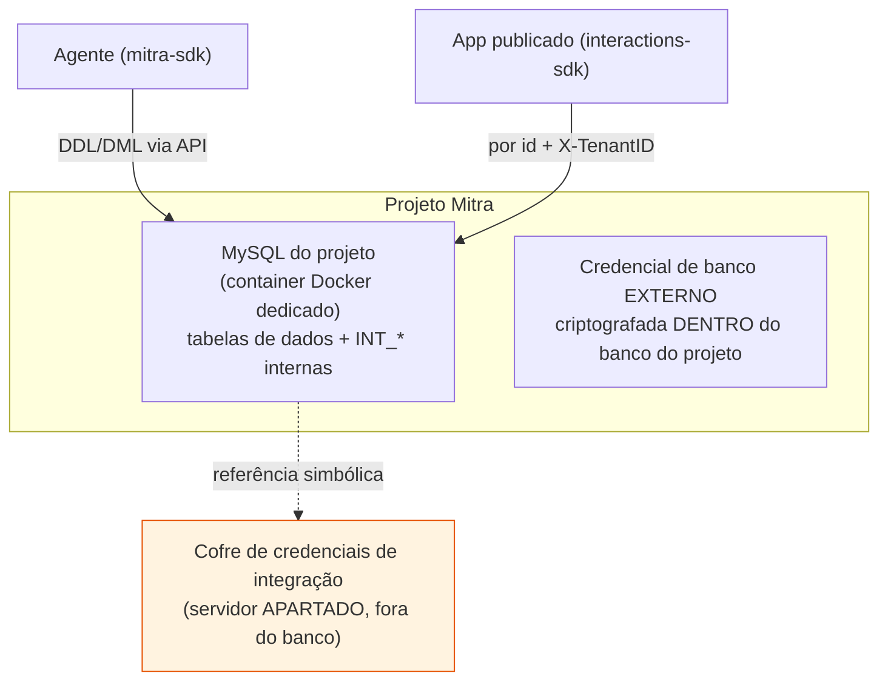

Dois lugares de segredo — e uma inconsistência:
- Credenciais de **integração** (Sankhya, SAP…) ficam num **servidor apartado**. ✔️ separação limpa.
- Credencial de **banco externo** fica **criptografada dentro do próprio banco do projeto**. ⚠️
  inconsistente com a regra acima (ver decisão).

## Como funciona

### Schema a partir de linguagem natural

O agente deriva o schema de uma descrição em linguagem natural e materializa com DDL idempotente
(`CREATE TABLE IF NOT EXISTS`). Detalhe de robustez real: injeta **placeholders de FK** para dado
sujo da origem —

```js
// placeholders para CODVEND=0 / CODPARC=0 (existem no Sankhya) — evita quebra de FK
INSERT INTO VENDEDORES VALUES (0,'SEM VENDEDOR','-','N') ON DUPLICATE KEY UPDATE …
```

### Migrations = log de auditoria, não gate de deploy

Ponto sutil e importante (do `CLAUDE.md` real):

- As migrations são **append-only**.
- O **sistema** materializa e commita `backend/migrations/` + `backend/migrations.yaml`
  **ele mesmo, depois que o turno termina** — o agente **não as vê durante a sessão** e nunca as
  cria/edita/`git add`.
- Ou seja: no fluxo observado, a migration é **registro do que já aconteceu**, não um portão que
  precisa passar antes de aplicar. **O banco e as SFs mudam na hora.**

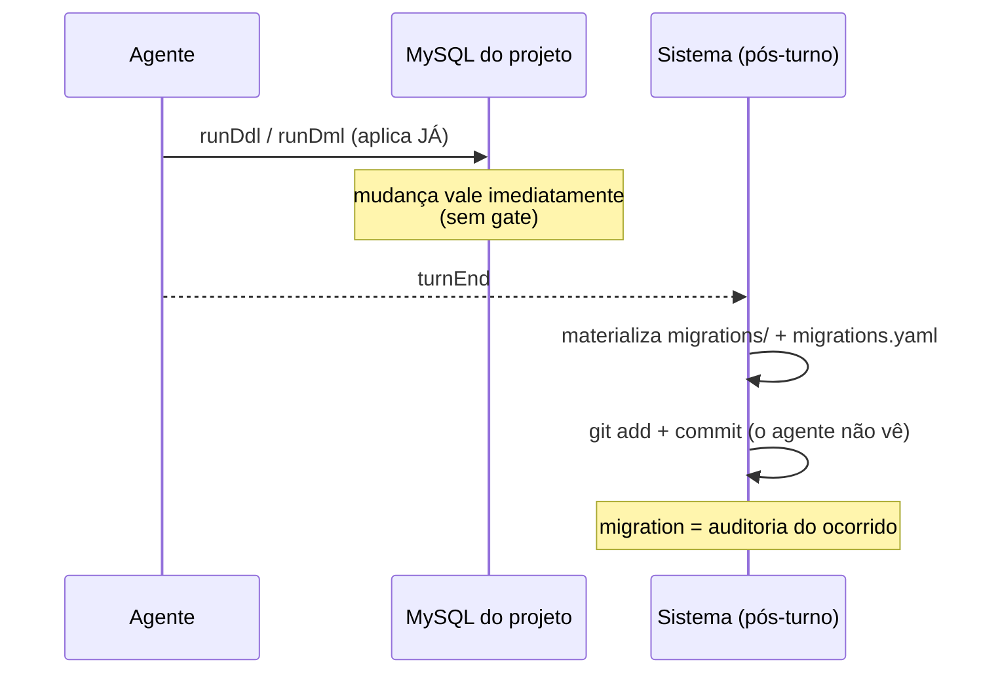

### Sem ambiente de teste — o banco de DEV é o banco

Não há base de teste separada por padrão. Consequência direta: **o "teste" do projeto é um smoke
test contra dados reais** (`testar-sfs.mjs` roda 31 chamadas de SF). Só é seguro porque as 28 SFs
analíticas são `SELECT`. Uma SF destrutiva rodada "em dev" atingiria produção. É o maior risco
operacional da plataforma. Ver ``08``.

### O conflito de fontes não resolvido (DEV vs PROD)

O mapa deixa isto explicitamente em aberto:
- **§27** (engenharia reversa): PROD é um projeto forkado, com **seu próprio banco** e migrations.
- **Doc oficial da Mitra**: *"o banco de dados e as Server Functions são os mesmos nos dois"*.

As duas fontes se contradizem. O mapa **não escolheu** a versão conveniente — registrou ambas e
marcou como o **único conflito de fontes não resolvido**, que só um promote real observado decide.
→ `§33.3`. Tratado como **SPIKE**.

## Contratos exatos

```js
// build (mitra-sdk) — as operações de dados privilegiadas
runDdlMitra({ projectId, sql })       // CREATE TABLE …
runDmlMitra({ projectId, sql })       // INSERT … ON DUPLICATE KEY UPDATE
runQueryMitra({ projectId, sql })     // SELECT (usado p/ cursor incremental)
```

Modelo de dados típico (projeto de orçamentos): tabelas de negócio normalizadas
(`ORCAMENTOS`, `ORCAMENTO_ITENS`, `CLIENTES`, `VENDEDORES`, `PRODUTOS`, `ESTOQUE`) + `LOG_IMPORTACOES`
para instrumentação. Tabelas nativas `INT_*` = log de ações da plataforma dentro do próprio banco.

## Evidência

- Um banco + container por projeto: `§33`
- Migrations como audit log: `§33`, `§34.3`
- Sem ambiente de teste / smoke em produção: `§33`, `§34.9`
- Conflito DEV/PROD: `§27`, `§33.3`
- Credenciais apartadas vs criptografadas no banco: `§33`

## Decisão Conexus

| Padrão | Veredito |
|---|---|
| Um schema + container Docker por projeto no create | **ADOPT** (isolamento por padrão) |
| Credenciais de integração em servidor apartado | **ADOPT** (copiar exatamente) |
| Backend serverless (só SFs, sem `src/`) | ADOPT |
| Migrations append-only materializadas pelo sistema | ADOPT (princípio) |
| Placeholders de FK p/ dado sujo | ADOPT |
| Schema a partir de linguagem natural | ADAPT (revisão humana antes de produção) |
| Credencial de banco externo criptografada no banco do projeto | ADAPT (preferir cofre único) |
| **Sem ambiente de teste de dados** | **REJECT** → efêmero + fixtures |
| **Banco/SFs não versionados; mudança na hora** | **REJECT** → migration como gate |
| Smoke test contra produção | **REJECT** → asserção de valor em base efêmera |
| Conflito DEV/PROD | **SPIKE** (resolver com promote observado) |

## Ideias de melhoria (Conexus)

- **Ambiente de dados efêmero por tarefa** + **fixtures**: o gap mais claro para superar a Mitra. O
  teste deixa de ser "não explodiu contra produção" e passa a ser **asserção de valor** contra dado
  controlado (`pendentes == 187`, não `query rodou`).
- **Migration como gate**, não como log pós-fato: schema só evolui por migration validada, com
  dry-run **antes** do deploy (ver ``05``).
- **Cofre único** para todo segredo — sem a exceção "criptografado dentro do banco do projeto".
- **UTF-8 fim a fim, não negociável** (o projeto real teve que guardar `Reativacao` sem acento e
  traduzir na borda; ver ``06``).
- **_(seu espaço para ideias)_**


---

# 04 — Integração externa

> Como um app Mitra fala com sistemas de fora (ERP, SaaS, on-prem) sem nunca expor credencial. Fonte:
> `§12`, `§15–16`,
> `§25`, `§34.5–34.6`.

## O que é

Integração externa na Mitra é **declarativa**. Uma SF do tipo `INTEGRATION` não é código — é um JSON
que descreve *o que* chamar, referenciando a credencial por **nome simbólico**. A credencial real
vive no servidor; nem o repositório nem o cliente a veem.

```js
// O "code" de uma SF INTEGRATION é isto — um JSON, não um script:
{
  connection: 'sankhya',                 // ← handle simbólico; a credencial fica no servidor
  method: 'POST',
  endpoint: '/gateway/v1/mge/service.sbr?serviceName=DbExplorerSP.executeQuery&outputType=json',
  body: { serviceName: 'DbExplorerSP.executeQuery', requestBody: { sql } },
}
```

Por isso o repositório do projeto é **público-safe**: `connection: 'sankhya'` não revela nada.

## Como funciona

### As 4 camadas de acesso a dado externo

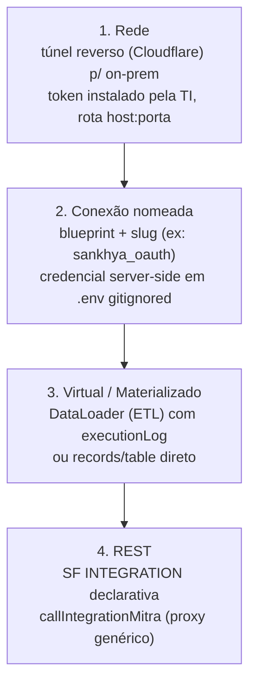

### Blueprint de conector — formulário gerado do schema

Uma conexão nasce de um **blueprint** versionado com `fieldsSchema` (gera o formulário de credencial
dinamicamente) + `testEndpoint` (teste de conexão padrão). Autorização é uma **union fechada**:
`header | basic | cookie | query` + `DYNAMIC_TOKEN` (token-refresh server-side). Cobre ~95% dos SaaS.

O catálogo real observado inclui Gmail, Google Calendar, HubSpot, SAP, Supabase, além de `custom`
(blueprint próprio) e `CSV` (upload como tipo de conexão).

> **Correção 2026-08-11 (OBS-42, leitura do bundle `integrations_store`).** Duas coisas que este doc
> descreve como propriedades do blueprint **não são**:
>
> - **`testEndpoint` é exceção allowlistada por id**, não propriedade do conector:
>   `test_endpoint: ["bearer_token","supabase"].includes(e.id) ? \`/${e.id}/test\` : null` — 2 dos 10
>   templates têm teste; SAP, HubSpot, Totvs, Gmail e o **próprio Sankhya** recebem `null`. É por isso
>   que a prova de que a conexão apontava para o sandbox teve de ser feita **pelo agente, na unha**
>   (OBS-21), cruzando o `blueprintId` com o OpenAPI oficial do fornecedor.
> - **`authStrategy` é derivada da categoria**, não declarada:
>   `e.category === "custom" ? "STATIC_KEY" : "DYNAMIC_TOKEN"`.
>
> O catálogo dos 10 templates está **hardcoded no bundle do frontend** (híbrido: lista fixa embarcada
> + `fetchConnectorTemplates()` do servidor). **Veredito Conexus:** o ADOPT de blueprint continua,
> mas `testEndpoint` vira **obrigatório por conector** — sem teste de conexão, provar ambiente
> (prod × sandbox) fica a cargo de quem está construindo, que foi exatamente o risco corrido nesta
> sonda com uma base de ERP real do lado.

### Data Discovery — o antídoto ao "inventar regra"

O padrão mais valioso desta área: antes de codar, o agente **consulta o dado real por SQL** para
validar hipóteses de escopo. No projeto de orçamentos isso derrubou três suposições:

- `Orçamento = CODTIPOPER IN (14,714)` (e não o `TGFTOP.ORCAMENTO='S'`, que estava mal configurado).
- `VLRCUS` **não é custo** em 94,8% dos itens → margem não é calculável → feature cancelada com o
  número que prova.
- Pendente = `PENDENTE='S'` sem derivado em `TGFVAR` → 187 orçamentos / R$ 6.283.878.

É o estágio-2 (build) **auditando** o estágio-1 (escopo) contra a fonte real. Ver ``07``.

### O caso Sankhya — paginação e upsert (SF JAVASCRIPT)

O gateway do ERP corta em 5.000 linhas/chamada. A SF de importação contorna com um helper de
paginação-até-esgotar (com teto de segurança), upsert em chunk e cursor incremental derivado do
próprio dado:

```js
async function fetchAll(sfId, baseInput) {          // lê todas as páginas
  const todas = []; let offset = 0;
  for (;;) {
    const rows = await fetchPage(sfId, {...baseInput, offset, limite: PAGE});
    todas.push(...rows);
    if (rows.length < PAGE) break;
    offset += PAGE;
    if (offset > 400000) throw new Error('Paginacao excedeu o teto de seguranca');
  }
  return todas;
}
// cursor sem estado externo: SELECT MAX(DTALTER) do próprio espelho, recuado 1h
```

Toda importação grava em `LOG_IMPORTACOES` com `ETAPAS_JSON`, `DURACAO_MS`, `PARAMETROS` e erro
truncado — sucesso **e** falha, antes de re-lançar.

## Contratos exatos

```js
// build — provisiona a SF INTEGRATION
createServerFunctionMitra({ projectId, name, type: 'INTEGRATION',
  code: JSON.stringify({ connection, method, endpoint, body }), description })

// runtime — proxy REST genérico (a credencial fica no servidor)
callIntegrationMitra({ ... })

// on-prem — túnel gerenciado
// cloudflared com token copiável na UI; 4 níveis: túnel → rota → jdbc → dataset
```

## Evidência

- SF INTEGRATION declarativa: `§34.5`
- `callIntegrationMitra` / proxy: `§12`
- Blueprint / `fieldsSchema` / `AuthorizationConfig`: `§16.2`, `§25`
- Data Discovery por SQL: `§14.1`, `§15`
- Túnel on-prem 4 níveis: `§18`, `§25`
- Paginação/upsert/cursor Sankhya: `§34.6`

## Decisão Conexus

| Padrão | Veredito |
|---|---|
| SF INTEGRATION declarativa + credencial simbólica | **ADOPT** |
| `callIntegrationMitra` (app nunca vê credencial) | ADOPT (princípio) |
| Blueprint + `fieldsSchema` + `testEndpoint` | ADOPT — mas `testEndpoint` **obrigatório**, não allowlistado por id (OBS-42) |
| Catálogo de conectores hardcoded no bundle; `authStrategy` derivada da categoria | **REJECT** — conector é dado, não `if` ternário (OBS-42) |
| Union fechada de auth + `DYNAMIC_TOKEN` | ADOPT |
| Data Discovery por SQL antes de codar | **ADOPT (forte)** |
| 4 camadas rede→conexão→virtual→REST | ADOPT |
| Túnel reverso gerenciado p/ on-prem | ADOPT |
| CSV como tipo de conexão | ADOPT |
| Paginação com teto + upsert em chunk + cursor derivado + log por etapa | **ADOPT** |
| Perfil de ERP plugável (TGFCAB, `AD_`…) | REFERENCE |
| Gateway com SQL livre em produção | ADAPT (read-only + allowlist por perfil) |
| Credencial de produção colada no chat; 1 token → 6 empresas | **REJECT** → canal dedicado, escopo por empresa |
| Chave de LLM no cliente / SF pública com segredo | **REJECT** |

## Ideias de melhoria (Conexus)

- **Dispatch multicanal como capability de 1ª classe** (e-mail nativo existe; WhatsApp/SMS ausentes
  na Mitra) — diferenciação clara.
- **Perfil de ERP versionado e plugável** (Sankhya, depois Protheus/SAP): conhecimento de domínio
  como dado, não hardcoded no agente.
- **SQL livre só em Discovery, com trava**: read-only forçado + allowlist de tabelas/schema por
  perfil. Nunca SQL livre contra produção.
- **Canal de credencial dedicado** com escopo por empresa e seleção explícita de ambiente — o
  oposto do "cola o token de produção no chat".
- Reaproveitar o **helper de paginação/upsert/cursor** como biblioteca do harness, não como código
  gerado por template literal.
- **_(seu espaço para ideias)_**


---

# 05 — Ciclo de vida (build → release → promote)

> Como o trabalho vai do sandbox efêmero ao app no ar, e como múltiplos construtores colaboram sem
> se atropelar. Fonte: `§24`,
> `§27–28`, `§34 (CLAUDE.md)`.

## O que é

O git é a espinha do ciclo de vida. Cada construtor trabalha num branch próprio; `main` é a baseline
compartilhada. O sandbox é descartável — **só o que foi para o GitHub sobrevive**. Publicação é um
**promote** de DEV para um projeto PROD separado, por snapshot versionado.

## Como funciona

### Colaboração — branch por usuário, SYNC/SHARE por turno

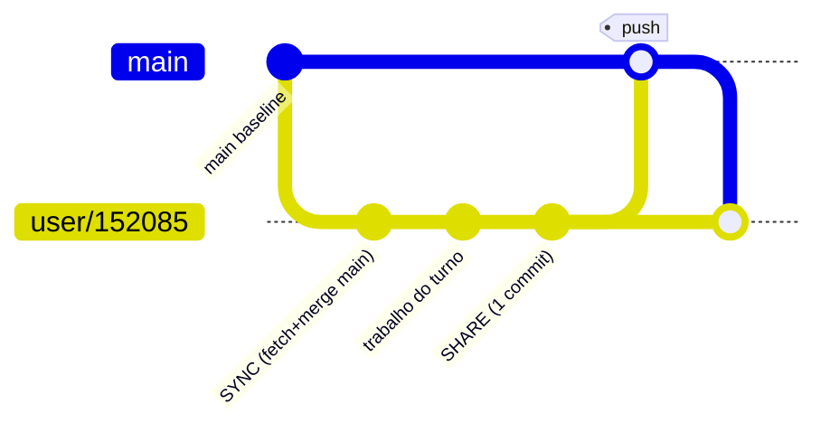

Sequência exata do SHARE (do `CLAUDE.md` real):

```
git add -A -- . ':(exclude)backend/migrations' ':(exclude)backend/migrations.yaml'
git commit -m "tipo: descrição"          # feat/fix/refactor/style/chore, em pt-BR
git checkout main
git pull --no-rebase origin main
git merge user/152085 --no-edit
git push origin main
git checkout user/152085
git merge main --no-edit
```

Regras: nunca `--force`, nunca `--rebase`, nunca deletar branch remoto. Conflito → `AskUserQuestion`
em linguagem de negócio, nunca resolver sozinho. Sandbox descartado após **20 min idle** → *"pular
SHARE = trabalho órfão que some no idle"*.

### Publicação — promote DEV→PROD

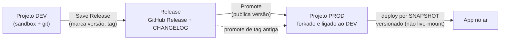

Características-chave:
- **PROD é um projeto forkado**, não uma flag "modo prod". Isolamento real de ambiente.
- **Save Release desacoplado de Promote**: marcar versão ≠ publicar versão.
- **12 steps nomeados e observáveis** no status do promote.
- **Rollback** = promote de uma tag antiga (código, não schema — coerente com migrations
  forward-only).
- **Falha de deploy vira tarefa do agente** ("Resolve with the agent") — fecha o loop
  agente↔operação.
- Status do app: `inSync / hasOutput / published / version` → UX clara de "há mudanças não
  publicadas".

### Baseline / scaffold — o piso de qualidade

Arquivos do UI-kit (`Chart.tsx`, `LoginPage.tsx`, `useDrill.ts`, `Button.tsx`, `useHighlight.ts`)
são **byte-idênticos entre projetos diferentes** — evidência de um template versionado que o agente
**não** autora. `mergeMitraPackageBaseline` atualiza o template upstream depois do fork.

## Contratos exatos

```
# code viewer (lê GitHub, NÃO o sandbox)
GET /api/mitra-agent/github-files/{ws}/{proj}                 → { files: [] }   (árvore, ?ref)
GET /api/mitra-agent/github-files/{ws}/{proj}/content         ?path=&ref=  (texto)
GET /api/mitra-agent/github-files/{ws}/{proj}/releases
GET /api/mitra-agent/github-files/{ws}/{proj}/release-tree?version=
GET /api/mitra-agent/github-files/{ws}/{proj}/release-content?version=&path=

# git ops
GET  /api/e2b-git/{ws}/{proj}/metadata   → { currentBranch, branches }   ⚠️ morto neste deploy
POST /api/e2b-git/{ws}/{proj}/checkout   { branch, createNew }
GET  /api/e2b-git/{ws}/{proj}/log?limit=                                  ⚠️ morto neste deploy
```

## Evidência

- SYNC/SHARE, branch por usuário, 20min idle: `§34 (CLAUDE.md)`
- Promote / releases / 12 steps / rollback: `§27`
- Deploy por snapshot / status de publicação: `§24`
- Baseline byte-idêntico / `mergeMitraPackageBaseline`: `§21`, `§27`, `§34.2`
- Painel de Git morto / code viewer lê GitHub: `§34.12`

## Decisão Conexus

| Padrão | Veredito |
|---|---|
| Branch `user/{id}` + `main` baseline; SYNC/SHARE por turno | ADOPT |
| PROD como projeto forkado ligado ao DEV | **ADOPT** |
| 12 steps nomeados e observáveis | **ADOPT** |
| Falha de deploy vira tarefa do agente | **ADOPT** |
| Save Release desacoplado de Promote | ADOPT |
| Rollback por promote de tag antiga | ADOPT |
| GitHub Release + CHANGELOG automáticos | ADOPT |
| Deploy por snapshot versionado (não live-mount) | ADOPT |
| Status `inSync/hasOutput/published` | ADOPT |
| Scaffold/UI-kit byte-idêntico versionado | ADAPT (bom piso, precisa escape hatch) |
| `mergeMitraPackageBaseline` p/ template upstream | REFERENCE |
| Dry-run de migration só dentro do promote | **REJECT** → validar antes |
| `/cancel` que a UI diz não poder cancelar | **REJECT** (contrato inconsistente) |
| Owner/Admin do workspace entra em todo projeto como dev | **REJECT** (privilégio implícito) |
| Painel de Git degradando em silêncio (rota devolve SPA) | REFERENCE (lição negativa) |

## Ideias de melhoria (Conexus)

- **Dry-run de migration ANTES do deploy**, não dentro dele. Descobrir schema quebrado no meio do
  promote é tarde.
- **Privilégio explícito e auditável** — nada de Owner de workspace entrando como dev em todo
  projeto por padrão.
- **Baseline com escape hatch**: o scaffold rico é uma alavanca de qualidade real (o agente herda
  boas decisões), mas o projeto precisa poder divergir do template de forma versionada.
- **Rota crítica nunca degrada em silêncio**: se o painel de git não pode responder, a UI diz
  "indisponível", não finge lista vazia (ver ``06`` e ``08``).
- **_(seu espaço para ideias)_**


---

# 06 — Runtime publicado

> O que o usuário final recebe: o app React no ar, como ele autentica, como fala com o backend, e
> como o chat de IA se embute em qualquer página. Fonte:
> `§20`, `§29`,
> `§32`, `§34.8`.

## O que é

O app publicado é uma **SPA React + Vite** (não Nuxt — o studio é Nuxt; o runtime é outra stack). No
momento do publish, a plataforma injeta `window.__mitraEnv` no HTML com a config de ambiente. O app
só recebe o **SDK restrito** (`mitra-interactions-sdk`) e só executa artefato por id.

```html
<script>window.__mitraEnv={
  "apiBaseURL":"https://api2.mitrasheet.com:4133",
  "agentWsUrl":"wss://mitra-agent-websocket-production.up.railway.app/sdk-ws"
};</script>
```

## Como funciona

### Dois planos de API

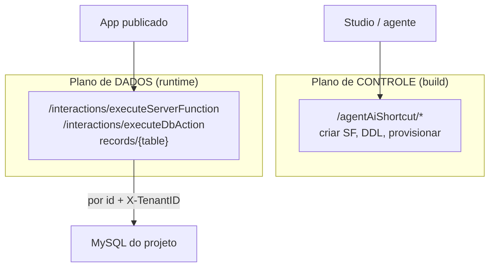

- **`/interactions/executeServerFunction`** é o que o app realmente usa; header `X-TenantID` por
  request.
- **`records/{table}`** dá CRUD tabular genérico com filtro/paginação server-side.
- Envelope de resposta e normalizador defensivo: ver ``02``.

### Login e RBAC do app (usuário final ≠ construtor)

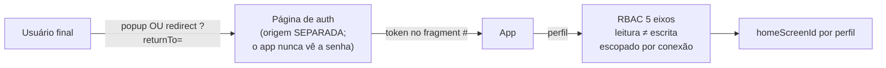

- **Self-signup** com código de 6 dígitos por projeto — contas próprias sem convite manual.
- **RBAC em 5 eixos**, leitura separada de escrita, escopado por conexão; **administrável via SDK em
  runtime** (o agente provisiona RBAC por código). É o **mesmo Perfil** que limita o agente (``01``).
- Token vive no fragment `#`, limpo via `replaceState` (não vaza em referrer/log). Refresh
  silencioso por iframe invisível (frágil com cookies 3rd-party — ver decisão).

### Chat-embed — IA em qualquer página, via postMessage

O chat da plataforma se embute como iframe controlado por um handshake de estado — sem `setTimeout`:

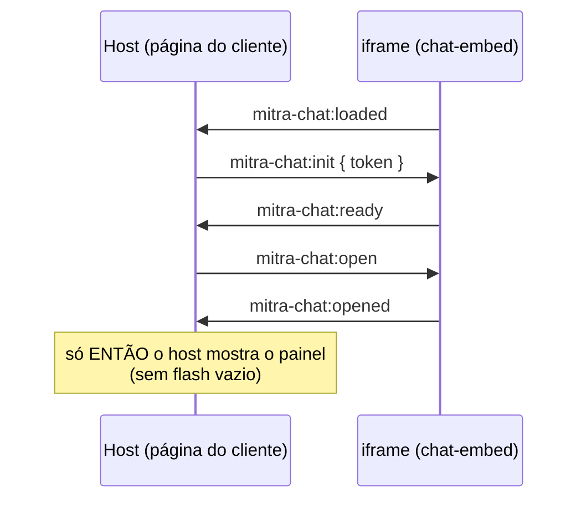

Layout responsivo por **razão**, não por breakpoint fixo: `W=480, PUSH_RATIO=0.4, FULL_RATIO=0.75`
→ modos push (app encolhe) / overlay / full. `window.__mitraChat = { init, open, close, isOpen, isReady }`.

### Armazenamento — S3 multitenant

`mitra-multitenant-prod/tenant_{projectId}/ai-files/public/…` — prefixo por tenant + sufixo único no
nome do arquivo. `/public/` é legível sem URL assinada (ver decisão).

### Uma disciplina que vale ouro

O `api.ts` real isola cada defeito da plataforma num ponto de borda **com o porquê comentado**:

```ts
/** O banco não aceita acentos nesse rótulo; a interface exibe acentuado. */
export const rotuloFaixa = (nome) => nome === 'Reativacao' ? 'Reativação' : nome;
```

## Contratos exatos

```js
// runtime SDK
executeServerFunctionMitra({ projectId, serverFunctionId, input })
executeDbAction({ projectId, dbActionId, input })   // POST /interactions/executeDbAction

// embed
window.__mitraChat.init(token) · .open() · .close() · .isOpen · .isReady
// postMessage types: mitra-chat:{loaded|init|ready|open|close|opened|closed}
```

## Evidência

- Dois planos de API / `records`: `§20`
- `__mitraEnv` injetado no publish: `§32.1`
- Login / RBAC 5 eixos / self-signup: `§29`
- Chat-embed handshake / modos: `§32.4`
- S3 multitenant: `§32.2`
- Normalizador / rótulo sem acento: `§34.8`

## Decisão Conexus

| Padrão | Veredito |
|---|---|
| 2 planos: `/agentAiShortcut` (dev) × `/interactions` (runtime) | ADOPT |
| `__mitraEnv` injetado no publish | **ADOPT** |
| `records/{table}` genérico server-side | ADOPT |
| Normalizador defensivo + comentar o defeito | ADOPT (disciplina) |
| Auth em origem separada (app nunca vê senha) | **ADOPT** |
| Popup **e** redirect `returnTo` | ADOPT |
| Self-signup com código de 6 dígitos | ADOPT |
| RBAC 5 eixos, leitura≠escrita, por conexão, via SDK | **ADOPT** |
| `homeScreenId` por perfil | ADOPT |
| Chat-embed handshake `loaded→init→ready→opened` | **ADOPT** |
| Modos push/overlay/full por razão | **ADOPT** |
| S3: prefixo por tenant + sufixo único | **ADOPT** |
| Token no fragment `#` limpo via replaceState | ADOPT |
| Refresh silencioso por iframe invisível | ADAPT (preferir refresh token) |
| `X-TenantID` como **única** fronteira de tenancy | ADAPT (não pode ser a única) |
| `/public/` legível sem URL assinada | ADAPT (Conexus: privado por padrão) |
| Token via `postMessage` `targetOrigin:"*"` | **REJECT** (origem explícita) |
| Erro colapsado em estado vazio na UI | **REJECT** (3 estados distintos) |

## Ideias de melhoria (Conexus)

- **`postMessage` sempre com origem explícita** — nunca `"*"`. Token não pode vazar para qualquer
  frame ouvinte.
- **Tenancy com fronteira real** no servidor, não só o header `X-TenantID` de trace.
- **Object storage privado por padrão**; público é opt-in explícito e assinado.
- **Três estados de UI sempre distintos**: `vazio`, `carregando`, `falhou`. Na Mitra, a aba Código
  colapsa erro em vazio e um projeto cheio parece vazio (ver ``08``).
- **Histórico tipado na origem**: refresh token em vez de iframe invisível; sessão robusta a
  políticas de cookie 3rd-party.
- **_(seu espaço para ideias)_**


---

# 07 — Padrão de projeto (como um app real nasce)

> A resposta à pergunta de fundo: *"o padrão da Mitra é workflow, skill ou código gerado por LLM?"*
> **É código gerado por LLM, disciplinado por um `CLAUDE.md` de plataforma e por documentos de
> planejamento versionados.** Não há workflow engine. Não há orquestrador de agentes. Fonte:
> `§13–14`, `§34`.
> Estudo de caso: projeto 55833 "Analisador Inteligente de Orçamentos (Sankhya)".

## O que é

Um projeto real não é gerado num passo. Nasce de um **pipeline de duas etapas com auditoria** e um
conjunto de **documentos de planejamento que o próprio agente escreve e depois relê como memória**.
A qualidade percebida vem de quatro mecanismos empilhados — nenhum é mágico.

## Como funciona

### As 8 fases (reconstruídas de `tasks.md` + `CLAUDE.md` + artefatos)

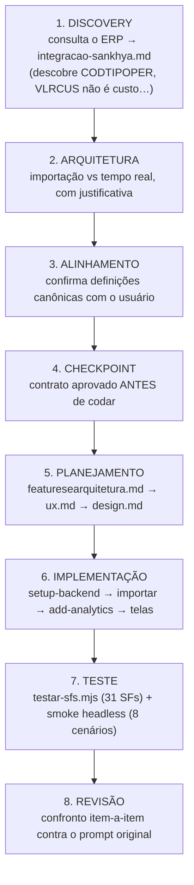

Sobreposto a isso, o protocolo de turno do `CLAUDE.md`: `SYNC → BACKEND → FRONTEND → BUILD → SHARE`,
todo turno (ver ``01``).

### O pipeline de duas etapas — estágio 2 audita estágio 1

O achado mais importante do estudo de escopo: são **dois agentes/etapas**, e o segundo **verifica** o
primeiro contra o dado real.

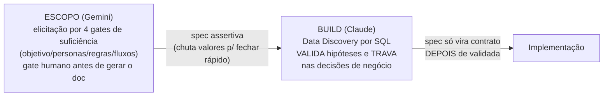

*"O pipeline Mitra funciona porque o segundo estágio audita o primeiro."* O escopo **inventa** para
fechar rápido; o build **verifica contra o dado real e trava**. Ver `§14.1`.

### Os documentos como memória externalizada

O agente escreve docs e depois os usa como contexto — barato e eficaz:

| Documento | Papel |
|---|---|
| `integracao-sankhya.md` | descobertas de discovery (fonte da verdade dos dados) |
| `featuresearquitetura.md` | o quê e por quê (abre com *"Base: integracao-sankhya.md"*) |
| `ux.md` / `design.md` | telas, tokens de design, paleta |
| `tasks.md` | razão de execução: tabela de tarefas com status/output + causa-raiz |

`add-analytics.mjs` abre com *"Definicoes canonicas (ver integracao-sankhya.md)"*. É **memória em
arquivo versionado**, relida pelo agente turnos depois.

### O que produz a qualidade — veredito

| # | Mecanismo | Onde vive | Força |
|---|---|---|---|
| 1 | Protocolo de turno rígido | `CLAUDE.md` gerado pela plataforma | **Alta** — é regra, não sugestão |
| 2 | Docs de planejamento como memória versionada | `*.md` no repo | **Alta** — decisão auditável, relida |
| 3 | SDK de build-time privilegiado | `mitra-sdk` | **Alta** — poder real sem a senha |
| 4 | Scaffold byte-idêntico | UI-kit | **Média** — garante o piso, não o teto |

### Testes — a única forma possível na plataforma

`testar-sfs.mjs` lê o `sf-ids.ts` gerado, roda 31 chamadas reais e **encadeia estado** (pega um
`NUNOTA` de uma consulta e injeta nas seguintes), cobrindo caso base **e** filtrado. Como não há
ambiente de teste, é smoke test contra produção — só seguro porque as SFs são SELECT. Ver
``03`` e ``08``.

### Honestidade — o traço mais copiável

O projeto **declara o que não conseguiu**, com evidência numérica e encaminhamento:

> `VLRCUS` não é custo — 91.856 de 96.936 itens (94,8%) idênticos ao `VLRUNIT` → **margem não é
> calculável** → feature cancelada, não entregue com dado errado.

Critérios de aceite são **verificáveis, não subjetivos**: *"Pendentes na tela = 187 / R$ 6.283.878
(bate com o Sankhya)"*, *"Conversão limpa 12M = 71,2%"*.

## Evidência

- Pipeline escopo→build + 4 gates + gate humano: `§13`
- Estágio 2 audita estágio 1: `§14.1`
- 8 fases / docs de planejamento: `§5`, `§34.10`
- Testes / smoke: `§34.9`
- Honestidade / limitações / critérios de aceite: `§34.11`

## Decisão Conexus

| Padrão | Veredito |
|---|---|
| Etapa de escopo separada, antes do build | ADOPT |
| Elicitação por 4 gates de suficiência | ADOPT |
| Gate de confirmação humana antes do doc | ADOPT |
| Modelo diferente por etapa (escopo/build) | ADAPT |
| **Estágio 2 audita estágio 1 contra o dado real** | **ADOPT** (achado central) |
| Docs de planejamento como memória versionada | **ADOPT** |
| `tasks.md` com causa-raiz | ADOPT |
| Validação de backend antes do frontend, executando | ADOPT |
| Smoke test que reproduz as chamadas da UI + reporte honesto | ADOPT |
| Revisão final item-a-item contra o prompt original | ADAPT |
| **"Limitações conhecidas" + critérios de aceite numéricos** | **ADOPT (requisito)** |
| Template rico → agente herda boas decisões | ADOPT |
| Auto-validação sem revisor frio | ADAPT (revisor frio p/ risco) |

## Ideias de melhoria (Conexus)

- **Tornar as 8 fases um contrato explícito do harness**, não uma convenção que emerge de um bom
  `CLAUDE.md`. Cada fase com entrada/saída e gate.
- **"Limitações conhecidas" + critérios de aceite numéricos como requisito de entrega**, não virtude
  opcional. O deliverable não fecha sem eles.
- **Memória versionada de 1ª classe**: em vez de `*.md` soltos relidos por sorte, um store de
  contexto em camadas (plataforma→projeto→agente→tarefa) carregado deterministicamente.
- **Revisor frio obrigatório** para mudanças de risco (dados, permissões, produção); auto-validação
  só para CRUD.
- **Roteamento de modelo por fase** (barato no escopo, forte no build) como política, com custo
  observável.
- **_(seu espaço para ideias)_**


---

# 08 — Limites e gaps: onde a Mitra falha = onde o Conexus ganha

> Este documento inverte a lente. Os outros descrevem o que a Mitra faz bem (o piso do Conexus).
> Aqui estão os **REJECT** (o que ela faz mal — requisitos negativos) e os **OWN** (o que ela não
> tem — as apostas). Juntos, são o esqueleto do que o Conexus precisa ser para superá-la.

## As apostas — o que a Mitra NÃO tem (OWN)

### 1. Não existe a abstração "Agente" — a maior lacuna

A Mitra tem todos os **primitivos** de um agente (credencial compartilhada, RBAC de tools via MCP,
contexto persistente, sessão embarcável) e **não tem a abstração**. Não existe entidade com
identidade, versão, conjunto de tools declarado e ciclo de vida próprios. *"O agente da Mitra é uma
convenção montada à mão dentro de um app"* — o system prompt é remontado à mão por cada app, a cada
thread. → `§30`, `§31.6`.

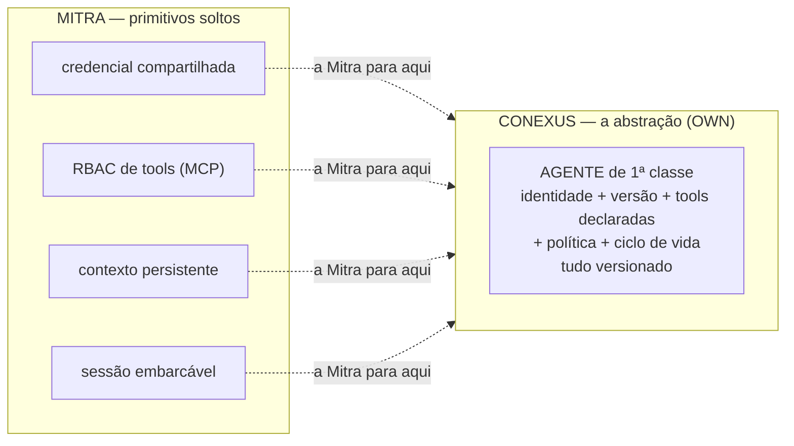

**Sub-lacunas relacionadas (todas OWN):**
- **Sem IA no SDK de backend** — agente de domínio server-side é território livre.
- **Contexto único por projeto** — sem escopo por agente/tarefa. Conexus: contexto em camadas
  plataforma → projeto → agente → tarefa.
- **WS agêntico exige usuário logado — sem agente headless.** Mata cron/webhook/evento. Conexus
  precisa de agente por evento com **identidade de serviço**. (É um REJECT que vira OWN.)

## Os requisitos negativos — o que a Mitra faz mal (REJECT)

Cada linha é um "não repetir isto". Agrupados por gravidade.

### Segurança — os graves

| # | Falha da Mitra | Por que é grave | Requisito Conexus | Evidência |
|---|---|---|---|---|
| S1 | **SQL por interpolação de string** — `{{param}}` é substituição textual, não prepared statement (um apóstrofo quebra a query) | O SDK é público e o id é numérico e sequencial | **Bind parameters reais**; opcional = `(:x IS NULL OR col=:x)` | `§34.4`, `OBS-46` |
| — | **Corrigido 11/08:** a sanitização **não** vive só no cliente. Há guarda server-side que recusa placeholder em posição estrutural (*"detectou que `{{linhas}}` era um fragmento de SQL, não um valor parametrizável"*) | O buraco remanescente é de **escaping de valor**, não de estrutura — falha menor do que este doc afirmava | Adotar a invariante (placeholder nunca vira sintaxe) **com a primitiva de lote correspondente** — senão o autor inventa slots fixos | `OBS-53`, + 3ª evidência independente: etapa de validação com estado próprio na UI (`validated_script` × `invalid_script` × `not_allowed_query`) em `OBS-67.3` |
| S2 | **Sem ambiente de teste — banco de DEV é o banco** | SF destrutiva "em dev" apaga produção | **Base efêmera + fixtures** por tarefa | `§33` |
| — | **Atenuado 11/08:** a plataforma **bloqueia `DROP` por padrão** e exige confirmação explícita (*"esvaziei as linhas, mas a tabela vazia continua lá"*) | Existe atrito no caminho destrutivo — a camada de dados não é ingênua como este doc sugeria | O guarda evita o acidente grosseiro; **não substitui ambiente**. S2 continua de pé, com peso menor | `OBS-60` |
| S3 | Token repassado por `postMessage` com `targetOrigin:"*"` | Vaza token para qualquer frame ouvinte | **Origem explícita** sempre | `§32.4` |
| S4 | Credencial de produção colada no chat; 1 token → 6 empresas | Segredo em canal errado, escopo largo demais | **Canal dedicado**, escopo por empresa, ambiente explícito | `§15` |
| S5 | Chave de LLM no cliente / SF pública com segredo | Segredo exposto no bundle | Credencial de modelo **sempre** server-side | `§13` |
| S6 | Owner/Admin do workspace entra em todo projeto como dev | Privilégio implícito não-revogável quebra segregação | Privilégio **explícito e auditável** | `§33` |
| S7 | `X-TenantID` como única fronteira de tenancy | Header não é fronteira de segurança | Fronteira **no servidor** | `§32.3` |
| S8 | `/public/` do bucket legível sem URL assinada | Vazamento por descuido como default | **Privado por padrão**, público opt-in assinado | `§32.2` |
| S9 | **JWT de runtime no fragmento da URL do preview** (`#token=...`) | Fica em histórico, sugestão de barra, print e ombro; fragmento não vai no `Referer` mas vive no cliente | Sessão por **cookie `HttpOnly` + `SameSite`**; URL nunca carrega credencial | `OBS-36` |

### Operação e versionamento

| # | Falha | Por que | Requisito Conexus | Evidência |
|---|---|---|---|---|
| O1 | **Banco e SFs não versionados; mudança vale na hora** | Incompatível com operação séria | **Migration como gate**, não log pós-fato | `§33` |
| O2 | Dry-run de migration só dentro do promote | Schema quebrado descoberto no meio do deploy | Dry-run **antes** do deploy | `§27` |
| O3 | Smoke test contra produção | Só "seguro" porque as SFs são SELECT | Asserção de **valor** em base efêmera | `§34.9` |
| O4 | Duplicação de projeto leva **dados** junto | Duplicar p/ outro cliente vaza dados do primeiro | Duplicar **pergunta** sobre dados, default "não" | `§33` |
| O5 | `/cancel` que a UI diz não poder cancelar | Contrato inconsistente | Contrato honesto ou não expõe | `§27` |
| **O1-ajuste** | *Precisão, não novo gap:* existe **auditoria de dado** — `db_action_log` com `log_operation` / `log_user_id` / `log_user_email` / `old_values` / `new_values`. O gap do O1 é de **artefato** (SF, schema, migration), não de linha | Evita pedirmos ao Conexus o que a Mitra já entrega e errarmos o alvo do requisito | O1 permanece, redigido como **versionamento de artefato**; auditoria de dado vira **ADOPT** | `OBS-67.2` |
| **Ganho** | Execução com **sucesso parcial** de primeira classe: `accepted_lines` / `rejected_lines` / `reason_for_rejections` / `execution_time` / `run_by` | O agente reconstruiu esse modelo do zero no M2 por não ter acesso a ele — e reconstruiu igual | **ADOPT + expor ao artefato do app**, não só ao pipeline de ingestão (entrada direta do T13) | `OBS-67.1` |

### Contrato de artefato e protocolo

| # | Falha | Por que | Requisito Conexus | Evidência |
|---|---|---|---|---|
| C1 | **`serverFunctionId` numérico no cliente** → `sf-ids.ts` gerado | Promote/duplicação vira remapeamento manual; o próprio prompt avisa "NUNCA IDs hardcoded" | **Slug estável** por nome | `§32.3`, `§34.3` |
| C2 | Três sintaxes de binding (`event.x` textual / global / `{{x}}`) | Inconsistência cara e confusa | **Uma só** sintaxe | `§34.4` |
| C3 | Código de job como string em template literal | Frágil (a própria Mitra documenta o `\s`→`s`) | **Arquivo real** | `§34.6` |
| C4 | `input` de tool truncado exigindo regex tolerante | Protocolo entrega dado corrompido | Input **íntegro**; se grande, referenciar por id | `§31.6` |
| C5 | `loadHistory()` devolve tool call como **texto cru** | Força o cliente a re-parsear o que era estruturado | Histórico **tipado na origem** | `§31.6` |
| C6 | Rename `connection`↔`integrationSlug` vazando no wire | Contrato de API divergente do corpo | **Versionar** o contrato de API | `§20` |
| **C7** 🔴 | **`runQueryMitra` corta em 2.000 linhas e devolve `rowCount: 2000` como se fosse o total.** `LIMIT 3000` também devolve 2.000. Nenhum sinal de corte — sem flag, sem `hasMore` | É o mesmo teto silencioso da paginação do ERP, agora na **função de consulta da própria SDK**. Uma auditoria que varre `INFORMATION_SCHEMA` (322 tabelas > 2.000 colunas) roda sobre 2/3 do schema e **reporta verde**. Falsa garantia é pior que garantia ausente | Teto **explícito no contrato**: ou devolve o total real, ou devolve `truncado: true`. E a primitiva de leitura completa pagina até página curta, **exige `ORDER BY`** (sem ordem estável a paginação repete e pula linha) e **recusa SQL que já traga `LIMIT`** | `OBS-69.1` |

### Experiência e observabilidade

| # | Falha | Por que | Requisito Conexus | Evidência |
|---|---|---|---|---|
| E1 | **Erro colapsado em estado vazio** — na UI (aba Código) e **também no dado** | Sessão expirada, 403 e "projeto vazio" renderizam a MESMA tela. Na camada de dado, `[]` por falha de rede = `[]` por fim de coleção, e o importador declara cobertura completa mentindo | `vazio` / `carregando` / `falhou` = **3 estados**. Cobertura só é `completa` por **evidência positiva** de fim; ausência de erro não é evidência; `desconhecido` é um terceiro valor real | `§34.12`, `OBS-49` |
| E2 | Painel de Git morto (`/api/e2b-git/*` devolve o SPA) | Rota crítica degrada em silêncio | Rota indisponível **diz** que está | `§34.12` |
| E3 | Zero gestão/telemetria de contexto na UI | Usuário não vê contexto restante nem quando compactou | Expor estado de contexto | `§26` |
| E4 | `AskUserQuestion` sem bloqueio mecânico (só instrução) | Tool depois dela executa trabalho não autorizado | **Bloqueio mecânico** no harness | `§34.10` |
| E5 | Refresh de sessão por iframe invisível | Quebra com política de cookies 3rd-party | **Refresh token** | `§29` |
| E6 | Encoding do MySQL não aceita acento (guardou `Reativacao`) | Defeito de plataforma vazando pro dado | **UTF-8 fim a fim** | `§34.8` |
| — | **Contestado 11/08:** em outro projeto, o banco é `utf8mb4` ponta a ponta e o acento sobrevive em DML, em parâmetro de SF e em dado de API externa | E6 provavelmente **não é limitação de plataforma**, e sim collation herdada de como aquele banco foi criado — falha de *default*, não de capacidade | Reclassificar; o requisito (UTF-8 fim a fim) não muda | `OBS-60` |

## O diagrama do diferencial

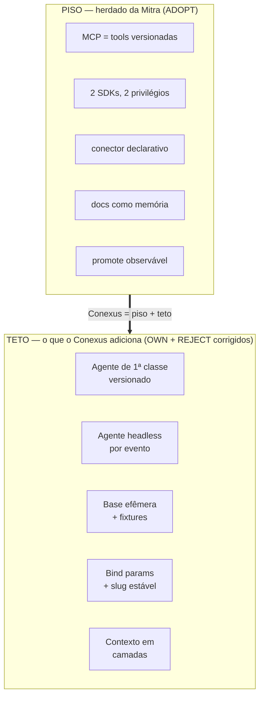

## Resumo executivo

- **6 apostas OWN** — todas convergem para uma: **agente como objeto de 1ª classe, versionado,
  com identidade de serviço e contexto em camadas.** É o produto.
- **~23 REJECT** — 9 de segurança (S1 e S2 são os que mais importam), o resto operação/contrato/UX.
  Nenhum é caro de acertar; a Mitra os tem por dívida de plataforma low-code, não por necessidade.
- **A regra de ouro**: onde a Mitra escolheu conveniência de plataforma sobre correção (SQL string,
  id numérico, banco único, header como tenancy), o Conexus escolhe correção. O custo é pequeno; o
  ganho de confiança operacional é o argumento de venda.

*Todos os vereditos com link de evidência no [Registro de Decisões](influence-on-conexus.md#registro-de-decisões--mitra--conexus).*


---

# Mitra — Agente embarcado (Generative UI / Playground)

> **O que este documento cobre.** O agente que roda **dentro de um app publicado** — não o
> construtor. A comunidade Mitra chama de "Playground": um app onde a IA não só conversa, ela
> **investiga os dados via SQL, narra o raciocínio em tempo real e desenha uma tela HTML** no canvas.
> O app fala com o mesmo backend agêntico da Mitra pelo **WebSocket por-usuário**, via o
> `mitra-interactions-sdk`. Este doc documenta esse stack **e** o protocolo de fio que foi capturado
> **ao vivo** numa sessão de operação real da plataforma.
>
> **Natureza da evidência.** Diferente dos docs 00–08 (que derivam do
> [Mitra Inspiration Map](influence-on-conexus.md#mitra-inspiration-map) congelado), este doc é
> **evidência primária nova**, coletada em **2026-08-11** operando a plataforma logada: projeto
> `Playground BI-Investigacao` (workspace `146638`, projeto `55878`), interceptando os frames do
> WebSocket agêntico no navegador. Onde confirma o mapa, é reforço; onde acrescenta, está marcado
> `[NOVO 2026-08-11]`.

Relacionados: `01 harness agêntico` · `02 registro de artefatos` · `03 camada de dados` · `06 runtime publicado` · `08 limites e gaps`.

---

## 1. O que é

Dois agentes, um backend. A Mitra reusa a **mesma infra agêntica** em dois lugares:

| | Agente **construtor** (doc 01) | Agente **embarcado** (este doc) |
|---|---|---|
| Onde roda | Studio, enquanto você constrói | Dentro do app publicado, para o usuário final |
| Cliente | UI do Studio (Nuxt) | `mitra-interactions-sdk` no bundle React do app |
| Tools | as server functions do projeto via MCP `mcp__mitra-business` | as server functions do projeto via MCP `mcp__mitra-business` |
| Transporte | WebSocket agêntico por-usuário | **o mesmo** WebSocket agêntico por-usuário |
| Modelo | Claude Code em sandbox E2B | Claude Code em sandbox E2B |

O "agente embarcado" **não é uma abstração nova de plataforma** — é o agente construtor exposto ao
runtime do app por um SDK mais restrito. Isso confirma o fato #7 do `OVERVIEW`: *não
existe a abstração "Agente"*; o app monta a experiência à mão sobre o WS. O Playground é a receita de
como montar bem (narração + tools + canvas HTML), entregue pela Mitra como **prompt de missão** que o
construtor executa.

---

## 2. Como funciona

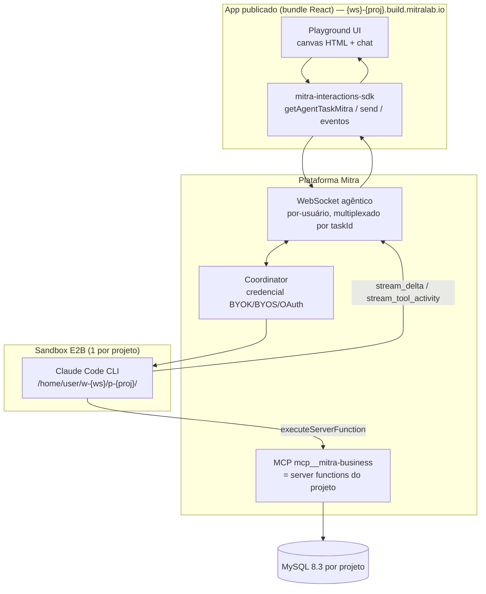

**Ciclo de uma pergunta:** usuário pergunta → SDK `send()` → Coordinator injeta na sessão Claude Code
→ agente chama `consulta_livre`/`schema_resumo` (SFs, via MCP) → cada chamada volta como
`stream_tool_activity` → agente narra (`stream_delta`) → ao final chama `playground_salvar_html`
(desenha o canvas) e `playground_renomear` (título do estudo) → `turnEnd`.

**Autenticação do WS `[NOVO 2026-08-11]`:** o WS conecta com `userId` da **sessão logada** (visto:
`[Mitra WS] Connecting with userId=152085`). Confirma o gap do doc 06: **o WS agêntico só aceita
sessão de usuário logado** — token de integração dá "conexão fechada". Em app publicada o
`agentWsUrl` vem de `window.__mitraEnv`; no Studio (builder) `window.__mitraEnv` é **`null`**
(confirmado ao vivo) e a URL vem da config do Studio.

**Resiliência `[NOVO 2026-08-11]`:** o WS é **uma conexão por usuário multiplexando várias tasks** —
cada frame carrega `taskId`, e o cliente mantém um mapa de streams ativos. Na sessão, o mesmo socket
carregava **duas** tasks simultâneas (dois projetos do mesmo usuário). Em desconexão (`code=1006`) há
reconexão com backoff (`Reconnecting in 2925ms (attempt 1)`) e **"F5 recovery — active streams"**
que reata os streams em andamento sem perder o turno.

---

## 3. Contratos exatos

### 3.1 Ciclo de vida da task (fio do WS) `[NOVO 2026-08-11]`

Sequência real observada ao enviar a primeira mensagem:

1. **Task otimista** — o cliente cria `optimistic-<epochMs>` e persiste no `localStorage`
   (`userId`, `ws`, `pj`, `projects[]`) antes de qualquer resposta do servidor.
2. **`sendTaskCreate`** — `{ agentType:'claudecode', provider:'anthropic',
   model:'anthropic/claude-opus-5:high', language:'pt-BR', isWhiteLabel:true }`.
3. Servidor devolve o **taskId real** (ex.: `EcFJk2N6Xb3MASBJNeKC`), que substitui o otimista.
4. **`sendUserInput`** — `{ agentType, provider, model, taskId, isWhiteLabel }` com o prompt.
5. **`streaming_state`** → cliente ativa "thinking".

**Formato do `modelId` no fio:** `provider` + `model` = `provider/modelo:esforço` — ex.
`anthropic/claude-opus-5:high`. (O label da UI, "Claude Opus 5 High **Sub**", indica a **origem**
`subscription`; o formato `origem:provider:modelo:esforço` do prompt de missão é a forma **de alto
nível**, o fio usa `provider/modelo:esforço` + campos `provider`/`isWhiteLabel` separados.)

**Governança do seletor:** logs `AgentSelectorLock` / `manageModelsLocked` — em conta white-label o
modelo pode ser **travado**. `isWhiteLabel:true` viaja em toda mensagem. Há `POST
/api/firebase/app-check-token` (App Check, anti-abuso) no fluxo.

### 3.2 Eventos do WS (tipos de fio reais) `[NOVO 2026-08-11]`

| `type` do frame | Payload | Vira, no SDK |
|---|---|---|
| `connected` | `{ userId, message }` | (handshake) |
| `streaming_state` | estado do stream por task | `statusChange` |
| `stream_delta` | `{ delta }` (texto; usar só `kind==='text'`) | `delta` |
| `stream_tool_activity` | `{ tool, input, content, description }` | `tool` |
| `stream_tool_activity_update` | `{ toolIndex, bashOutput }` (saída incremental) | (atualiza o passo) |
| `heartbeat` | — | (keepalive) |
| `turn_started` | início de turno | `turnStart` |
| `stream_end` | fim do stream do turno | `turnEnd` |
| `build_status` | progresso do `npm run build` | (UI de build) |
| `preview_ready` | app publicado/preview no ar | (habilita canvas/preview) |
| `message` / `message_status` | mensagem persistida + status | (histórico) |

Os seis últimos foram capturados **na fase de build** (o construtor rodando `build`/`share`);
`turn_started`/`stream_end` são os limites de turno de fio (o SDK expõe como `turnStart`/`turnEnd`),
`build_status`/`preview_ready` alimentam a UI de deploy, e `message`/`message_status` são a
persistência do histórico. Todo frame carrega `taskId` e `timestamp`. O `input` do `stream_tool_activity` **chega inteiro no
fio** (capturamos o SF probe completo); a truncagem que o prompt de missão alerta é do **evento
`tool` do SDK de alto nível**, não do frame cru — logo a regra "nunca `JSON.parse`, extraia por regex
tolerante" vale para o consumidor do SDK.

Exemplo real (probe do agente, task nossa):
```json
{"type":"stream_tool_activity_update","payload":{"toolIndex":26,
 "bashOutput":"VERSION/VAR_USER -> {\"status\":\"success\",\"result\":{\"executionId\":\"…\",
   \"executionStatus\":\"COMPLETED\",\"output\":{\"rowCount\":1,\"rows\":[{\"V\":\"8.3.0\",\"U\":7}]},
   \"durationMs\":11}}"},"taskId":"EcFJk2N6Xb3MASBJNeKC"}
```

### 3.3 SDK de runtime — `mitra-interactions-sdk` (app publicado) `[NOVO 2026-08-11 — código real capturado]`

O cliente do agente embarcado foi **capturado ao vivo** enquanto o construtor o escrevia (frames
`stream_tool_activity`, campo `codeContent`). Superfície do SDK confirmada por `import` real:
`executeServerFunctionMitra`, `getAgentTaskMitra`, `manageAgentCredentialMitra`.

**(a) Sessão do agente — `getAgentTaskMitra`** (arquivo `hooks/useAgentChat.ts`):
- `getAgentTaskMitra({ create:true, agentType:'claudecode', modelId })` → sessão. Reabrir:
  `getAgentTaskMitra({ taskId })` (reconecta inclusive stream ativa).
- Eventos: `taskCreated` (salve `task.id`), `turnStart`, `delta({delta,kind})` (só `kind==='text'`),
  `tool({tool,input})`, `turnEnd({content})`, `error`, `statusChange`. Métodos `send()`, `cancel()`,
  `loadHistory()`.
- `configureSdkMitra({ agentWsUrl })` quando fora de app publicada (dentro, vem de `window.__mitraEnv`).
- `loadHistory()` devolve tool calls como **texto cru** `mcp__…{json}` — detectar e converter em
  segmentos de tool, nunca renderizar como fala.

**(b) Modelo e credencial — `manageAgentCredentialMitra`** (arquivo `lib/agente-modelo.ts`). Quatro
ações reais capturadas: `list_models`, `list_providers`, `auth`, `connect`. **O `modelId` nunca é
hardcoded** — sai de `list_models`, que só devolve modelos de providers com credencial conectada;
lista vazia ⇒ usuário não conectou ⇒ o chat oferece o fluxo de conexão. Preferência de seleção:
assinatura Claude (`^subscription:anthropic` | `/claude/`) > API key Anthropic > o que houver.

```ts
export async function resolverModelo() {
  const r = await manageAgentCredentialMitra({ action: 'list_models' });   // só providers conectados
  return melhorModelo(r?.providers || []);                                 // assinatura Claude primeiro
}
```

**(c) Fluxo de credencial no chat** (`components/CredencialCard.tsx`) — oferecido **dentro** do chat
quando um `error` menciona credencial. Etapas `inicio → codigo → conectando`:
`iniciarConexaoClaude()` = `manageAgentCredentialMitra({action:'auth', target:'claude'})` →
`{ authUrl, state }` → `window.open(authUrl)` → usuário autoriza e **cola o código** →
`concluirConexaoClaude(code, state)` = `manageAgentCredentialMitra({action:'connect', code, state})`.
Status por polling: `GET /api/mitra-agent/auth/{claude,openai}/status`.

**(d) Execução de SF — `executeServerFunctionMitra`** (`lib/sf.ts`). O `output` chega em **três
formatos** conforme o caminho, e um normalizador defensivo cobre os três (a inconsistência do §3.4):

```ts
import { executeServerFunctionMitra } from 'mitra-interactions-sdk';
export function normalizarSaida(bruto) {           // objeto (autenticado) | string JSON (público) | {result:[…]}
  let s = bruto;
  if (typeof s === 'string') { try { s = JSON.parse(s); } catch {} }
  if (s && Array.isArray(s.result)) return s.result;
  return s;
}
export async function chamarSF(serverFunctionId, input) {
  const res = await executeServerFunctionMitra({ serverFunctionId, input });
  if (res?.result?.executionStatus === 'FAILED') throw new Error(res.result.error || '…');
  return normalizarSaida(res?.result?.output);
}
```
A **rota pública** não usa o SDK (precisa funcionar sem token): `POST
${VITE_MITRA_BASE_URL}/public/serverFunction/${projectId}/${serverFunctionId}/execute` (fetch cru).
Os ids de SF vêm de um módulo `sf-ids.ts` gerado do registry — `SF` (id por nome) e `SF_ROTULO`
(id → rótulo amigável), **nunca digitados à mão**.

**(e) Motor de segmentos do chat** (`hooks/useAgentChat.ts`) — onde mora a qualidade percebida. Um
turno é uma **lista ordenada de segmentos**, não um blocão:
```ts
type Seg = { t:'md'; c:string }
         | { t:'tool'; label:string; n:number;      // n = "×N" chamadas repetidas da mesma tool
             det?:string|null; mono?:boolean;         // det = título humano ou SQL (mono)
             t0?:number; pulse?:number };             // t0 = cronômetro; pulse = re-key do ícone
```
A lista viva do turno **mora num `ref`** (fonte da verdade, mutada em ordem síncrona) e o render é
disparado por um contador — elimina a corrida entre drenar o buffer de texto e a chegada de um evento
`tool`. Persistência **compacta** (só o `label` da tool; o ícone resolve no render), últimas 60 msgs,
dreno de streaming a cada 24 ms. O `input` do evento `tool` chega truncado ⇒ `tool-parse.ts` extrai
campos por **regex com fecha-aspas opcional** (`"${chave}"\s*:\s*"((?:[^"\\]|\\.)*)`), **nunca**
`JSON.parse`.

**(f) Contexto injetado na 1ª mensagem** (`lib/agente-contexto.ts`) — "a alma da velocidade". Sem
ele o agente gasta minutos se orientando. Três blocos: **TOKENS** (design system — hex, fonte,
radius, sombra, para o canvas sair no DS e não genérico), **SCHEMA** inline (tabelas-núcleo com
colunas; apoio só nome) e **CONVENCOES** (identificadores case-sensitive/maiúsculas, datas VARCHAR
`'YYYY-MM-DD'`, `SUBSTRING` para agrupar por mês, período dos dados). Ids de SF do registry.

### 3.4 SDK de build — `mitra-sdk` (só no sandbox, privilegiado) `[NOVO 2026-08-11]`

Superfície completa capturada do `setup-backend.mjs` real (import único do pacote `mitra-sdk`):

```js
import {
  configureSdkMitra,
  runDdlMitra, runDmlMitra, runQueryMitra,                 // dados, 3 níveis de privilégio
  createServerFunctionMitra, updateServerFunctionMitra,     // SF: cria / atualiza (por nome = idempotente)
  listServerFunctionsMitra, deleteServerFunctionMitra,
  togglePublicExecutionMitra,                               // marca SF como executável sem login
  listProfilesMitra, createProfileMitra,                    // RBAC por perfil
  setProfileServerFunctionsMitra, setProfileSelectTablesMitra, setProfileUsersMitra,
  listProjectUsersMitra,
  updateAdditionalInstructionsMitra, updateAdditionalBusinessInstructionsMitra, // instruções do agente
} from 'mitra-sdk';

configureSdkMitra({ baseURL: MITRA_BASE_URL, token: MITRA_TOKEN, integrationURL: MITRA_BASE_URL_INTEGRATIONS });

// registrar SF:  createServerFunctionMitra({ projectId, name, type:'SQL', code, description }) → { result:{ serverFunctionId } }
// dados (dentro de SF JS, via require('mitra-sdk')):
const r = await sdk.runQueryMitra({ projectId, sql });  // read  → { result:{ rows, rowCount } }
await sdk.runDmlMitra({ projectId, sql });               // write → { result:{ affectedRows } }
await sdk.runDdlMitra({ projectId, sql });               // schema (só build)
```

- **Três níveis de privilégio de dados no próprio SDK:** `runDdlMitra` (DDL/schema) ⊃ `runDmlMitra`
  (INSERT/UPDATE/DELETE) ⊃ `runQueryMitra` (SELECT). Espelha exatamente o `runDdl/runDml/runQuery` de
  C-005. O app publicado **não** recebe esses — recebe só `mitra-interactions-sdk` (executa artefato
  por id). Confirma o fato #3 do OVERVIEW.
- **RBAC por perfil `[NOVO 2026-08-11]`:** existe um modelo de permissão real. Um *profile* liga
  **{usuários} × {server functions permitidas} × {tabelas com SELECT liberado}**:
  `createProfileMitra`, `setProfileServerFunctionsMitra`, `setProfileSelectTablesMitra`,
  `setProfileUsersMitra`, `listProfilesMitra`, `listProjectUsersMitra`. `togglePublicExecutionMitra`
  abre uma SF para execução **sem login** (as rotas públicas do Playground).
- **Instruções adicionais do agente `[NOVO 2026-08-11]`:** `updateAdditionalInstructionsMitra` e
  `updateAdditionalBusinessInstructionsMitra` injetam instruções/regras de negócio na sessão do
  agente — o embrião de uma "camada de regras" por projeto (insumo direto para o Tópico 15).
- **Idempotência (confirma doc 02):** tabelas com `CREATE TABLE IF NOT EXISTS` (reexecutar nunca
  apaga dado de usuário); SFs atualizadas **por nome** (`update` se já existir). O `setup-backend.mjs`
  é seguro para rodar N vezes; flag `--dominio` recria só o dataset de investigação.
- **Env vars do sandbox:** `MITRA_BASE_URL`, `MITRA_TOKEN`, `MITRA_BASE_URL_INTEGRATIONS`,
  `MITRA_PROJECT_ID`. A URL de integrações é **apartada** da base.
- **Execução direta (o que o `interactions-sdk` faz por baixo):**
  `POST ${MITRA_BASE_URL}/interactions/executeServerFunction`
  body `{ projectId, serverFunctionId, input }`, header `Authorization: <token>`.
- **Envelope de execução:**
  `{ status:'success', result:{ executionId, executionStatus:'COMPLETED',
     output:{ rowCount|affectedRows, rows }, durationMs } }`.
- **`serverFunctionId` é inteiro sequencial** por projeto (na sessão: `consulta_livre=5`,
  `schema_resumo=6`, … `playground_restaurar=18`). O frontend referencia a SF por esse número — é o
  "contrato exato com serverFunctionId numérico" que o prompt de missão manda front-loadar.
- **Inconsistência de serialização público × autenticado `[NOVO 2026-08-11]`:** a SF marcada com
  `togglePublicExecutionMitra` e executada **sem login** volta `output` como **string JSON**, não
  objeto (o próprio agente flagrou: *"o endpoint público funciona (HTTP 200) — mas devolve `output`
  como string JSON, não objeto. Detalhe importante para o frontend"*). O caminho autenticado devolve
  objeto. É a mesma **normalização defensiva inconsistente** que motivou a serialização global do
  C-005 / Tópico 8.
- **`runDdlMitra` bloqueia `DROP` por padrão `[NOVO 2026-08-11]`:** *"A plataforma bloqueia DROP por
  padrão — correto"* (agente). DROP de tabela só sob flag explícita e checando existência. Safety
  default no nível da plataforma.
- **RBAC é opcional:** setup emitiu *"aviso: perfil não configurado — segue sem bloquear"*. Sem
  profile, todas as SFs ficam acessíveis ao usuário logado; a restrição é opt-in.

### 3.5 Modelo de programação de uma Server Function `[NOVO 2026-08-11]`

Do código-fonte real das SFs do Playground:

- **Input** chega no global **`event`** (ex.: `const { consulta } = event;`). **Retorno** é um objeto
  simples (a plataforma envelopa).
- **SF tipo `SQL`**: o `code` é SQL com **interpolação `{{campo}}`** e binds de sistema **`:VAR_USER`**
  (= id do usuário logado; no probe resolveu `7`). **Multi-statement executa mas o SELECT final é
  descartado** — só volta `affectedRows`. → não dá para `INSERT …; SELECT LAST_INSERT_ID()`.
- **SF tipo JS**: `require('mitra-sdk')`, usa `runQueryMitra`/`runDmlMitra`. Placeholder
  **`__PROJECT_ID__`** é substituído no provisionamento. **SQL é montado por concatenação de string
  com um escaper manual `lit()`** (`replace(/\\/g,'\\\\').replace(/'/g,"''")`) — **não há bind
  params reais**.
- **Provisionamento:** um `setup-backend.mjs` lê cada `backend/sf/*.js` via `readFileSync` e chama
  `createServerFunctionMitra`. Por isso os regexes das SFs podem usar escape simples — **não passam
  por um template literal JS** (a armadilha do `\s`→`s` só existe se a SF for embutida inline num
  script; lida de arquivo, some).

Exemplo — guardas do `consulta_livre.js` (SF de leitura livre):
```js
const { consulta } = event;
// 1) rejeita comentários  (--  #  /*  */)
// 2) 1 statement (tolera ; final, senão bloqueia)
// 3) exige  ^(select|with)\b
// 4) blocklist \b(insert|update|delete|drop|truncate|alter|create|replace|
//    grant|revoke|rename|lock|unlock|call|execute|handler|prepare|commit|
//    rollback|savepoint|shutdown|kill|use)\b
// 5) LIMIT 200 forçado
// erro → { ok:false, erro, dica }
```

### 3.6 Layout do sandbox e do app publicado `[NOVO 2026-08-11]`

- **Sandbox:** `/home/user/w-{ws}/p-{proj}/` — ex. `/home/user/w-146638/p-55878/`. Contém
  `frontend/` (bundle React/Vite), `backend/sf/*.js` (as SFs), `backend/seed-dominio.mjs` (seed 3NF),
  `setup-backend.mjs`, e **docs de planejamento versionados** (`design.md`, `ux.md`,
  `featuresearquitetura.md`, `tasks.md`) que o agente relê como memória (confirma doc 07).
- **Scaffold do frontend `[NOVO 2026-08-11]`:** template **`react-ts-tailwind`** (React + TypeScript +
  Tailwind + Vite; `index.html` com `<div id="root">` + `/src/main.tsx`). Usa
  `verbatimModuleSyntax` — por isso o `ChatPanel.tsx` redeclara os tipos `Seg`/`Msg` localmente (import
  de `interface` entre arquivos quebra em runtime). Confirma o "scaffold/UI-kit byte-idêntico" do fato
  #6 do OVERVIEW. Estrutura capturada: `src/lib/` (sf, tool-parse, markdown, agente-contexto,
  agente-modelo, sf-ids), `src/hooks/useAgentChat.ts`, `src/components/` (ChatPanel, CredencialCard).
- **Sandbox do agente *embarcado* (por task) `[NOVO 2026-08-11]`:** diferente do builder — layout
  `/home/user/tasks/{taskId}/`, um diretório por task, com um `.env` contendo `MITRA_PROJECT_ID`. O
  builder mora em `w-{ws}/p-{proj}/`; o analista embarcado roda por-task, isolado.
- **App publicado:** `https://{ws}-{proj}.build.mitralab.io` — ex.
  `https://146638-55878.build.mitralab.io`. Expõe `window.__mitraEnv = { apiBaseURL, agentWsUrl }`.
- **Endpoints de produção `[NOVO 2026-08-11]`:** `apiBaseURL = https://api2.mitrasheet.com:4133`;
  `agentWsUrl` do runtime = `wss://mitra-agent-websocket-production.up.railway.app/sdk-ws` (o WS
  agêntico do app publicado é **hospedado no Railway**, apartado da API). Preview do Studio em
  `/v1/w/{ws}/p/{proj}/preview/index.html` (redireciona p/ `/w/{ws}` se aberto standalone — guarda de SPA).
- **Armadilha do SPA (confirmada por um verificador que o agente escreveu):** o servidor devolve o
  **mesmo `index.html` para qualquer caminho** (200 até em rota inexistente), e rota atrás do guard de
  login **descarta o `?code=` do OAuth silenciosamente** (200 → redireciona `/login`). *"HTTP 200 não
  prova nada."* Verificação séria roda o **bundle publicado num DOM real (jsdom)** e olha o que
  renderizou + onde a URL parou — não o status HTTP nem o código-fonte local.

### 3.7 Protocolo de turno (confirmado ao vivo)

Primeiras narrações reais do agente construindo o Playground, em ordem: **`SYNC feito (já
atualizado)`** → survey do projeto → "projeto novo (só template)" → instalações em paralelo →
**cria `tasks.md`** com plano ordenado de 18 itens (TodoWrite) → **sonda a plataforma antes de decidir
arquitetura** ("SF JAVASCRIPT com `runQueryMitra` funciona (1.4s)"; "MySQL 8.3, `:VAR_USER` funciona,
multi-statement não retorna SELECT. Arquitetura definida") → escreve docs de planejamento → backend.
Confirma o SYNC-first e os passos BACKEND→FRONTEND→BUILD→SHARE do doc 01, e a **honestidade empírica**
do doc 07 (o agente testa a capacidade real da plataforma em vez de assumir).

### 3.8 Corrida ao vivo — o loop completo do analista embarcado `[NOVO 2026-08-11 — confirmado ponta a ponta]`

Abrimos o app publicado (`146638-55878.build.mitralab.io`, estudo `#/estudo/4`, task embarcada
`AkTMvv04aFKcrxMJ5Btj`), fizemos uma pergunta de negócio e **interceptamos o WS de runtime** nos dois
sentidos. O loop rodou inteiro, sozinho, sem parede de credencial (assinatura Claude conectada).

**Protocolo RPC client→server no WS de runtime** (distinto do fio do builder do §3.1): correlação por
`requestId`, o servidor devolve um frame `response` casado.
```json
// cliente → servidor
{ "type":"credentials", "requestId":"req-…", "payload":{ "action":"list_models", "data":{} } }
{ "type":"send_prompt", "requestId":"req-…", "payload":{ "prompt":"<system prompt do analista>" } }
// servidor → cliente
{ "type":"response", "requestId":"req-…", "ok":true, "data":{ … } }
```
`list_models` respondeu com o provider `anthropic-subscription` ("Anthropic Subscription") — é assim
que o `resolverModelo()` do §3.3(b) descobre que há assinatura conectada e nem oferece o `CredencialCard`.

**System prompt real injetado no analista** (frame `send_prompt`, início capturado) — a "receita
montada à mão" que a Mitra reentrega a cada sessão (e que o Conexus quer transformar em Agente de 1ª classe):
> Voce e o analista de dados do Playground. O usuario faz uma pergunta de negocio e voce investiga o
> banco, narra o raciocinio ao vivo e entrega uma tela de analise. === COMO AGIR NA PLATAFORMA === Voce
> atua exclusivamente pela ferramenta `mcp__mitra-business__executeServerFunction`. A chave dos
> argumentos e "input" [...]. Nao existe outra forma de acessar os dados. Nao procure outras ferramentas,
> nao liste projetos, nao leia arquivos, nao explore [...]

**O loop, confirmado com ids de SF reais:**

1. **13× `executeServerFunction` sf=5 (`consulta_livre`)** — investigação SQL pura, **zero exploração**
   (o contexto injetado do §3.3(f) já entrega SCHEMA + CONVENÇÕES). Cada chamada carrega um `titulo`
   humano que vira o rótulo do passo no chat (com cronômetro e folding ×N do §3.3e). Títulos reais:
   *"margem por categoria de produto"*, *"impacto dos descontos por canal de venda"*, *"desconto e venda
   abaixo da tabela por vendedor"*, *"evolução do desconto do Rafael Nogueira"*, *"produtos vendidos
   abaixo do custo"*, entre outros.
2. **`executeServerFunction` sf=12 (`playground_salvar_html`)** — `input:{ playgroundId:4, html:"…" }`.
   Desenha o canvas: **7160 chars de HTML self-contained** que **honra os DESIGN TOKENS injetados** —
   `background:#0B0E14; color:#E7ECF5; font-family:Inter`, cards `#12161F`/borda `#232A38`, negativo
   `#F45B69`, alerta `#F5A524`, mono JetBrains — com KPIs, dois gráficos SVG inline, tabela de margem por
   categoria e bloco de insights. **Sem CDN, sem `<script>` externo** — renderiza em `<iframe srcdoc>`.
3. **`executeServerFunction` sf=10 (`playground_renomear`)** — `input:{ id:4, nome:"Vazamentos de margem
   por desconto" }`. Auto-renomeia o estudo pelo tema descoberto.
4. **`stream_end`** — turno encerra; o status do canvas vira **"atualizado 13:35"**.

Os ids batem com o registry (§3.4): SFs sequenciais 5–18, `consulta_livre`=5, `playground_renomear`=10,
`playground_salvar_html`=12. **Conclusão de negócio entregue** (2–3 frases + números): o analista achou
os padrões **plantados no `seed-dominio.mjs`** — Rafael Nogueira com 18% de desconto médio há 18 meses
(equipe ~2%, R$ 117,6 mil), devoluções por defeito concentradas em Eletrônicos (R$ 94,9 mil), metade dos
itens abaixo do preço de tabela (R$ 166 mil) — e recomendou três ações que "recuperam mais de R$ 350
mil". **Prova de que o contexto injetado (TOKENS + SCHEMA + CONVENÇÕES) basta para uma investigação de BI
autônoma e on-brand** — nenhuma tool nova, nenhum passo de setup, nenhuma leitura de arquivo.

---

## 4. Evidência

Sessão de operação ao vivo **2026-08-11**, conta logada (`userId 152085`, white-label), projeto
`Playground BI-Investigacao` (`ws 146638` / `proj 55878`, task `EcFJk2N6Xb3MASBJNeKC`). Coleta por
interceptação dos frames do WebSocket agêntico no navegador + leitura do console e da rede.

- **Console:** `handleWelcomeSend`; task otimista no `localStorage`; `sendTaskCreate` /
  `sendUserInput` com `provider/model/language/isWhiteLabel`; `streaming_state`; `AgentSelectorLock`;
  `POST /api/firebase/app-check-token`; reconexão `code=1006` + "F5 recovery — active streams".
- **Frames WS:** `connected` / `streaming_state` / `stream_delta` / `stream_tool_activity` /
  `stream_tool_activity_update` / `heartbeat`, multiplexados por `taskId` (2 tasks no mesmo socket).
- **Probe empírico do agente** (`_probe3.mjs`): MySQL **8.3.0**; `:VAR_USER` = `7`; multi-statement
  descarta SELECT; envelope de `executeServerFunction`.
- **Código-fonte de SF capturado:** `consulta_livre.js` (guardas), `playground_salvar_html.js` e
  `playground_restaurar.js` (`runQueryMitra`+`runDmlMitra`+`lit()`+`__PROJECT_ID__`).
- **Código-fonte do FRONTEND capturado ao vivo (campo `codeContent` dos frames):** `lib/sf.ts`
  (`executeServerFunctionMitra` + `normalizarSaida` + rota pública), `hooks/useAgentChat.ts`
  (`getAgentTaskMitra` + motor de segmentos `Seg`/`Msg` + persistência compacta), `lib/agente-modelo.ts`
  (`manageAgentCredentialMitra` ações `list_models`/`list_providers`/`auth`/`connect`),
  `components/CredencialCard.tsx` (fluxo `auth→connect` no chat), `lib/tool-parse.ts` (regex tolerante),
  `lib/markdown.ts`, `lib/agente-contexto.ts` (TOKENS+SCHEMA+CONVENCOES). Evidência bruta em
  `scratchpad/evidencia-frontend-p55878.md`.
- **Endpoints:** `/api/mitra-agent/keys`, `/auth/{claude,openai}/status`, `/files/{ws}/{pj}`,
  `/api/e2b-git/{ws}/{pj}/metadata`, `POST /interactions/executeServerFunction`,
  `POST /public/serverFunction/{projectId}/{sfId}/execute` (rota pública sem login). **Produção:**
  `apiBaseURL https://api2.mitrasheet.com:4133`; WS de runtime `wss://mitra-agent-websocket-production.up.railway.app/sdk-ws`.
- **Corrida ao vivo do agente embarcado (task `AkTMvv04aFKcrxMJ5Btj`, estudo `#/estudo/4`):** WS de
  runtime interceptado nos dois sentidos (`window.__pubCap`/`__pubSent`). Capturado: o RPC
  `credentials`/`send_prompt`/`response` (por `requestId`), o **system prompt real** injetado no analista,
  o loop **13× `consulta_livre` (sf=5) → `playground_salvar_html` (sf=12) → `playground_renomear` (sf=10)
  → `stream_end`**, o **canvas de 7160 chars** honrando os design tokens, e a conclusão de negócio com os
  padrões plantados no seed. Bruto em `scratchpad/evidencia-frontend-p55878.md` (seção "Corrida ao vivo").

---

## 5. Decisão Conexus

O agente embarcado **valida no laboratório** decisões que já tínhamos tomado e acende gatilhos:

| Achado Mitra | Veredito Conexus | Onde |
|---|---|---|
| Dois SDKs, poder no build (`runDml`/`runQuery`) e runtime só executa por id | **ADOPT (confirma C-005).** Nosso SDK build (`runDdl/runDml/runQuery` + `executeCandidate`) vs runtime (`execute(slug,input)`) é a mesma partição, com o privilégio mais explícito (roles reais por kind). | `C-005` |
| SQL montado por interpolação `{{}}` + escaper manual `lit()`, sem bind real | **REJECT (confirma a crítica de C-005).** Mitra deixa a injeção na mão do autor da SF. Conexus usa **bind params reais** via parser pinado; `:param` nunca vira interpolação. | `C-005` |
| Multi-statement executa e **descarta** o SELECT final, em silêncio | **OWN.** Footgun. Conexus proíbe multi-statement no kind `query` (gramática de 1 statement) e falha explícito, nunca silencioso. | C-005 |
| DB por projeto = **MySQL 8.3** | **Insumo p/ Tópico 6.** Confirma "um banco por projeto". Conexus decide Postgres × MySQL com este dado na mesa (Mitra prova MySQL; nós já inclinamos a Postgres por DDL transacional — ver C-005). | Tópico 6 (pendente) |
| WS agêntico **só** com sessão de usuário logado; multiplexado por `taskId`; F5 recovery | **ADOPT como requisito de runtime publicado.** O runtime do agente embarcado precisa de sessão autenticada + reconexão que reata stream. Deriva o `deployment`/allow-list server-side de C-005. | `C-002`, Tópico 12 |
| `modelId` no fio = `provider/modelo:esforço` + `provider`/`isWhiteLabel`; seletor travável | **ADOPT (confirma C-002 HAR-11).** Multi-modelo por papel + governança de seleção (lock white-label) é exatamente o nosso "identidade runtime ≠ modelo". | `C-002` |
| Sem abstração "Agente" — Playground é receita montada à mão via prompt de missão | **OWN (a aposta central).** Conexus faz o **Agente de 1ª classe** (identidade, versão, tools, headless, contexto em camadas) — o que a Mitra reentrega como prompt toda vez. | Tópico 9 (pendente) |
| App publicado atrás de SPA catch-all: 200 pra tudo, code do OAuth some | **OWN.** Roteamento do runtime publicado do Conexus serve artefato por deployment e responde 404 de verdade; callback de OAuth não fica atrás do guard. Sem precisar de verificador jsdom. | Tópicos 7, 12 |
| `tasks.md` + docs de planejamento versionados relidos como memória | **ADOPT (confirma C-003 HAR-7 e Tópico 13).** Checklist vivo durável. | `C-003`, Tópico 13 |
| **RBAC por perfil**: profile liga {usuários}×{SFs}×{tabelas SELECT}; `togglePublicExecution` p/ rota sem login | **ADOPT como prova de RC-1.** A Mitra **já tem** audiência por artefato e por tabela — valida que a nossa RC-1 (audiência + tenant binding) é capacidade real e necessária, não teórica. Conexus a promove a 1ª classe (role de banco por kind + audiência declarada). | C-005 (RC-1), Tópico 12/14 |
| `updateAdditionalBusinessInstructionsMitra`: regras de negócio injetadas na sessão do agente | **Insumo p/ Tópico 15 (cérebro da empresa).** É estrutura de "instrução extra" por projeto, sem atravessar projetos nem carregar processo — exatamente a metade que falta e que o Conexus vai OWN. | Tópico 15 |

---

## 6. Ideias de melhoria (onde o Conexus ganha)

1. **Bind params reais no lugar de `lit()`.** O escaper manual da Mitra é uma linha de código entre
   o dado do usuário e um `DELETE`. Conexus: driver placeholders, gramática de 1 statement, sem
   identificadores dinâmicos. A SF de "consulta livre" vira **kind `query` com role read-only** — a
   segurança é a role do banco, não uma blocklist de regex que o autor pode esquecer.
2. **Multi-statement explícito, nunca silencioso.** Se o kind não permite, rejeita na compilação; se
   permite (migration), roda em transação e devolve todos os result sets.
3. **Envelope discriminado global** (já em C-005) em vez de `{ok:false, erro, dica}` ad-hoc por SF: o
   contrato de erro é da plataforma, não reinventado em cada arquivo.
4. **Verificação de deploy sem gambiarra jsdom.** Porque o runtime publicado do Conexus tem
   roteamento real e registry de artefatos versionado, um smoke test bate no artefato certo do
   deployment — não precisa renderizar o bundle num DOM pra descobrir se a rota existe.
5. **Agente de 1ª classe.** Transformar a "receita Playground" (narração + tools + canvas) em uma
   capability declarável do Agente, com contexto em camadas injetado pela plataforma — não um prompt
   de 7 KB que o usuário cola e o construtor reimplementa do zero a cada projeto.

> **Nota de método.** O próprio agente da Mitra, ao receber a missão, **sondou a plataforma antes de
> decidir** (rodou SFs de teste para medir capacidade real e as apagou). É a mesma ética adversarial
> que usamos no Conexus: evidência primária antes de decisão. Bom sinal de que a receita é sólida — e
> confirmação de que a diferença competitiva não está em "ter um agente", e sim em **promover a
> receita a abstração**.
